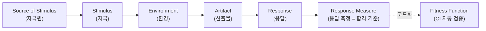
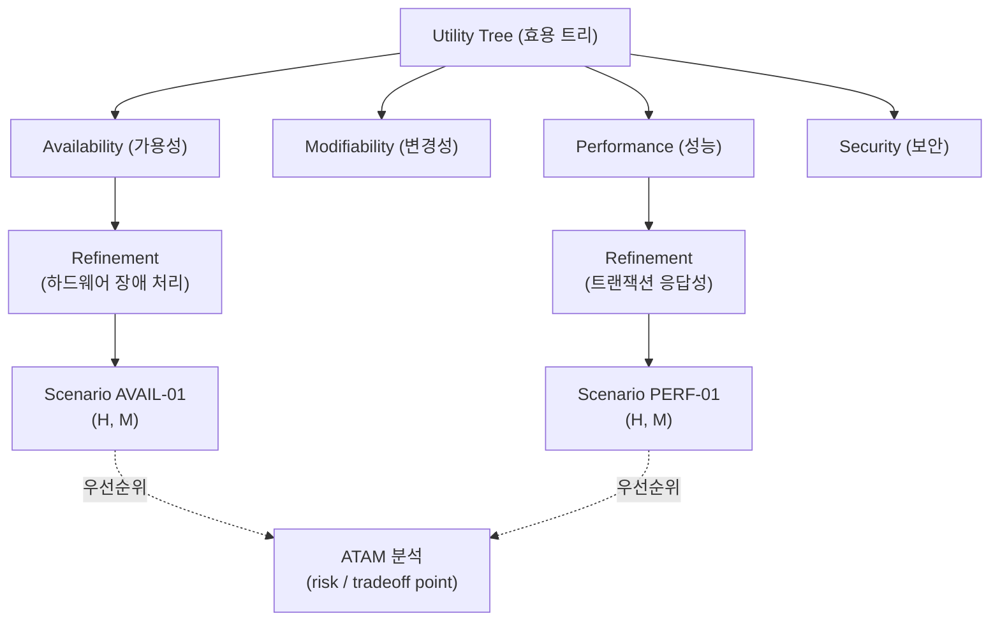

# 아키텍처 평가 (Architecture Evaluation)

SEI(Software Engineering Institute, Bass·Clements·Kazman *Software Architecture in Practice*) 계열의 **시나리오 기반 아키텍처 평가** 방법론을 다룬다. ATAM/SAAM/CBAM 은 아키텍처 결정의 위험(risk)·민감점(sensitivity)·절충점(tradeoff)을 이해관계자 워크숍으로 사전 심사하고, Quality Attribute Scenario 는 비기능 요구를 측정 가능한 형태로 정형화하며, Architectural Tactics 는 품질속성을 달성하는 패턴보다 작은 설계 결정 단위다. [iso25010.md](iso25010.md) 품질 특성 및 [evolutionary-arch.md](evolutionary-arch.md) Fitness Function 과 보완 관계다.

---

<a id="atam-saam-cbam"></a>
## 1. ATAM / SAAM / CBAM (아키텍처 평가 방법)

**정의**: SEI(Carnegie Mellon Software Engineering Institute)가 정립한 **시나리오 기반(scenario-based) 사전 아키텍처 심사** 방법군. 코드를 작성하기 전 단계에서, 품질 속성(quality attribute) 요구를 구체적 시나리오로 환원하고 아키텍처 결정이 그 시나리오를 어떻게 만족/위협하는지를 stakeholder workshop 형태로 평가한다. 세 방법은 한 계보 — **SAAM(1994, 변경성 평가의 원조) → ATAM(2000, 다속성 trade-off 분석) → CBAM(2002, 비용-효익 의사결정)** — 으로 진화했으며 핵심 저자는 Rick Kazman, Mark Klein, Paul Clements (그리고 *Software Architecture in Practice* 의 Len Bass · Paul Clements · Rick Kazman) 이다.

**원전**:
- Kazman, Bass, Abowd, Webb, *SAAM: A Method for Analyzing the Properties of Software Architectures*, ICSE 1994 — SAAM 원전
- Kazman, Klein, Clements, *ATAM: Method for Architecture Evaluation*, SEI Technical Report **CMU/SEI-2000-TR-004**, August 2000 — ATAM 원전
- Kazman, Asundi, Klein, *Quantifying the Costs and Benefits of Architectural Decisions* (CBAM), ICSE 2001 / SEI **CMU/SEI-2002-TR-011** — CBAM 원전
- Bass, Clements, Kazman, *Software Architecture in Practice*, 4th ed., Addison-Wesley, 2021 — 통합 교과서

**핵심 판단**: 아키텍처가 *명세된 품질 속성 요구를 만족할 수 있는가* 를 **구현 전에**, **stakeholder 합의 위에서**, **trade-off 를 명시적으로 드러내며** 평가하는가. 평가의 단위는 모호한 "-ility" 가 아니라 자극(stimulus)→환경(environment)→응답(response measure)으로 구조화된 **품질 속성 시나리오** 다.

---

ATAM 은 9 단계 2 페이즈(Phase 1: 평가팀+아키텍트 핵심 모임, Phase 2: 광범위 stakeholder 워크숍)로 진행되며, 산출물은 다음 핵심 개념으로 정리된다.

**ATAM 핵심 산출 개념**:
- **Utility Tree (효용 트리)**: 루트 "Utility" → 품질 속성(Performance / Modifiability / Availability / Security …) → 정련(refinement) → 잎(leaf)에 구체 시나리오. 각 잎은 `(중요도, 위험/달성난이도)` 를 `(H/M/L, H/M/L)` 로 우선순위화 → 평가 자원을 `(H,H)` 시나리오에 집중.
- **Sensitivity Point (민감점)**: 하나 이상의 품질 속성 응답이 어떤 아키텍처 결정의 속성에 *민감하게* 좌우되는 지점 (예: 캐시 TTL 값 → 응답시간).
- **Tradeoff Point (절충점)**: 둘 이상의 품질 속성에 동시에 영향을 주는 민감점으로, 한 속성을 높이면 다른 속성이 낮아지는 지점 (예: 암호화 추가 → 보안 ↑, 성능 ↓). 절충점은 가장 위험한 설계 결정 후보.
- **Risk / Non-Risk**: 시나리오 달성을 위협하는 결정(=Risk)과 명확히 정당화된 결정(=Non-Risk).
- **Risk Theme**: 개별 리스크를 묶어 비즈니스 동인(business driver) 과 연결한 체계적 위험 주제 — 경영진 보고의 핵심.

**SAAM (Software Architecture Analysis Method)** — ATAM 의 조상. **단일 속성(주로 변경성/modifiability)** 에 초점. 변경 시나리오를 수집·분류(direct: 현 아키텍처로 즉시 수용 / indirect: 아키텍처 수정 필요)하고, 시나리오 간 상호작용(scenario interaction — 한 컴포넌트가 여러 무관한 시나리오에 얽히면 낮은 응집의 신호)을 분석한다. 경량·저비용이라 ATAM 이 과한 소규모 평가에 여전히 유효.

**CBAM (Cost Benefit Analysis Method)** — ATAM 의 *후속*. ATAM 이 식별한 아키텍처 전략(architectural strategy)들에 **경제적 의사결정** 을 붙인다. stakeholder 가 각 시나리오에 효용(utility) 곡선을 매기고, 전략별 `효익(benefit)` 과 `비용(cost)` 을 추정해 **ROI = (Σ 효용 변화 × 시나리오 가중치) / 비용** 으로 전략의 우선순위를 매긴다. ATAM 이 "무엇이 위험한가" 라면 CBAM 은 "그 위험을 줄이는 데 돈을 어디에 쓸 것인가" 에 답한다.

**측정 지표 예시**:
- Utility Tree 잎 시나리오 수 및 `(H,H)` 비율 (평가 집중도)
- 식별된 Sensitivity / Tradeoff / Risk / Non-Risk 개수
- Risk Theme 수와 영향받는 business driver 매핑률
- (CBAM) 전략별 ROI = 효익/비용, 효용 곡선 상의 한계 효용(marginal utility)
- (SAAM) indirect 시나리오 비율, 컴포넌트당 얽힌 시나리오 수(scenario interaction 밀도)

**장점**: 코드 작성 전 위험을 발견(가장 싼 시점의 결함 제거), 암묵적 품질 trade-off 를 명시화, stakeholder 간 우선순위 합의 도출, 아키텍처 결정의 *근거 문서화* (ADR 와 자연 결합)
**약점**: 워크숍 자원 소모 큼(ATAM full = 다수 stakeholder × 2~3일), 평가팀 숙련도 의존, 시나리오 품질에 결과가 좌우됨(누락된 속성은 평가되지 않음), CBAM 의 비용/효익 추정은 주관적 입력에 민감

**검증 방법**: 품질 속성 시나리오 워크숍, Utility Tree 리뷰, ADR(Architecture Decision Record) 와의 추적, ATAM Risk Theme → 백로그 항목 변환 후 [Architectural Fitness Function](evolutionary-arch.md#1-fitness-function) 으로 지속 검증, CBAM ROI 재계산(가정 변경 시 민감도 분석)

**난이도**: 높음 | **사용 빈도**: ★★★☆☆

```python
# ATAM Utility Tree + CBAM ROI — 품질 속성 시나리오 우선순위화 및 전략 선택
# 시나리오는 (자극, 환경, 응답측정)으로 구조화하고 (중요도, 위험) 으로 등급화
from dataclasses import dataclass, field

@dataclass
class QAScenario:
    qa: str                 # 품질 속성 (Performance / Modifiability / Availability ...)
    stimulus: str           # 자극: "동시 1만 요청 유입"
    response_measure: str   # 응답측정: "p99 < 300ms"
    importance: str         # 비즈니스 중요도 H/M/L
    risk: str               # 달성 난이도/위험 H/M/L

    @property
    def is_high_priority(self) -> bool:
        # (H,H) 시나리오에 평가 자원 집중 — ATAM 핵심 휴리스틱
        return self.importance == "H" and self.risk == "H"

@dataclass
class ArchStrategy:
    name: str
    cost: float                          # 추정 구현 비용 (man-day)
    utility_gain: dict[str, float]       # 시나리오별 효용 변화 (0~100)

    def roi(self, weights: dict[str, float]) -> float:
        # CBAM: ROI = Σ(가중치 × 효용변화) / 비용 — 높을수록 우선
        benefit = sum(weights[s] * g for s, g in self.utility_gain.items())
        return benefit / self.cost

# Utility Tree 잎 — (H,H) 만 정밀 평가 대상
tree = [
    QAScenario("Performance", "동시 1만 요청", "p99<300ms", "H", "H"),
    QAScenario("Security",    "외부 토큰 위조", "100% 차단",  "H", "H"),  # ← Tradeoff 후보
    QAScenario("Modifiability","결제수단 추가", "1주 내 반영", "M", "L"),
]
focus = [s for s in tree if s.is_high_priority]  # 평가 집중 시나리오

# CBAM: 두 전략의 ROI 비교 → 한정 예산 배분 결정
weights = {"perf": 0.6, "sec": 0.4}              # stakeholder 합의 가중치
caching = ArchStrategy("Redis 캐시", cost=8,  utility_gain={"perf": 70, "sec": 0})
mtls    = ArchStrategy("mTLS+서명", cost=12, utility_gain={"perf": -10, "sec": 90})
# perf↑ vs sec(암호화 오버헤드로 perf↓) = Tradeoff Point 가 ROI 수치로 가시화
print(caching.roi(weights), mtls.roi(weights))  # → 높은 ROI 전략부터 투자
```

**관련 원칙 / 패턴**: [iso25010.md](iso25010.md) (평가 대상 품질 속성의 표준 분류 — ATAM 시나리오의 어휘 제공), [evolutionary-arch.md#1-fitness-function](evolutionary-arch.md#1-fitness-function) (ATAM 이 일회성 사전 심사라면 fitness function 은 그 시나리오를 지속 검증으로 전환), [evolutionary-arch.md](evolutionary-arch.md) (Architectural Characteristics — 평가할 "-ilities" 정의), [sw-economics.md#9-technical-debt-quadrant](sw-economics.md#9-technical-debt-quadrant) (CBAM 의 비용-효익 의사결정과 기술부채 경제학 연결), Architecture Decision Record (ADR), SEI Views & Beyond, Risk Storming (Simon Brown)

---

<a id="quality-attribute-scenarios"></a>
## 2. Quality Attribute Scenarios (품질속성 시나리오)

**정의**: "A quality attribute scenario is a quality-attribute-specific requirement. It consists of six parts: source of stimulus, stimulus, environment, artifact, response, and response measure." — 품질속성에 특화된 요구사항을, **자극원(Source) · 자극(Stimulus) · 환경(Environment) · 산출물(Artifact) · 응답(Response) · 응답 측정(Response Measure)** 의 6개 부분으로 분해해 *테스트 가능·측정 가능* 하게 기술하는 명세 형식. Carnegie Mellon SEI(Software Engineering Institute) 의 Len Bass, Paul Clements, Rick Kazman 이 *Software Architecture in Practice* (1998, 2/e 2003, 3/e 2012) 에서 정형화했다.

**핵심 판단**: "시스템은 가용성이 높아야 한다" 같은 *형용사 요구* 를 6-part 구조로 옮겨 *반증 가능한 명제* 로 바꾸는가. 품질속성(가용성·변경성·성능·보안 등) 은 그 자체로는 측정 불가능 — 시나리오만이 "무엇이, 어떤 상황에서, 얼마나" 를 못박는다. ATAM(Architecture Tradeoff Analysis Method) 의 utility tree 를 채우는 *잎(leaf) 노드* 가 곧 품질속성 시나리오이며, 아키텍처 평가의 1차 입력이다.

**6-Part 구조 (SEI)**:
- **Source of Stimulus (자극원)**: 자극을 발생시키는 주체 — 사용자, 외부 시스템, 내부 컴포넌트, 공격자, 운영자, 타이머
- **Stimulus (자극)**: 시스템에 도달하는 사건 — 요청 도착, 컴포넌트 장애, 변경 요청, 침입 시도, 부하 급증
- **Environment (환경)**: 자극이 발생하는 조건 — 정상 운영, 과부하(peak load), 장애 모드(degraded), 개발/배포/런타임 시점
- **Artifact (산출물)**: 자극을 받는 대상 — 전체 시스템, 특정 컴포넌트, 데이터 저장소, 통신 채널
- **Response (응답)**: 자극에 대한 시스템의 활동 — 요청 처리, failover, 변경 반영, 침입 탐지·차단·기록
- **Response Measure (응답 측정)**: 응답을 정량화한 *합격 기준* — 측정 가능해야 함이 핵심 (시간·비율·횟수·비용)

**품질속성별 시나리오 예시 (Source / Stimulus / Environment / Artifact / Response / Measure)**:

| 품질속성 | Source | Stimulus | Environment | Artifact | Response | Response Measure |
|---|---|---|---|---|---|---|
| 가용성(Availability) | 내부 컴포넌트 | DB 노드 crash | 정상 운영 | 결제 서비스 | failover 수행 | 다운타임 ≤ 30초, 데이터 손실 0 (RPO=0) |
| 변경성(Modifiability) | 개발자 | 결제 게이트웨이 추가 요청 | 설계 시점 | 결제 모듈 | 코드 수정·테스트·배포 | 3 인일(person-day) 이내, 기존 모듈 변경 0 |
| 성능(Performance) | 외부 사용자 | 동시 요청 1000 RPS | peak load | 주문 API | 요청 처리 | p99 latency ≤ 200ms, 처리율 ≥ 99% |
| 보안(Security) | 공격자 | 인증 우회 시도 | 정상 운영 | 인증 게이트웨이 | 차단·감사 로깅 | 차단율 100%, 탐지 ≤ 1분, 무단 접근 0건 |

**측정 지표 예시 (Response Measure 로 쓰이는 정량 단위)**:
- 가용성: 다운타임(초), MTTR(복구 시간), RTO/RPO, 가용성 % (99.9% = 8.76h/년)
- 변경성: 변경 비용(person-day), 영향 받는 모듈 수, 회귀 결함 수
- 성능: p50/p95/p99 latency, throughput(RPS/TPS), 자원 사용률
- 보안: 탐지 시간, 차단율, 무단 접근 건수, 감사 로그 완전성 %

**장점**: 모호한 형용사 요구 → 검증 가능한 합격 기준으로 전환; ATAM/utility tree 의 우선순위 부여(중요도×난이도) 기반 제공; 이해관계자 간 *공통 어휘* 확보; ISO/IEC 25010 품질 특성과 1:1 매핑되어 추적성 확보
**약점**: 작성 비용·합의 비용 큼(이해관계자 워크숍 필요); Response Measure 를 무리하게 정량화하면 *측정 가능하지만 무의미한* 지표 양산 위험; 변경성·사용성 등은 측정 단위 합의가 어려움

**검증 방법**: ATAM 워크숍(utility tree 작성 → 시나리오 우선순위화 → 아키텍처 접근법 분석 → sensitivity/tradeoff point 식별 → risk/non-risk 도출), QAW(Quality Attribute Workshop, 아키텍처 이전 단계), 시나리오를 [evolutionary-arch.md#1-fitness-function](evolutionary-arch.md#1-fitness-function) 으로 코드화하여 CI 에서 자동 검증, load/chaos/penetration test 로 Response Measure 실측

**난이도**: 중간~높음 | **사용 빈도**: ★★★★☆

```yaml
# Quality Attribute Scenario — 6-part 구조를 기계 판독 가능 형식으로
# (이 YAML 을 fitness function / 테스트 케이스로 컴파일 → CI 자동 검증)
scenario:
  id: AVAIL-01
  quality_attribute: Availability       # ISO 25010 → Reliability/Availability 매핑
  source: "결제 DB primary 노드"          # 자극원 (Source)
  stimulus: "primary 노드 hardware crash" # 자극 (Stimulus)
  environment: "정상 운영 (normal operation)"  # 환경 (Environment)
  artifact: "결제 서비스 데이터 계층"      # 산출물 (Artifact)
  response: "standby replica 로 자동 failover, 진행 중 트랜잭션 보존"  # 응답 (Response)
  response_measure:                      # 응답 측정 (Response Measure) — 합격 기준
    downtime_seconds: { op: "<=", value: 30 }
    data_loss_rpo:    { op: "==", value: 0 }
    failover_auto:    { op: "==", value: true }
  # ATAM 분류
  importance: HIGH        # 비즈니스 중요도 (utility tree H/M/L)
  difficulty: MEDIUM      # 달성 난이도 (utility tree H/M/L)
  tradeoff_with: [Performance, Cost]   # sensitivity/tradeoff point 명시
```





**관련 원칙 / 패턴**: [iso25010.md](iso25010.md) (시나리오가 측정하는 8 품질 특성 — Availability→Reliability, Modifiability→Maintainability, Performance Efficiency, Security 로 매핑), [evolutionary-arch.md#1-fitness-function](evolutionary-arch.md#1-fitness-function) (Response Measure 를 실행 가능한 적합도 함수로 코드화), [performance-metrics.md](performance-metrics.md) (성능 시나리오의 Response Measure — p99 latency·throughput), [resilience-theory.md](resilience-theory.md) (가용성 시나리오의 검증 — chaos engineering·failover), SEI ATAM / QAW, NFR(비기능 요구) 명세

---

<a id="architectural-tactics"></a>
## 3. Architectural Tactics (아키텍처 전술)

**정의**: "An architectural tactic is a design decision that influences the achievement of a quality attribute response." — 단일 품질 속성(quality attribute) 응답을 제어하기 위한 설계 결정. Len Bass, Paul Clements, Rick Kazman, *Software Architecture in Practice*, 3rd ed. (2012), SEI(Software Engineering Institute) 가 정립한 개념. **아키텍처 패턴(pattern)보다 작은 단위** — 패턴은 여러 전술의 묶음이고, 전술은 "하나의 품질 속성 단 하나"에 집중하는 원자적(atomic) 설계 결정이다.

**핵심 판단**: 품질 속성 요구를 *어떤 패턴을 쓸지* 가 아니라 *어떤 응답 메커니즘을 심을지* 로 분해한다. 모든 전술은 **품질 속성 시나리오(Quality Attribute Scenario)** 의 6 요소 — 출처(source) · 자극(stimulus) · 대상(artifact) · 환경(environment) · 응답(response) · 응답 측정(response measure) — 에서 *자극을 응답으로 변환* 하는 결정에 대응한다. "Circuit Breaker 패턴을 쓰자"가 아니라 "결함을 탐지(detect)하고 — 재도입(reintroduce)으로 회복한다"는 전술 수준 판단이 먼저다.

**6 품질 속성별 전술 카탈로그 (Bass/Clements/Kazman 3rd ed.)**:

- **Availability (가용성)** — 결함을 *탐지·회복·예방*:
  - 결함 탐지(Detect Faults): **Ping/Echo**, **Heartbeat**, **Monitor**, **Timestamp**, **Sanity Checking**, **Voting**, **Exception Detection**, **Self-Test**
  - 결함 회복 — 준비·수리(Recover-Preparation and Repair): **Active Redundancy(hot spare)**, **Passive Redundancy(warm spare)**, **Spare(cold spare)**, **Exception Handling**, **Rollback**, **Software Upgrade**, **Retry**, **Ignore Faulty Behavior**, **Degradation**, **Reconfiguration**
  - 결함 회복 — 재도입(Recover-Reintroduction): **Shadow**, **State Resynchronization**, **Escalating Restart**, **Non-Stop Forwarding**
  - 결함 예방(Prevent Faults): **Removal from Service**, **Transactions**, **Predictive Model**, **Exception Prevention**, **Increase Competence Set**
- **Modifiability (변경성)** — 변경 비용·파급을 축소:
  - 모듈 크기 축소(Reduce Size of a Module): **Split Module**
  - 응집도 증가(Increase Cohesion): **Increase Semantic Coherence**
  - 결합도 감소(Reduce Coupling): **Encapsulate**, **Use an Intermediary**, **Restrict Dependencies**, **Refactor**, **Abstract Common Services**
  - 바인딩 시점 지연(Defer Binding): 컴파일 → 배포 → 런타임으로 결정을 미뤄 변경 흡수
- **Performance (성능)** — 처리·대기 시간 제어:
  - 자원 수요 제어(Control Resource Demand): **Manage Sampling Rate**, **Limit Event Response**, **Prioritize Events**, **Reduce Overhead**, **Bound Execution Times**, **Increase Resource Efficiency**
  - 자원 관리(Manage Resources): **Increase Resources**, **Introduce Concurrency**, **Maintain Multiple Copies of Computations(caching)**, **Maintain Multiple Copies of Data(replication)**, **Bound Queue Sizes**, **Schedule Resources(스케줄링: FIFO, fixed-priority, dynamic-priority)**
- **Security (보안)** — 공격을 *탐지·저항·반응·복구* (detect / resist / react / recover):
  - 공격 탐지(Detect Attacks): **Detect Intrusion**, **Detect Service Denial**, **Verify Message Integrity**, **Detect Message Delay**
  - 공격 저항(Resist Attacks): **Identify Actors**, **Authenticate Actors**, **Authorize Actors**, **Limit Access**, **Limit Exposure**, **Encrypt Data**, **Separate Entities**, **Change Default Settings**
  - 공격 반응(React to Attacks): **Revoke Access**, **Lock Computer**, **Inform Actors**
  - 공격 복구(Recover from Attacks): **Maintain Audit Trail** + 가용성 회복 전술 재사용
- **Testability (시험성)**: **Specialized Interfaces**, **Record/Playback**, **Localize State Storage**, **Abstract Data Sources**, **Sandbox**, **Executable Assertions**, **Limit Structural Complexity**, **Limit Nondeterminism**
- **Usability (사용성)**: 사용자 주도 지원(**Cancel**, **Undo**, **Pause/Resume**, **Aggregate**) · 시스템 주도 지원(**Maintain Task/User/System Model**)

**핵심 이론 배경 (정량 한계)**: 전술 선택은 무한히 효과적이지 않다. 성능 전술의 *Introduce Concurrency / Increase Resources* 는 **Amdahl's Law (Gene Amdahl, 1967)** — 직렬 비율 *s* 가 있으면 최대 speedup 은 1/s 로 상한 — 와 **Gunther's Universal Scalability Law(USL)** — 경합(contention) 계수 α 와 일관성(coherency) 계수 β 가 있으면 처리량이 정점 후 오히려 감소(retrograde) — 의 제약을 받는다. 보안 전술 *Limit Access / Limit Exposure / Separate Entities* 의 이론적 토대는 **Saltzer & Schroeder (1975)** 의 8 보안 설계 원칙과, **Saltzer, Reed & Clark (1984), "End-to-End Arguments in System Design"** — 정합성·보안 같은 종단(end-to-end) 보장은 통신 경로 중간이 아니라 양 끝점에서 책임져야 한다는 원칙 — 이다.

**적용 방법 (전술 → 패턴 → 검증)**:
1. 품질 속성 시나리오를 6 요소로 명세한다. 예) "[자극] 노드 장애 발생 시 [환경] 정상 운영 중에 [응답] 5초 내 대기 노드로 failover, [응답 측정] 데이터 손실 0".
2. 시나리오를 만족할 전술을 카탈로그에서 선택한다. 예) Detect = **Heartbeat**, Recover = **Active Redundancy** + **State Resynchronization**.
3. 전술을 구현 패턴으로 사상한다. 예) Active Redundancy → **Leader-Follower**, Detect = Heartbeat → **Health Check** 패턴.
4. **ATAM(Architecture Tradeoff Analysis Method, SEI)** 으로 전술 간 trade-off(예: Redundancy ↑ → 가용성 ↑, 비용·복잡도 ↑) 와 risk·sensitivity point 를 평가한다.

**장점**: 품질 속성을 *측정 가능한 설계 결정* 으로 분해 → 패턴 선택 근거가 명확해진다. 어휘 통일(공통 vocabulary) 로 아키텍트·리뷰어 간 소통 비용 절감. ATAM/CBAM 평가의 입력 단위가 된다.
**약점**: 전술 자체는 구현이 아님 — 잘못된 패턴으로 사상하면 효과 미달. 전술 남용은 복잡도 폭증(예: 과도한 Redundancy → split-brain risk). 전술 간 trade-off 를 무시하면 한 속성을 위해 다른 속성을 희생.

**검증 방법**: ATAM (시나리오 기반 trade-off 분석), CBAM (Cost-Benefit Analysis Method — 비용 대비 효용), **architecture fitness function** (자동화된 품질 속성 회귀 가드 → [evolutionary-arch.md#1-fitness-function](evolutionary-arch.md#1-fitness-function)), chaos engineering (가용성 전술 실증), load/stress test (성능 전술 검증), threat modeling + pentest (보안 전술 검증).

**난이도**: 중간~높음 | **사용 빈도**: ★★★★☆

```python
# Architectural Tactics — 가용성 시나리오를 전술 조합으로 구현
# 시나리오: [자극] 프라이머리 노드 장애 → [응답] failover, [측정] 데이터 손실 0
#
# 전술 1) Detect Faults = Heartbeat (탐지)
# 전술 2) Recover = Active Redundancy(hot spare) (회복-수리)
# 전술 3) Reintroduce = State Resynchronization (회복-재도입)
import time

class HeartbeatMonitor:
    """결함 탐지 전술(Detect Faults): Heartbeat — 주기적 생존 신호 누락을 장애로 판정"""
    def __init__(self, interval_s: float = 1.0, miss_threshold: int = 3):
        self.interval_s = interval_s            # 심박 주기
        self.miss_threshold = miss_threshold    # 연속 누락 허용 횟수
        self._last_beat = time.monotonic()

    def beat(self) -> None:                      # 프라이머리가 살아있음을 알림
        self._last_beat = time.monotonic()

    def is_dead(self) -> bool:                   # threshold × interval 초과 → 장애 판정
        return (time.monotonic() - self._last_beat) > self.miss_threshold * self.interval_s

class HotSpareCluster:
    """회복 전술(Recover-Preparation): Active Redundancy — hot spare 가 동일 상태를 항상 유지"""
    def __init__(self, primary, hot_spare, monitor: HeartbeatMonitor):
        self.primary = primary
        self.hot_spare = hot_spare    # 동기 복제로 항상 최신 상태 (RPO=0 지향)
        self.monitor = monitor

    def replicate(self, op) -> None:
        # Performance 전술(Maintain Multiple Copies of Data): 동기 복제 → 데이터 손실 0
        self.primary.apply(op)
        self.hot_spare.apply(op)      # 양쪽 동시 반영 (state in lockstep)

    def failover(self):
        """장애 탐지 시 hot spare 승격. 직렬 동기 복제 구간은 Amdahl's Law 의 s(직렬 비율)."""
        if self.monitor.is_dead():
            self.hot_spare.resynchronize()  # 재도입 전술: State Resynchronization
            self.primary, self.hot_spare = self.hot_spare, None
            return self.primary           # 승격된 노드 반환
        return self.primary
# trade-off(ATAM): 가용성↑ 데이터손실 0 ↔ 동기 복제 latency·비용↑ → CBAM 으로 효용 평가
```

**관련 원칙 / 패턴**: [iso25010.md#reliability](iso25010.md#reliability) (가용성·결함 허용성·복구성 — 전술이 달성하려는 품질 속성), [evolutionary-arch.md#2-architectural-characteristics](evolutionary-arch.md#2-architectural-characteristics) ("-ilities" = 전술의 대상 품질 속성), [resilience-theory.md#6-graceful-degradation](resilience-theory.md#6-graceful-degradation) (Degradation 가용성 전술의 안전공학 관점), [patterns/reliability.md](../patterns/reliability.md) (Circuit Breaker·Retry·Bulkhead·Health Check — 가용성 전술의 구현 패턴), [patterns/architectural.md](../patterns/architectural.md) (전술 묶음으로서의 아키텍처 패턴), [patterns/caching.md](../patterns/caching.md) (Maintain Multiple Copies 성능 전술), [security/index.md](../security/index.md) (detect/resist/react/recover 보안 전술), ATAM / CBAM (SEI), Saltzer-Reed-Clark *End-to-End Arguments* (1984), Amdahl's Law (1967), Gunther USL
