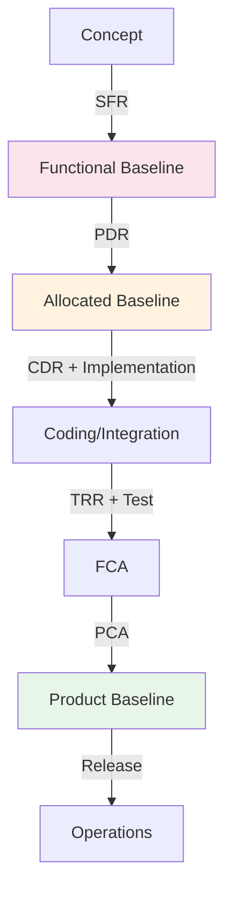
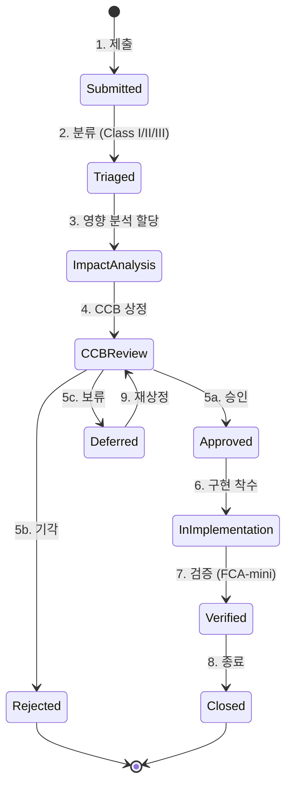
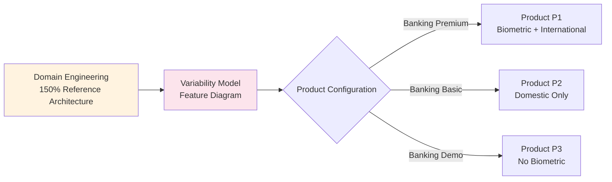

# 소프트웨어 형상 관리 (Software Configuration Management, SWEBOK KA8)

소프트웨어 산출물(Configuration Items, CI) 의 **식별·통제·상태 보고·감사** 를 통해 *언제·누가·왜·무엇* 을 바꿨는지 추적하고, 베이스라인의 무결성을 보존하는 공학 활동. SWEBOK V4 KA8 (Software Configuration Management) 가 정의하는 5 가지 활동 — **SCM Management / Configuration Identification / Configuration Control / Status Accounting / Configuration Auditing** — 을 IEEE Std 828, ISO/IEC/IEEE 12207, CMMI Level 2 PA(Configuration Management) 와 정합시켜 6 가지 핵심 주제로 다룬다.

**원전 / 표준 출처**:
- IEEE Std 828-2012, *IEEE Standard for Configuration Management in Systems and Software Engineering* — SCMP 의 6 정보 클래스 + Activity Diagram
- ISO/IEC/IEEE 12207:2017, *Systems and Software Engineering — Software Life Cycle Processes* §6.3.5 Configuration Management Process
- ISO/IEC/IEEE 15288:2023, *Systems Engineering — Life Cycle Processes* §6.3.5 — 시스템 레벨 형상 관리
- MIL-HDBK-61B (2020), *Configuration Management Guidance* — DoD Functional / Allocated / Product Baseline 정의
- EIA-649C (2019), *Configuration Management Standard* — 산업 표준 (NDIA / SAE)
- CMMI for Development V2.0 (2018), Process Area: Configuration Management (CM) — Level 2 성숙도 요건
- SWEBOK V4 (IEEE Computer Society, 2024), Chapter 8: Software Configuration Management
- Kyo C. Kang et al., *Feature-Oriented Domain Analysis (FODA) Feasibility Study* — CMU/SEI-90-TR-21 (1990)
- Klaus Pohl, Günter Böckle, Frank van der Linden, *Software Product Line Engineering: Foundations, Principles, and Techniques* (Springer 2005)
- Roger S. Pressman & Bruce R. Maxim, *Software Engineering: A Practitioner's Approach* 9th ed. (McGraw-Hill 2020), Ch. 22 SCM
- Anne Mette Jonassen Hass, *Configuration Management Principles and Practice* (Addison-Wesley 2003)

---

## 1. SCMP — Software Configuration Management Plan (IEEE Std 828) <a id="scmp-ieee-828"></a>

**정의**: 프로젝트 수명주기 전 기간 동안 **무엇을 / 누가 / 어떻게 / 언제** 형상 관리할지 사전에 정의하는 마스터 문서. IEEE Std 828-2012 가 6 가지 정보 클래스(Information Class) 로 구조화한 표준 양식이며, 모든 후속 활동(식별·통제·감사) 의 헌법 역할을 한다. CMMI CM SP 1.1 "Identify Configuration Items" 의 선행 조건이며, FDA / DO-178C / IEC 62304 / ISO 26262 등 규제 산업 감사의 1차 증빙이다.

**표준 출처**: IEEE Std 828-2012 §4 (Information Classes), §5 (SCMP content), Annex A (Sample Outline)

**IEEE 828 정보 클래스 6 종**:

| Info Class | 영문 | 핵심 질문 | 산출물 예 |
|---|---|---|---|
| IC-1 | SCM Introduction | 범위·용어·약어 | 적용 시스템 목록, 생명주기 단계 |
| IC-2 | SCM Management | 조직·역할·책임 | CM Manager / CCB Chair / Librarian RACI |
| IC-3 | SCM Activities | 활동·절차 | Identification / Control / Status / Audit 절차서 |
| IC-4 | SCM Schedules | 일정·마일스톤 | Baseline 확립 시점, 감사 일정 |
| IC-5 | SCM Resources | 도구·인프라 | Git / Jira / Artifactory / 리포지토리 구조 |
| IC-6 | SCMP Maintenance | 본 문서 자체의 갱신 | SCMP 검토 주기·승인권자 |

**SCMP 작성 절차** (IEEE 828 §5):
1. **Scope 정의** — 적용 CI 범위 (전체 시스템 / 특정 서브시스템)
2. **CI 명명 규약** — `<프로젝트>-<서브시스템>-<유형>-<버전>` (예: `ACME-AUTH-LIB-1.2.0`)
3. **저장소 구조** — Working / Controlled / Released 3 단계 라이브러리
4. **변경 통제 절차** — CR (Change Request) lifecycle (§3 참조)
5. **상태 보고 메트릭** — Open CR, Avg Closure Time, Baseline Drift
6. **감사 일정** — FCA / PCA 시점 (§4, §5 참조)
7. **승인** — Project Manager / Quality Manager / Customer Representative 서명

**산출물 (SCMP Document Skeleton)**:

```markdown
# Software Configuration Management Plan (SCMP)
Project: ACME Order Service v2.0
Version: 1.0  Date: 2026-01-15  Approver: J. Kim (PM)

### 1. Introduction (IC-1)
- 1.1 Purpose / 1.2 Scope / 1.3 Definitions / 1.4 References

### 2. SCM Management (IC-2)
- 2.1 Organization (CM Manager: A, CCB Chair: B, Librarian: C)
- 2.2 RACI Matrix
- 2.3 Interfaces (QA, Test, Release Eng)

### 3. SCM Activities (IC-3)
- 3.1 Configuration Identification (CI list, naming)
- 3.2 Configuration Control (CR/ECR workflow, CCB)
- 3.3 Configuration Status Accounting (reports, metrics)
- 3.4 Configuration Audits (FCA, PCA schedule)

### 4. Schedules (IC-4)
- 4.1 Baseline Schedule (Functional: T+30d, Allocated: T+60d, Product: T+180d)

### 5. Resources (IC-5)
- 5.1 Tools (Git, Jira, Artifactory, Confluence)
- 5.2 Repository Structure / Branching Strategy

### 6. SCMP Maintenance (IC-6)
- 6.1 Review cycle (annual) / 6.2 Change history
```

**예시 — RACI 매트릭스**:

| 활동 | CM Manager | CCB Chair | Developer | QA Lead | Librarian |
|---|---|---|---|---|---|
| CI 등록 | A | C | R | C | R |
| CR 제출 | I | C | R | C | I |
| CR 심의 | C | A | C | C | I |
| Baseline 승격 | A | R | I | C | R |
| FCA 수행 | C | I | C | A | C |

(R=Responsible, A=Accountable, C=Consulted, I=Informed)

**CMMI 매핑**: CM SP 1.1 (Identify CIs), SP 1.2 (Establish CM System), SP 1.3 (Create / Release Baselines) — SCMP 가 이 3 가지 Specific Practice 의 작업 산출물이다.

**관련 패턴 / 원칙**:
- `principles/sdlc-models.md` — V-Model / Waterfall 의 단계별 baseline 확립 게이트
- `principles/process-metrics.md` — DORA Lead Time / Change Failure Rate 와 SCM 메트릭 연계
- `patterns/build-versioning.md` — CI 식별의 구현 도구 (SemVer / CalVer / Git tag)

---

## 2. Baseline 3 종 — Functional / Allocated / Product <a id="baseline-three-types"></a>

**정의**: 베이스라인(Baseline) 은 **공식 검토를 거쳐 합의된 시점의 형상 항목 스냅샷** 으로, 이후 변경은 반드시 변경 통제 절차(§3 CCB) 를 거쳐야 한다. MIL-HDBK-61B / EIA-649C 가 정의하는 *시스템 공학 베이스라인 3 종* 은 시스템 정의 → 할당 → 구현 산출물에 차례로 대응하며, V-Model 의 좌측 검토 게이트와 1:1 매칭된다. 베이스라인 없이는 *무엇이 변했는가* 를 정량화할 수 없다 — 즉 변경 영향 분석(impact analysis) 이 불가능해진다.

**표준 출처**: MIL-HDBK-61B §3.4, EIA-649C §5.2, IEEE Std 15288 §6.3.5

**베이스라인 3 종 비교**:

| Baseline | 영문 약어 | 확립 시점 | 검토 게이트 | 포함 CI | 책임 |
|---|---|---|---|---|---|
| Functional | FBL | 요구 분석 종료 | SFR (System Functional Review) | SyRS, ConOps, 외부 ICD | 시스템 엔지니어 |
| Allocated | ABL | 설계 종료 | PDR (Preliminary Design Review) | SRS, IRS, SDD (상위), 내부 ICD | 소프트웨어 아키텍트 |
| Product | PBL | 검증·인수 종료 | PCA (Physical Config Audit) | 소스 / 빌드 / 매뉴얼 / 배포 패키지 | 형상 관리자 |

**각 베이스라인 상세**:

### 2.1 Functional Baseline (FBL)
- **무엇**: 시스템이 **무엇을** 해야 하는가 — 외부에서 본 기능·성능·인터페이스 요구
- **포함 산출물**: System Requirements Specification (SyRS, ISO 29148), Concept of Operations (ConOps), External Interface Control Document (ICD)
- **확립 트리거**: System Functional Review (SFR) 통과 — 고객·이해관계자 승인
- **고정 이후 변경**: Class I ECR (Engineering Change Request) — CCB 의결 + 고객 통보 필수

### 2.2 Allocated Baseline (ABL)
- **무엇**: 기능을 **어느 컴포넌트에** 배분했는가 — 내부 구조·인터페이스·설계 결정
- **포함 산출물**: Software Requirements Specification (SRS, IEEE 830), Interface Requirements Specification (IRS), 상위 수준 Software Design Description (SDD, IEEE 1016)
- **확립 트리거**: Preliminary Design Review (PDR) 통과
- **고정 이후 변경**: Class II ECR — CCB 의결 (고객 통보 선택)

### 2.3 Product Baseline (PBL)
- **무엇**: **출하 가능한** 산출물 전체 — 빌드된 바이너리·소스·매뉴얼·설치 스크립트·테스트 증빙
- **포함 산출물**: Source code (frozen), Build manifest (예: SBOM — CycloneDX / SPDX), 운영 매뉴얼, FCA / PCA 보고서
- **확립 트리거**: Physical Configuration Audit (PCA) 통과 — Customer Acceptance
- **고정 이후 변경**: 유지보수 release — patch / minor / major (SemVer 매핑)



**예시 — Git 환경에서의 베이스라인 구현**:

```bash
# FBL — 요구사항 동결
git tag -a fbl-v1.0 -m "Functional Baseline v1.0 (SFR 2026-02-01 통과)"
git tag -s fbl-v1.0  # GPG 서명으로 무결성 강화

# ABL — 설계 동결
git tag -a abl-v1.0 -m "Allocated Baseline v1.0 (PDR 2026-03-15 통과)"

# PBL — 출하 동결
git tag -a pbl-v1.0.0 -m "Product Baseline v1.0.0 (PCA 2026-06-01 통과, SBOM 첨부)"
```

**SemVer 매핑**: PBL 의 major 증분 = 새 PBL 확립, minor / patch = 기존 PBL 의 변경 통제하 release.

**관련 패턴 / 원칙**:
- `principles/sdlc-models.md` §V-Model — SFR / PDR / CDR / TRR 게이트와 베이스라인 매핑
- `patterns/build-versioning.md` — Git tag, SemVer, SBOM 발행 도구
- `patterns/deployment.md` — Blue/Green / Canary 시점에 PBL 어떻게 활용하는가

---

## 3. CCB — Change Control Board (변경 통제 위원회) <a id="change-control-board"></a>

**정의**: 베이스라인 확립 이후 모든 변경 요청(CR / ECR) 을 **승인 / 보류 / 기각** 결정하는 다기능 위원회. IEEE Std 828-2012 §5.3.2 가 정의한 *Configuration Control* 활동의 핵심 메커니즘이며, 단일 개발자의 일방적 변경을 차단하고 비용·일정·품질·보안 영향을 다각도로 평가하기 위해 존재한다. CMMI CM SP 2.1 "Track Change Requests" 의 운영 주체.

**표준 출처**: IEEE Std 828-2012 §5.3, MIL-HDBK-61B §5.4, EIA-649C §6.3

**CCB 구성원 (전형)**:

| 역할 | 책임 | 거부권 |
|---|---|---|
| CCB Chair | 의사결정 주재 / 동률 시 결정권 | O |
| Project Manager | 비용·일정 영향 평가 | O (예산 한도 초과 시) |
| Software Architect | 기술적 실행 가능성 | O (아키텍처 위반 시) |
| QA Lead | 품질·테스트 영향 | O (회귀 위험 시) |
| Security Officer | 보안·컴플라이언스 | O (CVE / GDPR 위반 시) |
| Customer Representative | 비즈니스 가치 | O (Class I CR 한정) |
| CM Manager | 절차 준수·기록 | X (서기 역할) |

**Change Request Lifecycle (10 상태)**:



**CR 분류 (Class I / II / III)**:

| Class | 범위 영향 | 비용·일정 영향 | 외부 인터페이스 | 승인 권한 |
|---|---|---|---|---|
| Class I | FBL 변경 | >10% 또는 critical-path | 변경 | 고객 + CCB |
| Class II | ABL 변경 | 3~10% | 내부만 | CCB |
| Class III | PBL 의 micro patch | <3% | 없음 | CCB Chair 단독 |

**CCB 의사록 템플릿** (운영 산출물):

```markdown
# CCB Meeting Minutes — 2026-W19
Date: 2026-05-08  Time: 14:00–15:30  Chair: Y. Park
Attendees: PM(O), Arch(O), QA(O), SecOps(O), CustRep(X-proxy), CM(O)

## Agenda
| CR-ID | Title | Class | Submitter | Recommendation |
|---|---|---|---|---|
| CR-2026-041 | Add OAuth2-PKCE to mobile login | I | A. Lee | Approve |
| CR-2026-042 | Refactor PaymentGateway interface | II | B. Choi | Defer |
| CR-2026-043 | Fix typo in error message | III | C. Han | Approve (Chair) |

## Decisions
- CR-2026-041 **APPROVED** (5/5)
  - Impact: 3 sprints, $48K, ABL 갱신 필요
  - Conditions: 기존 SAML SSO 호환성 보장, PCA 전 보안 리뷰 필수
  - Owner: A. Lee  Target Release: v2.1.0
- CR-2026-042 **DEFERRED** to 2026-W21
  - Reason: 영향 분석에서 18 개 caller 식별, 추가 회귀 테스트 계획 필요
- CR-2026-043 **APPROVED** by Chair (Class III 단독 권한)

## Action Items
- [ ] A. Lee — CR-041 설계 문서 ABL 갱신안 제출 (Due: W20)
- [ ] B. Choi — CR-042 caller dependency 매트릭스 제출 (Due: W20)
- [ ] CM — CR-043 적용 후 status accounting 갱신 (Due: W19 Fri)

Next Meeting: 2026-W20 (2026-05-15)
```

**메트릭 (Status Accounting 입력)**:
- Open CR Count (by Class)
- Average CR Closure Time (Class 별)
- Approval / Rejection / Deferral Ratio
- Class III bypass rate (CCB 정족수 회피 비율 — 거버넌스 약화 신호)

**안티 패턴**:
- **Rubber-Stamp CCB**: 모든 CR 무조건 승인 → 영향 분석 미수행 → baseline 침식
- **Bottleneck CCB**: 주 1 회 회의로 모든 CR 누적 → 개발 흐름 정체 → Class III 위임 권한 위반
- **Phantom CCB**: 의사록 없이 구두 승인 → 감사 추적 불가

**관련 패턴 / 원칙**:
- `principles/process-metrics.md` — Lead Time for Changes (DORA) 와 CR Closure Time 정합
- `principles/professional-ethics.md` — 변경 사실 은폐 / 우회 승인 = ACM Code 1.3 위반

---

## 4. FCA — Functional Configuration Audit (기능 형상 감사) <a id="fca-functional-audit"></a>

**정의**: 구현된 시스템이 **할당 베이스라인(ABL) 의 모든 요구사항을 충족했는가** 를 시험·검토 증빙으로 확인하는 공식 감사. MIL-HDBK-61B §5.5.2 가 정의하는 *Verification* 게이트로, "*시스템이 명세대로 동작하는가*"(Does the system do what the SRS says?) 를 정량적으로 답한다. V-Model 의 우측 상승 곡선 중 **System Testing → Acceptance Testing** 사이에 수행되며, PCA 의 선행 조건이다.

**표준 출처**: MIL-HDBK-61B §5.5.2, EIA-649C §7.2, IEEE Std 1012-2016 §7.3 (V&V 의 일부)

**FCA 의 목적**:
1. 요구사항-시험 추적성(Requirements-to-Test Traceability) 100% 확인
2. 모든 시험 케이스의 *통과* 또는 *승인된 편차(Waiver)* 확인
3. 성능 / 안전 / 보안 요구의 정량 측정치 확인
4. ABL 이후 발생한 모든 CR 의 반영 / 미반영 추적

**FCA 입력 산출물**:
- ABL (SRS, IRS, IEEE 830)
- Test Plan (IEEE 829)
- Test Procedures
- Test Reports (단위·통합·시스템·인수 단계)
- Open Defect List
- Approved CRs (ABL 이후)

**FCA 체크리스트** (예시):

```markdown
# Functional Configuration Audit Checklist
Project: ACME Order Service v2.0  Date: 2026-05-25  Auditor: QA Lead

## Section A — Traceability
- [ ] A.1 모든 SRS 요구사항이 최소 1 개 시험 케이스에 매핑되었는가? (도구: ReqIF / DOORS)
- [ ] A.2 모든 시험 케이스가 SRS 요구사항을 역추적할 수 있는가?
- [ ] A.3 고아 시험(Orphan Test) / 고아 요구(Orphan Req) 0 건 확인
- [ ] A.4 IRS 의 외부 인터페이스가 통합 시험으로 검증되었는가?

## Section B — Test Execution
- [ ] B.1 단위 시험 통과율 ≥ 95% (CMMI 권장)
- [ ] B.2 통합 시험 통과율 100% (실패 시 Waiver 첨부)
- [ ] B.3 시스템 시험 통과율 100%
- [ ] B.4 회귀 시험(Regression Suite) 100% 통과

## Section C — Non-Functional
- [ ] C.1 성능 요구 (예: P95 latency < 200ms) 측정치 첨부
- [ ] C.2 보안 요구 (OWASP Top 10, CVE 스캔) 통과
- [ ] C.3 가용성 / 신뢰성 요구 (예: 99.9% SLA) 시뮬레이션 결과 첨부
- [ ] C.4 접근성 (WCAG 2.2 AA) 점검 결과

## Section D — Change Tracking
- [ ] D.1 ABL 이후 승인된 모든 CR 이 구현·시험 완료되었는가?
- [ ] D.2 미반영 CR 의 Deferred 사유 + 차기 release 계획 명시
- [ ] D.3 Open Defect 의 우선순위·완화책 명시

## Section E — Sign-off
- Audit Result: [ ] Pass  [ ] Pass w/ Action Items  [ ] Fail
- Action Items: ___
- Signatures: QA Lead ___ / PM ___ / CCB Chair ___
```

**FCA 결과 처리**:
- **Pass**: PBL 확립을 위한 PCA 진행 승인
- **Pass with Action Items**: 잔여 결함 추적 + 차기 release 까지 close 약속
- **Fail**: ABL 또는 구현 복귀 — root cause 분석 후 재 FCA

**메트릭**:
- Requirement Coverage = (Tested Req / Total Req) × 100
- Test Pass Rate (Unit / Integration / System / Acceptance)
- Defect Density = Defects / KLOC
- Waiver Count + 사유 분포

**관련 패턴 / 원칙**:
- `principles/sdlc-models.md` §V-Model — TRR / Acceptance Test 와 FCA 정합
- `principles/process-metrics.md` — Change Failure Rate 입력 데이터
- `principles/iso25010.md` — 비기능 품질 특성 (Functional Suitability) 검증 기준

---

## 5. PCA — Physical Configuration Audit (물리 형상 감사) <a id="pca-physical-audit"></a>

**정의**: 인수 직전 산출물의 **실제 구성 요소(소스·바이너리·매뉴얼·라벨)** 가 **as-built 문서와 일치** 하는지 확인하는 감사. "*만든 것과 문서가 같은가*"(Does the built product match its documentation?) 를 답한다. PBL(Product Baseline) 확립의 마지막 게이트이며, 출하·인도 시 고객에게 *형상 동결 증빙* 으로 제출한다.

**표준 출처**: MIL-HDBK-61B §5.5.3, EIA-649C §7.3, IEEE Std 12207 §6.3.5.3.4

**FCA vs PCA**:

| 구분 | FCA | PCA |
|---|---|---|
| 질문 | *Does it do what we said?* | *Is it what we said it is?* |
| 입력 | ABL (SRS, IRS) | as-built 산출물 전체 |
| 시점 | 시험 종료 직후 | 인수 / 출하 직전 |
| 초점 | 기능·성능 충족 | 물리적 일치·라벨·매뉴얼 |
| 출력 | Test 증빙 + 결함 목록 | as-built 매니페스트 + 라벨 검증 |

**PCA 입력 산출물**:
- 출하 후보 빌드 (frozen source + binary)
- Software Version Description (SVD, MIL-STD-498) 또는 Release Notes
- 사용자 / 운영 / 설치 매뉴얼
- SBOM (Software Bill of Materials — SPDX 2.3 / CycloneDX 1.5)
- 라이선스 매니페스트 (오픈소스 컴플라이언스)
- FCA 통과 증빙

**PCA 체크리스트** (예시):

```markdown
# Physical Configuration Audit Checklist
Project: ACME Order Service v2.0  Date: 2026-05-30  Auditor: CM Manager

## Section A — Artifact Inventory
- [ ] A.1 소스 트리 = git tag pbl-v2.0.0 와 byte-level 일치 (SHA256 매니페스트 첨부)
- [ ] A.2 빌드된 바이너리 = 재현 가능한 빌드(Reproducible Build) 해시 일치
- [ ] A.3 SBOM 의 모든 의존성이 라이선스 매니페스트에 포함
- [ ] A.4 docker image digest = release notes 명시 digest 와 일치

## Section B — Documentation Match
- [ ] B.1 SVD / Release Notes 의 기능 목록 = FCA 결과 일치
- [ ] B.2 사용자 매뉴얼의 스크린샷 / API 예시 = 실제 동작과 일치
- [ ] B.3 설치 매뉴얼대로 clean 환경에서 설치·기동 성공
- [ ] B.4 운영 매뉴얼의 트러블슈팅 케이스 5 종 재현 가능

## Section C — Labeling & Packaging
- [ ] C.1 모든 산출물 파일에 버전 라벨 (예: v2.0.0) 명시
- [ ] C.2 라이선스 표기 (LICENSE, NOTICE) 정확
- [ ] C.3 보안 인증서 / GPG 서명 유효 (예: cosign verify)
- [ ] C.4 archive 무결성 (tar.gz / zip 해시 매니페스트)

## Section D — Open Items
- [ ] D.1 Open Defect 목록의 우선순위 / 영향 / 차기 release 계획
- [ ] D.2 FCA 의 모든 Action Item 종결 또는 차기 release ETA

## Section E — Sign-off
- Audit Result: [ ] Pass → PBL 확립  [ ] Conditional Pass  [ ] Fail
- Signatures: CM Manager ___ / PM ___ / Customer Rep ___
```

**PCA 통과 후 산출**:
1. **PBL 확립 공지** — git tag + SBOM + 매니페스트 archive
2. **As-Built Document Set** — 모든 매뉴얼·SVD·라이선스 매니페스트 동결본
3. **Release to Customer** — 인수 시험(UAT) 또는 운영 이관

**현대적 보완 — Reproducible Builds + SLSA**:
- SLSA (Supply-chain Levels for Software Artifacts) Level 3+ 가 *PCA 의 디지털 자동화* 역할
- Sigstore / cosign 으로 빌드 산출물 서명 → PCA 의 "라벨 / 서명" 검증을 cryptographic 으로 강제

**관련 패턴 / 원칙**:
- `patterns/build-versioning.md` — SemVer / Git tag / SBOM 발행
- `patterns/deployment.md` — Blue/Green release 전 PBL 동결 의무
- `principles/professional-ethics.md` — 라이선스 / 출처 누락 = ACM Code 1.5 위반

---

## 6. Variant Management — Software Product Line (제품 라인 형상) <a id="variant-management-product-line"></a>

**정의**: 동일 도메인의 **여러 변종(variant)** 을 공통(commonality) 과 가변점(variability) 으로 분해해 체계적으로 재사용하는 형상 관리 영역. 단일 제품의 베이스라인 관리(§2~§5) 가 *세로축* 시간 흐름이라면, 제품 라인 형상 관리는 *가로축* 변종 분기를 다룬다. SEI 가 1990 년 FODA(Feature-Oriented Domain Analysis) 로 정형화했으며, Pohl/Böckle/van der Linden 의 SPLE 프레임워크가 산업 표준 참조 모델이다.

**표준 출처**:
- Kang et al., FODA (CMU/SEI-90-TR-21, 1990)
- Pohl, Böckle, van der Linden, *Software Product Line Engineering* (Springer 2005)
- ISO/IEC 26550:2015, *Software and Systems Engineering — Reference Model for Product Line Engineering and Management*

**제품 라인 vs 단일 제품 형상 관리**:

| 차원 | 단일 제품 | 제품 라인 |
|---|---|---|
| 형상 단위 | CI (file / module) | Feature + Variation Point |
| 베이스라인 | FBL / ABL / PBL (세로축) | Domain Asset + Product Asset (가로축) |
| 재사용 | 의도된 재사용 미흡 | 핵심 가치 명제 |
| 변경 영향 | 단일 product 내 | 다수 product 동시 영향 가능 |

**FODA / Feature Model**:

```
Mobile Banking [Feature Model]
├── [Mandatory] Account View
├── [Mandatory] Transfer
│   ├── [Alternative] Domestic Only
│   └── [Alternative] International
├── [Optional] Biometric Auth
│   ├── [Or] Fingerprint
│   └── [Or] Face ID
├── [Optional] Investments
└── [Excludes: Biometric → Demo Mode]
```

**Variation Mechanisms**:

| 메커니즘 | 시점 | 도구 예 |
|---|---|---|
| Parameterization | 런타임 | Config file, Feature flag |
| Conditional Compilation | 빌드 타임 | `#ifdef`, Kotlin `expect/actual` |
| Component Selection | 통합 타임 | Maven profile, Gradle variants |
| Inheritance / Polymorphism | 설계 타임 | OOP, Strategy 패턴 |
| Generation | 설계 타임 | Code gen, DSL |

**150% Model (Pohl SPLE §4.3)**:
- *모든 가능한 feature 조합을 포함한 superset* 모델
- 단일 product 는 150% 모델에서 feature 를 *선택 / 제거* 해 100% 모델로 도출
- 장점: 일관성·재사용성 / 단점: 모델 복잡도 증가



**제품 라인 SCM 추가 활동**:
1. **Variability Model 형상화** — Feature Model 자체를 CI 로 등록 (도구: pure::variants, FeatureIDE)
2. **Asset Repository 이중 분류** — Domain Assets(공유) / Product Assets(개별)
3. **Cross-Product Impact Analysis** — CR 1 건이 N 개 product 에 미치는 영향 매트릭스
4. **Variant-Aware CCB** — 단일 CCB 가 모든 variant 영향 통합 의결 (또는 Domain CCB + Product CCB 2 단계)

**예시 — Cross-Product Impact Matrix**:

| CR-ID | Title | P1 (Premium) | P2 (Basic) | P3 (Demo) | Class |
|---|---|---|---|---|---|
| CR-051 | OAuth2-PKCE 추가 | Affect | Affect | N/A (Demo 제외) | I |
| CR-052 | International Transfer 수수료 표시 | Affect | N/A | N/A | II |
| CR-053 | 공용 UI 라이브러리 v3 업그레이드 | Affect | Affect | Affect | I |

**Variant Management 안티 패턴**:
- **Clone-and-Own**: 신규 variant 마다 코드 복제 → 점진적 분기 → 유지보수 폭증 (대량 fork 의 운명)
- **Configuration Explosion**: Feature flag 100+ 누적 → 실제 조합 미시험 → 운영 사고
- **Phantom Variant**: Feature Model 에는 있으나 실제 배포된 적 없는 조합 — 코드 베이스에서 dead code 화

**관련 패턴 / 원칙**:
- `patterns/build-versioning.md` — Gradle Flavor / Maven Profile / Bazel variant
- `principles/evolutionary-arch.md` — Fitness Function 으로 variant 일관성 자동 검증
- `principles/sdlc-models.md` §RUP — Domain Engineering / Application Engineering 2-life-cycle 분리
- `patterns/deployment.md` — Feature flag 기반 progressive rollout 과 variant 형상 관리 정합
