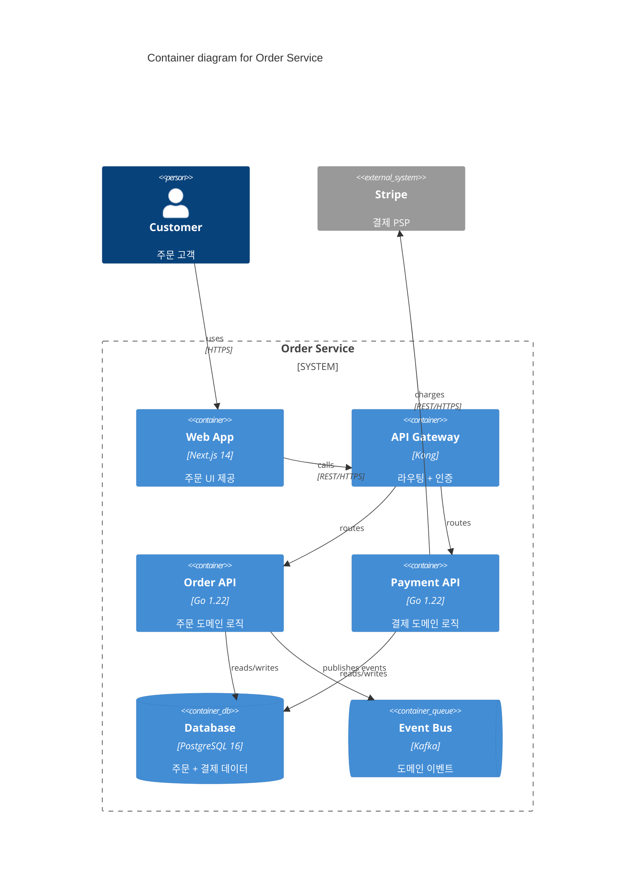

# 기술 문서화 (Technical Documentation)

ADR / RFC / Diátaxis / Living Documentation / C4 Model 의 정평 있는 8 표준. **결정 기록 + 사용자 문서 + 자동화** 3 축.

**원전·표준 참고**:
- Michael Nygard — *Documenting Architecture Decisions* (2011, blog)
- Olaf Zimmermann — MADR (Markdown Architectural Decision Records, https://adr.github.io/madr/)
- Daniele Procida — *Diátaxis* (https://diataxis.fr)
- Cyrille Martraire — *Living Documentation: Continuous Knowledge Sharing by Design* (2019)
- Andrew Etter — *Modern Technical Writing* (Docs-as-Code)
- Simon Brown — *The C4 Model for Software Architecture* (https://c4model.com)
- Write the Docs community (writethedocs.org)
- ThoughtWorks Technology Radar — ADR 표준화 권고

**Diátaxis 4 분류**:

| 분류 | 목적 | 예시 |
|------|------|------|
| Tutorial | 학습 | "Getting Started" |
| How-to Guide | 문제 해결 | "How to deploy to AWS" |
| Reference | 정확한 정보 | API spec, Configuration reference |
| Explanation | 이해 | "Why we chose Kafka" |

**관련 카탈로그**:
- [evolutionary-arch.md](evolutionary-arch.md) — Architecture as Hypothesis (ADR 자매)
- [code-smells.md](code-smells.md) — Comments smell (코드 내 문서)
- [`../patterns/api-design.md`](../patterns/api-design.md) — Problem Details RFC 7807

---

<a id="adr"></a>
## 1. Architecture Decision Records (ADR)

**정의**: "An architecture decision record (ADR) is a document that captures an important architectural decision made along with its context and consequences." — Michael Nygard 가 2011 년 블로그 *Documenting Architecture Decisions* 에서 제안한 *경량* 의사결정 기록 형식. ThoughtWorks Technology Radar 2017 년 "Adopt" 등재.

**핵심 판단**: "왜 이렇게 결정했는가" 를 결정 *시점* 에 기록. 추후 회고 시 *맥락* 을 보존 — "그때는 이게 최선이었다" 를 증명 가능. 한 번 작성된 ADR 은 **수정하지 않는다** (immutable). 결정이 바뀌면 새 ADR 을 *작성* 하고 이전 ADR 을 *Superseded* 로 표시.

**포맷·구조** (Nygard 원형 5 섹션):

| 섹션 | 내용 |
|------|------|
| Title | 짧고 명확. 예: "ADR-0009: Use PostgreSQL for primary data store" |
| Status | Proposed / Accepted / Deprecated / Superseded by ADR-XXXX |
| Context | 결정이 필요한 *배경* — 비즈니스/기술적 상황, 제약, 가정 |
| Decision | *우리가* 내린 결정 — 능동태, 단언적 |
| Consequences | 긍정·부정·중립적 결과 (trade-off 포함) |

**장점**:
- 결정의 *맥락* 이 남아 신규 팀원이 "왜?" 를 빠르게 파악
- 회고 시 *후견편향* (hindsight bias) 차단 — 당시 정보로 평가
- 코드 리뷰·아키텍처 워크숍의 인용 source
- 마이그레이션·리팩토링 시 *과거 결정의 인과* 추적 가능

**단점·주의**:
- 작성 *비용* 과 *유지* 비용 — 누가 언제 쓸지 합의 필요
- 과도하게 형식화하면 작성 자체가 부담 → 권장: 1 페이지 이내, 30 분 작성
- *결정* 만 기록 (조사 / 토론 / brainstorming 은 RFC 로)
- ADR 번호는 **재사용 금지** — Superseded 된 ADR 도 그대로 보존

**실제 사용**:
- 작성 트리거: 새 기술 스택 도입, 라이브러리 교체, 데이터 모델 변경, 보안 경계 이동, *되돌리기 어려운 결정*
- 저장 위치: `docs/adr/NNNN-kebab-title.md` 또는 `adrs/` 디렉터리 — 코드 저장소 내 (Docs-as-Code)
- 도구: `adr-tools` (CLI by Nat Pryce), `Log4brains` (web UI), `pyadr`
- ThoughtWorks / Spotify / Mozilla / GitHub Engineering 채택

**난이도**: 낮음 | **사용 빈도**: ★★★★★

```markdown
# ADR-0007: Adopt PostgreSQL for primary data store

## Status

Accepted (2026-04-12)

## Context

신규 주문 서비스의 primary store 선정 필요. 후보:
- PostgreSQL: 팀 익숙, JSON/JSONB 지원, 강한 일관성
- MongoDB: 스키마 유연성, 수평 확장 용이
- DynamoDB: 운영 부담 낮음, AWS lock-in

비즈니스 요구:
- 주문-결제 트랜잭션 일관성 (ACID 필수)
- 예상 트래픽: 1000 TPS, 데이터 100GB/년
- 팀 5명 중 4명이 PostgreSQL 경험 보유

## Decision

PostgreSQL 16 을 primary data store 로 채택한다.
- 단일 region 배포 (다중 region 은 추후 ADR)
- JSONB 컬럼으로 가변 속성 (배송 메타 등) 처리
- Connection pooling: PgBouncer

## Consequences

긍정:
- ACID 보장으로 결제 일관성 코드 단순화
- 팀 학습 곡선 최소
- 풍부한 ecosystem (timescale, postgis 등 확장 여지)

부정:
- 수평 확장 한계 — sharding 시 Citus 도입 필요 (별도 ADR)
- 다중 region active-active 불가

중립:
- Multi-tenancy 는 schema-per-tenant 로 시작 (ADR-0008 참조)
```

**관련 항목**:
- [y-statement-nygard](#y-statement-nygard) — ADR 의 1줄 요약 형식
- [madr](#madr) — Markdown ADR 표준 템플릿
- [rfc-process](#rfc-process) — *결정 전* 토론 프로세스
- [evolutionary-arch.md](evolutionary-arch.md) — Architecture as Hypothesis

---

<a id="y-statement-nygard"></a>
## 2. Y-Statement / Nygard Format (Y-스테이트먼트)

**정의**: Olaf Zimmermann 이 정리한 *한 줄짜리* 아키텍처 결정 요약 문법. ADR 의 압축 형태. "In the context of X, facing Y, we decided for Z and neglected A, to achieve W, accepting downside B."

**핵심 판단**: ADR 본문 작성 전 *결정의 본질* 을 한 문장으로 표현. 6 슬롯 — context / facing / decided / neglected / achieve / accepting — 모두 채우면 결정이 *명확* 한 것. 한 슬롯이라도 채우기 어려우면 *조사 부족* 신호.

**포맷·구조**:

```
In the context of <use case / functional requirement>,
facing <concern / non-functional requirement>,
we decided for <chosen option>
and neglected <not chosen option(s)>,
to achieve <quality / desired outcome>,
accepting <downside / drawback>.
```

| 슬롯 | 의미 | 예시 |
|------|------|------|
| Context | 사용 사례 / 기능 요구 | "결제 트랜잭션 일관성" |
| Facing | 비기능 / 압박 요인 | "ACID 보장 필요" |
| Decided | 채택안 | "PostgreSQL 16" |
| Neglected | 기각안 | "MongoDB / DynamoDB" |
| Achieve | 달성 목표 | "코드 복잡도 감소" |
| Accepting | 인정하는 약점 | "수평 확장 한계" |

**장점**:
- 결정 review 30 초 — slack message / commit 메시지로 적합
- *기각안* (neglected) 을 명시 → "왜 그게 아니라 이걸?" 질문 사전 차단
- *trade-off* (accepting) 을 강제 → "trade-off 가 없다" 는 false 결정 차단
- ADR 본문 *Decision* 섹션의 한 줄 요약으로 그대로 인용 가능

**단점·주의**:
- 한 문장 강박이 *복합 결정* (예: "DB 선택 + 마이그레이션 전략") 을 흐리게 만들 수 있음 → 분리
- *기각안* 슬롯을 비우면 의미 손실. "없음" 도 의도 표기
- 영어 문법 그대로는 한국어로 어색 → 6 슬롯 *구조* 만 유지하고 자연스러운 한국어 변형 허용

**실제 사용**:
- ADR 본문 첫 줄에 Y-Statement 1 회 + 본문 5 섹션 전개
- Architecture Review Meeting 에서 결정 후보를 Y-Statement 로 모아 비교
- Zimmermann (2020) 이 *Microservice API Patterns* 에서 패턴 의도 기술에 활용

**난이도**: 매우 낮음 | **사용 빈도**: ★★★★☆

```markdown
# Y-Statement 예시 — 인증 전략 결정

In the context of multi-tenant SaaS user authentication,
facing GDPR data residency requirement + 5 region rollout,
we decided for Auth0 Organizations
and neglected Keycloak self-hosted, AWS Cognito,
to achieve sub-month time-to-market + region-isolated tenant data,
accepting $0.05/MAU runtime cost + vendor lock-in risk.
```

```markdown
# Y-Statement 예시 — 한국어 변형

[Context]    멀티-테넌트 SaaS 사용자 인증
[Facing]     GDPR 데이터 잔류 + 5 region 출시 압박
[Decided]    Auth0 Organizations
[Neglected]  Keycloak self-hosted, AWS Cognito
[Achieve]    Month-단위 출시 + region-격리 테넌트 데이터
[Accepting]  $0.05/MAU 운영비 + vendor lock-in
```

**관련 항목**:
- [adr](#adr) — Y-Statement 의 전체 본문
- [madr](#madr) — Markdown ADR 의 짧은 형식 (short MADR) 에서 활용
- [rfc-process](#rfc-process) — RFC 결정 요약에 활용

---

<a id="madr"></a>
## 3. MADR (Markdown Architectural Decision Records)

**정의**: Olaf Zimmermann, Oliver Kopp 등이 2019 년 표준화한 *Markdown 기반 ADR 템플릿*. GitHub / GitLab 친화적 — 코드 리뷰·issue·PR 와 동일한 워크플로우. 현재 v3 (2023~).

**핵심 판단**: Nygard 의 *5 섹션* 보다 더 *구조화* 된 형식. 결정의 *고려 옵션*, *결정 동인 (drivers)*, *Pros/Cons 매트릭스* 를 명시. 의사결정 *과정* 까지 기록되어 회고 가치가 큼.

**포맷·구조** (MADR v3 full template):

| 섹션 | 의미 |
|------|------|
| Title (`# {short title}`) | ADR 번호 + 짧은 제목 |
| Status | proposed / rejected / accepted / deprecated / superseded |
| Date | 결정 일자 |
| Deciders | 의사결정 참여자 |
| Technical Story | 관련 issue / ticket link |
| Context and Problem Statement | 문제 정의 (질문 형식 가능) |
| Decision Drivers | 결정에 영향을 준 요인 (bullet) |
| Considered Options | 고려한 옵션 목록 |
| Decision Outcome | 선택한 옵션 + 근거 |
| Positive Consequences / Negative Consequences | 긍/부정 결과 |
| Pros and Cons of the Options | 각 옵션별 장단점 (옵셔널) |
| Links | 관련 ADR, RFC, 외부 자료 |

**Short MADR** (간이 형식): Title / Context / Decision / Consequences 4 섹션만 — Nygard 형식과 동일.

**장점**:
- *Considered Options* + *Decision Drivers* → 비교 *근거* 명시 → 후일 "왜 다른 안이 아니었나" 답변 가능
- *Pros and Cons* 매트릭스 → 다른 팀의 *재평가* 가 쉬움
- Markdown 표준 → renderer 의존 없음 (GitHub, GitLab, Bitbucket, Confluence 모두 가능)
- Template 자동화 도구: `adr-tools`, `log4brains init`, `pyadr new`

**단점·주의**:
- Full template 은 1~2 시간 작성 부담 → 단순 결정은 Short MADR 또는 Nygard 형식 사용
- Pros/Cons 가 *주관적* 표현으로 흐를 수 있음 → 측정 가능한 지표 우선
- Number scheme: `0001-xxxx.md` 4 자리 권장 — 9999 결정까지

**실제 사용**:
- 저장 경로: `docs/decisions/NNNN-kebab-title.md` (MADR v3 권고)
- index: `docs/decisions/README.md` 에 모든 ADR 목차 + 상태
- Spotify Backstage 의 `@backstage/plugin-adr` 가 MADR 렌더링 내장
- Microsoft Azure Architecture Center 가 MADR 채택

**난이도**: 낮음 | **사용 빈도**: ★★★★★

```markdown
---
# MADR v3 full template (YAML frontmatter 옵셔널)
status: accepted
date: 2026-04-12
deciders: [zime, alice, bob]
consulted: [security-team]
informed: [product, platform]
---

# Use PostgreSQL for primary data store

## Context and Problem Statement

신규 주문 서비스의 primary store 를 무엇으로 할 것인가? 결제 트랜잭션 일관성·운영 부담·팀 역량 사이의 균형이 필요하다.

## Decision Drivers

- ACID 보장 (결제 일관성)
- 팀 학습 곡선 최소화
- 운영 부담 (managed service 선호도)
- 5 년 후 수평 확장 여지

## Considered Options

- PostgreSQL 16 (RDS / Aurora)
- MongoDB Atlas
- DynamoDB

## Decision Outcome

선택: **PostgreSQL 16 (Amazon RDS)**

이유:
- 팀 5명 중 4명이 운영 경험 보유 → 학습 곡선 최소
- ACID + JSONB 로 정형/반정형 모두 처리
- Citus / Aurora Limitless 등 수평 확장 옵션 잔존

### Positive Consequences

- 결제 트랜잭션 코드 단순 (단일 DB 트랜잭션)
- 풍부한 ecosystem (PostGIS, pgvector, TimescaleDB)

### Negative Consequences

- 다중 region active-active 불가
- 100 TB+ 규모에서 sharding 복잡도 증가

## Pros and Cons of the Options

### PostgreSQL 16

- Good, ACID 보장
- Good, 팀 익숙
- Bad, 수평 확장 시 sharding 부담

### MongoDB Atlas

- Good, 스키마 유연성
- Bad, ACID 다중 문서 비용
- Bad, 팀 경험 부족

### DynamoDB

- Good, 운영 부담 0
- Bad, AWS lock-in
- Bad, 쿼리 표현력 제한

## Links

- [ADR-0008: Multi-tenancy strategy](0008-multi-tenancy.md)
- [RFC-0003: Database benchmarking](../rfcs/0003-db-benchmark.md)
```

**관련 항목**:
- [adr](#adr) — MADR 의 부모 개념
- [y-statement-nygard](#y-statement-nygard) — Decision Outcome 의 한 줄 형식
- [docs-as-code](#docs-as-code) — Markdown + Git 워크플로우

---

<a id="rfc-process"></a>
## 4. RFC (Request for Comments) 프로세스

**정의**: 결정 *전* 단계의 *제안서* + *토론* 프로세스. IETF RFC (1969~) 의 정신을 내부 엔지니어링에 적용한 형식. Rust 언어, Python PEP, Kubernetes KEP, React RFC, Ember RFC 등이 채택.

**핵심 판단**: ADR 이 *결정* 의 기록이라면 RFC 는 *결정에 이르는 과정* 의 기록. PR 기반 review 로 *transparency* 와 *비동기 합의* 를 달성. "느린 합의 vs 빠른 실행" 사이의 균형 도구.

**ADR vs RFC**:

| 축 | ADR | RFC |
|----|-----|-----|
| 시점 | 결정 *후* | 결정 *전* |
| 상태 | Accepted / Rejected (final) | Draft → Review → Accepted / Rejected (lifecycle) |
| 길이 | 1 페이지 | 수 페이지 |
| 작성자 | architect / tech lead | 누구나 (proposer) |
| 리뷰 | 옵셔널 | 필수 (다수 reviewer) |
| 수명 | Immutable (Superseded 만 가능) | Mutable (수정 반복) |

**RFC 라이프사이클**:

```
Draft (PR open)
  ↓ comment / iteration
Review (RFC team / domain owners)
  ↓ approval / rejection
Final Comment Period (FCP, 7~10 일)
  ↓ no new objection
Accepted → 구현 시작
  ↓ 구현 완료 → ADR 생성 (결정 봉인)
```

**RFC 표준 섹션** (Rust RFC template 기준):

| 섹션 | 내용 |
|------|------|
| Summary | 1~2 문단 요약 |
| Motivation | 왜 필요한가 (use case) |
| Guide-level Explanation | 사용자 관점 설명 (튜토리얼 톤) |
| Reference-level Explanation | 구현 세부 |
| Drawbacks | 알려진 단점 |
| Rationale and Alternatives | 대안 비교 |
| Prior Art | 다른 언어/시스템 참고 |
| Unresolved Questions | 미결 항목 |
| Future Possibilities | 후속 작업 |

**장점**:
- *공개 토론* 으로 다양한 관점 수집 → blind spot 감소
- 비동기 리뷰 → 시간대·일정 문제 해결 (글로벌 팀)
- 검색 가능한 archive → "왜 이 기능이 이렇게 되었나" 답변
- *기각된 RFC* 도 보존 → 같은 제안 재제기 시 reference

**단점·주의**:
- 작성 비용 — 수 페이지, 검토 수일~수주
- *bikeshedding* (사소한 부분에 토론 집중) 위험 → reviewer 명시, FCP 시한 설정
- 모든 결정에 RFC 를 강요하면 *velocity 저하* → "되돌리기 어려운 결정" 만 대상
- *합의 부족* 으로 결정 못 내리는 deadlock → BDFL (Benevolent Dictator) 또는 RFC team 이 종결

**실제 사용**:
- 저장 경로: `rfcs/text/NNNN-title.md` (Rust 패턴), `proposals/` (Kubernetes), `peps/` (Python)
- PR 기반: 1 PR = 1 RFC, 머지 = 채택
- Tooling: GitHub PR + reviewer 지정, `rfcbot` (Rust) 의 자동 FCP 추적
- 사례: Rust RFC 2256 (async/await), Python PEP 8 (스타일 가이드), Kubernetes KEP-1645 (Multi-cluster Services), Ember RFC 176 (module unification)

**난이도**: 중간 | **사용 빈도**: ★★★☆☆ (조직 규모 따라)

```markdown
# RFC-0042: Introduce Server-Side Rendering

- Status: Draft
- Author: zime
- Reviewers: @alice (frontend), @bob (perf), @carol (sre)
- Created: 2026-04-12
- FCP: 2026-04-30

## Summary

Next.js SSR 도입으로 LCP (Largest Contentful Paint) 를 4s → 1.5s 로 단축.

## Motivation

현재 SPA-only 아키텍처는 검색 봇·저사양 모바일에서 LCP 4s+, SEO 점수 60/100.
SSR 도입 시 초기 HTML 사전 렌더 → LCP 1.5s 추정, SEO 90/100.

## Guide-level Explanation

개발자는 기존 React component 를 그대로 작성. `getServerSideProps` 만 추가.

```tsx
export async function getServerSideProps(ctx) {
  const products = await fetchProducts(ctx.query.category);
  return { props: { products } };
}
```

## Reference-level Explanation

- Next.js 14 (app router)
- Edge runtime on Vercel
- ISR (Incremental Static Regeneration) for /products

## Drawbacks

- 빌드 시간 증가 (CI 5min → 12min)
- Vercel lock-in
- 동적 데이터의 cache invalidation 복잡

## Rationale and Alternatives

- **Alt 1 — Remix**: SSR 표준 강함, but team unfamiliar
- **Alt 2 — Astro**: static-first, but dynamic 부족
- **Alt 3 — keep SPA + prerender.io**: 최소 변경, but cost $$$

## Prior Art

- Airbnb (2018, Next.js 채택)
- Vercel marketing site
- Netflix Hawkins design system

## Unresolved Questions

- Auth cookie 처리 방식? (httpOnly vs JS readable)
- A/B test 도구와의 통합?

## Future Possibilities

- Edge middleware 로 i18n routing
- Streaming SSR (React 18 Suspense)
```

**관련 항목**:
- [adr](#adr) — RFC 채택 후 결정 봉인
- [docs-as-code](#docs-as-code) — PR 기반 RFC 워크플로우
- [diataxis](#diataxis) — Guide-level 은 Tutorial, Reference-level 은 Reference

---

<a id="diataxis"></a>
## 5. Diátaxis Framework (다이아탁시스)

**정의**: Daniele Procida 가 정리한 *기술 문서 4 분류* 프레임워크. 그리스어 *dia* (분할) + *taxis* (배열) — "체계적 분할". Django, Cloudflare, Gatsby, Numpy, GitLab 등이 채택.

**핵심 판단**: 모든 기술 문서는 **사용자의 동기** 와 **시점** 에 따라 4 가지 *서로 다른* 글쓰기 형식이 필요. 하나의 문서가 4 분류를 *섞으면* 모두 실패 — 학습자는 절차에 막히고, 문제 해결자는 이론에 갇히고, 참조자는 튜토리얼 톤에 짜증.

**4 분류 매트릭스**:

|              | 학습 (Acquisition) | 작업 (Application) |
|--------------|-------------------|-------------------|
| **실용 (Practical)** | Tutorial — 학습자를 안내 | How-to Guide — 목표 달성 |
| **이론 (Theoretical)** | Explanation — 이해를 깊게 | Reference — 정확한 정보 |

**Tutorial (튜토리얼)**:
- 목적: *학습* 의 첫 경험 — "내가 뭔가 만들었다" 의 성취감
- 톤: 손잡고 함께 걷기
- 예: Django 의 *Polls app* tutorial, React 의 *Tic-Tac-Toe*
- 금지: 분기 / 옵션 / 이론 — 학습자에게 *결정* 을 강요하지 않는다

**How-to Guide (사용 가이드)**:
- 목적: *문제 해결* — "X 를 어떻게 합니까?"
- 톤: 레시피
- 예: "How to deploy to AWS", "How to migrate from v1 to v2"
- 금지: 학습용 설명, 처음 보는 사용자 가정

**Reference (레퍼런스)**:
- 목적: *정확한 정보* — "이 함수 시그니처가 뭐죠?"
- 톤: 사전·도감
- 예: API spec, configuration reference, CLI man page
- 금지: 설명 톤, 튜토리얼 톤

**Explanation (설명)**:
- 목적: *이해* — "왜 그렇게 동작합니까?"
- 톤: 에세이·강의
- 예: "Why we chose Kafka", "How the scheduler works"
- 금지: 절차, API list — 추론·맥락 중심

**장점**:
- 사용자 *동기* 별로 문서 *진입점* 분리 → 첫 5 초 안에 필요한 곳 도달
- 작성자가 "어떤 형식으로 써야 하나" 결정 *알고리즘* 보유
- *섞임 방지* → 4 분류 표시 (sidebar, breadcrumb) 시 사용자 만족도 ↑
- 문서 *gap* 진단 도구 — "이 기능에 Reference 만 있고 Tutorial 없음" 즉시 보임

**단점·주의**:
- 작은 프로젝트는 4 분류 분리 비용 > 효익 → README 1 개로 충분
- 분류가 모호한 경우 (예: 보안 가이드 = How-to + Explanation 혼재) 존재 → *주된* 동기에 따라 분류
- Reference 자동 생성 도구 (Sphinx autodoc, TypeDoc) 가 다른 3 분류는 *수동* 작성 필요
- 4 분류를 *조직 구조* (팀 분리) 로 만들면 동기화 비용 — 문서는 *기능별* 묶음 + 4 분류 *태그*

**실제 사용**:
- 사이트 IA: `/tutorials/`, `/how-to/`, `/reference/`, `/explanation/` (Cloudflare, Gatsby)
- Django docs: 1 단 레벨 메뉴가 4 분류
- 도구: MkDocs Material 의 `nav` + tag 기반 분류
- 측정: 각 분류별 페이지 수 비율 → 5:3:1:1 (Tutorial 적고 Reference 많음) 흔함, 4 분류 모두 0 아님 확인

**난이도**: 낮음 (개념) / 중간 (실행) | **사용 빈도**: ★★★★★

```markdown
# Diátaxis 적용 — 사이트 IA 예시

docs/
├── tutorials/                # "처음 시작하는 사람"
│   ├── 01-quickstart.md      # 10 분 안에 hello world
│   └── 02-first-app.md       # 1 시간 안에 todo app
├── how-to/                   # "특정 작업 수행"
│   ├── deploy-to-aws.md
│   ├── enable-oauth.md
│   ├── migrate-from-v1.md
│   └── debug-memory-leak.md
├── reference/                # "정확한 정보"
│   ├── api/                  # 자동 생성 (TypeDoc)
│   ├── cli.md
│   ├── config.md             # 모든 환경변수
│   └── error-codes.md
└── explanation/              # "왜 그렇게 동작하는가"
    ├── architecture.md       # C4 컨테이너 다이어그램
    ├── scheduling-algorithm.md
    └── design-decisions.md   # ADR index 링크
```

```markdown
# 문서 작성 시 체크 — Diátaxis 자가진단

[ ] 이 문서를 읽는 사람의 *동기* 가 한 가지인가?
[ ] 학습 + 작업 이 섞이지 않았나?
[ ] 실용 + 이론 이 섞이지 않았나?
[ ] 다른 분류의 내용이 필요하면 *링크* 로 분리했는가?

만약 한 문서에 Tutorial + Reference + Explanation 이 섞여 있다면:
  → 분할: Tutorial 본문 + 끝에 Reference·Explanation 링크
  → 또는 "Getting Started" 페이지로 4 분류 진입점 모음
```

**관련 항목**:
- [docs-as-code](#docs-as-code) — Markdown + Git 으로 4 분류 구현
- [living-documentation](#living-documentation) — Reference 자동 생성
- [rfc-process](#rfc-process) — Guide-level / Reference-level 이 Tutorial / Reference 와 대응

---

<a id="living-documentation"></a>
## 6. Living Documentation (살아있는 문서)

**정의**: Cyrille Martraire 가 *Living Documentation: Continuous Knowledge Sharing by Design* (2019, Pearson) 에서 정리한 개념 — 문서가 *코드와 함께* 생성·갱신되어 항상 *최신 상태* 인 문서. "Documentation should never be out of date because it's a side-effect of the work."

**핵심 판단**: 손으로 작성한 문서는 **반드시** 코드와 어긋난다 (drift). 해결책은 *작성 규율* 이 아니라 *추출* — 문서를 코드·테스트·도메인 모델에서 *생성* 한다. *single source of truth* (SSoT) 는 항상 *코드*.

**4 원칙** (Martraire):

| 원칙 | 의미 |
|------|------|
| Reliable | 정확하고 최신 — 자동화로 보장 |
| Low-Effort | 작성·유지 비용 < 가치 |
| Collaborative | 다양한 stakeholder 가 기여 가능 |
| Insightful | 단순 정보 나열이 아니라 *통찰* 제공 |

**4 카테고리**:

1. **Evergreen Documents** — 거의 안 변하는 (vision, principles, ADR)
2. **Living Documents** — 코드 변경 시 자동 갱신 (BDD spec, API spec, schema)
3. **Living Diagrams** — 자동 생성 다이어그램 (PlantUML, mermaid, C4 model from code)
4. **Living Glossaries** — 도메인 용어 사전 (DDD ubiquitous language)

**구현 기법**:

| 기법 | 도구 |
|------|------|
| BDD spec → 사양서 | Cucumber `--format html`, SpecFlow LivingDoc, Behave |
| OpenAPI → API 문서 | Swagger UI, Redoc, Stoplight |
| GraphQL schema → 문서 | GraphQL Voyager, SpectaQL |
| Code → 아키텍처 다이어그램 | Structurizr, jQAssistant, dependency-cruiser |
| 코드 주석 → 도메인 사전 | KDoc, JSDoc, Sphinx autodoc, javadoc + custom annotations |
| Database schema → ERD | SchemaSpy, dbdocs.io, dbml |
| Annotation → bounded context 맵 | @BoundedContext (custom), Context Mapper |
| Domain event → flow 다이어그램 | EventStorming output → mermaid |

**장점**:
- *drift 0* — 문서가 항상 정확 (자동화 신뢰)
- 작성 비용 → 코드 작성에 통합 (separate task 없음)
- 시연 가능한 문서 → 비기술 stakeholder 도 접근
- 회귀 차단 — 문서 검증이 CI 단계 (broken doc = broken build)

**단점·주의**:
- *Insightful* 은 자동화 어려움 — *why* 는 ADR / Explanation 으로 별도
- 자동 생성 결과의 *가독성* 검증 필요 (생성만으로 끝나면 noise)
- 도구 lock-in 위험 → 표준 포맷 (OpenAPI, JSON Schema, Mermaid) 우선
- *what* 만 자동화되면 *why* 가 사라짐 → Diátaxis 의 Explanation 보완 필수

**실제 사용**:
- BDD-first 팀: Gherkin feature → SpecFlow LivingDoc → HTML report → stakeholder 공유
- API-first 팀: OpenAPI spec → Stoplight → SDK 자동 생성 + 문서 게시
- Architect: jQAssistant + Neo4j → 의존성 그래프 → 매주 자동 갱신
- 산출물 게시: GitHub Pages, ReadTheDocs, Netlify — main 머지 시 자동 배포

**난이도**: 중간 | **사용 빈도**: ★★★★☆

```yaml
# OpenAPI 3.1 — Living Reference 의 source (API spec → Swagger UI 자동 렌더)
openapi: 3.1.0
info:
  title: Order Service API
  version: 2.4.0
  description: |
    주문 도메인 REST API.

    > 이 문서는 `openapi.yaml` 에서 자동 생성됩니다.
    > 변경은 spec 파일 PR 로만 가능 (UI 직접 편집 금지).

paths:
  /orders/{id}:
    get:
      summary: 주문 단건 조회
      parameters:
        - name: id
          in: path
          required: true
          schema:
            type: string
            format: uuid
            example: "9f1c3a2e-..."
      responses:
        '200':
          description: 주문 정보
          content:
            application/json:
              schema:
                $ref: '#/components/schemas/Order'
        '404':
          description: 미존재
          content:
            application/problem+json:
              schema:
                $ref: '#/components/schemas/Problem'  # RFC 7807
```

```gherkin
# Living Documentation — BDD spec 이 곧 사양서 + 회귀 테스트
Feature: 주문 환불
  As a 고객 지원 직원
  I want 14 일 이내 주문을 환불 처리
  So that 약관에 따라 고객을 응대할 수 있다

  Scenario: 7 일 전 주문 전액 환불
    Given 주문 "ORD-001" 가 2026-04-05 에 결제되었다
    And 환불 정책은 14 일 전액 환불이다
    When 고객 지원 직원이 환불을 요청한다 (오늘=2026-04-12)
    Then 결제 게이트웨이에 100% 환불이 요청된다
    And 주문 상태가 "REFUNDED" 가 된다

  # → Cucumber `--format html` 로 사양서 HTML 자동 생성
  # → CI 통과 = 사양서 검증 완료
```

```typescript
// JSDoc + TypeScript → Living Reference (TypeDoc 자동 추출)
/**
 * 주문 환불 정책 평가.
 *
 * @param order - 평가 대상 주문 (immutable)
 * @param today - 평가 기준일 (테스트 가능성을 위해 주입)
 * @returns 환불 가능 여부 + 사유
 *
 * @example
 * ```ts
 * evaluateRefund(order, new Date("2026-04-12"));
 * // → { eligible: true, reason: "within-14d" }
 * ```
 */
export function evaluateRefund(order: Order, today: Date): RefundDecision {
  // ...
}
```

**관련 항목**:
- [diataxis](#diataxis) — Reference 자동 생성에 활용
- [docs-as-code](#docs-as-code) — Git 기반 워크플로우
- [c4-model](#c4-model) — Living Diagram 의 표준
- [code-smells.md](code-smells.md) — 코드 주석 vs 자동 추출

---

<a id="docs-as-code"></a>
## 7. Documentation as Code (Docs-as-Code)

**정의**: Andrew Etter 의 *Modern Technical Writing* (2016) + Write the Docs (writethedocs.org) 운동이 정착시킨 원칙 — 문서를 *코드와 같은 도구·프로세스* 로 다룬다. Markdown / reStructuredText / AsciiDoc + Git + CI/CD + Lint + Review.

**핵심 판단**: 문서가 코드와 *별도 시스템* (Confluence, Notion, Word) 에 있으면 (1) drift, (2) review 부재, (3) version mismatch, (4) 검색 분산 문제 발생. 코드 저장소 안에 두면 *변경 = PR*, *검증 = CI*, *배포 = 머지*.

**5 원칙** (Etter / Write the Docs):

| 원칙 | 실행 |
|------|------|
| Source of truth in version control | 모든 문서 Git 에 — `docs/`, `README.md` |
| Plain text formats | Markdown / RST / AsciiDoc — binary 금지 (Word, PDF source 금지) |
| Continuous integration | 빌드·lint·dead-link 검사 자동화 |
| Peer review | PR 기반, 코드와 동일 review 프로세스 |
| Automated publishing | main 머지 → static site 자동 배포 |

**툴 스택**:

| 역할 | 도구 |
|------|------|
| Static site generator | MkDocs (+ Material), Sphinx, Docusaurus, Hugo, Jekyll, Antora, mdBook, VitePress, Astro Starlight |
| Format | Markdown (CommonMark / GFM), reStructuredText (Sphinx), AsciiDoc (Antora) |
| Linter | Vale (prose style), markdownlint, alex (inclusive language), proselint |
| Dead link 검사 | `lychee`, `markdown-link-check`, `linkinator` |
| Spell check | cspell, hunspell |
| Diagrams | Mermaid (inline), PlantUML, D2, Excalidraw, Graphviz |
| Host | GitHub Pages, ReadTheDocs, Netlify, Vercel, Cloudflare Pages |
| Versioning | mike (MkDocs), Antora (multi-repo) |

**장점**:
- 코드 변경과 문서 변경이 *동일 PR* → drift 방지
- *git blame* 으로 문서 히스토리 추적 가능
- 비개발 stakeholder 도 GitHub.dev / web editor 로 기여 가능
- 검색 / grep / sed 가능 (Confluence 의 약점)
- 비용 ↓ (대부분 OSS, hosting 무료)

**단점·주의**:
- 비개발자 진입 장벽 — Markdown / Git 학습 필요 (해결: PR template, 1-click web editor)
- WYSIWYG 부족 → 표·다이어그램 작성 불편 (해결: Mermaid 인라인, MkDocs admonition)
- 권한 모델이 Git 의존 → 세밀한 권한 분리 어려움 (해결: 별도 repo 또는 CODEOWNERS)
- 이미지 / 동영상 binary 는 LFS / 외부 host
- 검색이 약하면 (단순 grep) Algolia DocSearch 같은 검색 인덱스 추가

**실제 사용**:
- Stripe, Twilio, Cloudflare, GitLab, Kubernetes — 전체 문서가 Docs-as-Code
- 사내: `docs/` 디렉터리 + MkDocs Material + GitHub Pages 가 표준 stack
- CI lint 예시: PR open → `markdownlint` + `vale` + `lychee` 자동 실행
- 측정: PR 머지 시 문서 변경 비율 — code:doc ≥ 5:1 이상이면 drift 신호

**난이도**: 낮음~중간 | **사용 빈도**: ★★★★★

```yaml
# .github/workflows/docs.yml — CI 자동화
name: Docs

on:
  pull_request:
    paths: ['docs/**', '**/*.md']
  push:
    branches: [main]

jobs:
  lint:
    runs-on: ubuntu-latest
    steps:
      - uses: actions/checkout@v4
      - name: Markdown lint
        uses: DavidAnson/markdownlint-cli2-action@v15
      - name: Prose style (Vale)
        uses: errata-ai/vale-action@reviewdog
        with:
          fail_on_error: true
      - name: Dead link check
        uses: lycheeverse/lychee-action@v1
        with:
          args: --no-progress './**/*.md'

  build-and-deploy:
    needs: lint
    if: github.ref == 'refs/heads/main'
    runs-on: ubuntu-latest
    steps:
      - uses: actions/checkout@v4
      - uses: actions/setup-python@v5
        with: { python-version: '3.12' }
      - run: pip install mkdocs-material
      - run: mkdocs gh-deploy --force
```

```yaml
# mkdocs.yml — MkDocs Material 구성
site_name: Order Service Docs
site_url: https://docs.example.com
repo_url: https://github.com/example/order-service

theme:
  name: material
  features:
    - navigation.tabs
    - navigation.sections
    - search.suggest
    - content.code.copy

nav:
  - Home: index.md
  - Tutorials: tutorials/
  - How-to: how-to/
  - Reference: reference/
  - Explanation: explanation/
  - Decisions: decisions/         # ADR / MADR
  - RFCs: rfcs/

plugins:
  - search
  - mkdocs-material-relative-language-selector
  - mermaid2                       # Mermaid 인라인 렌더

markdown_extensions:
  - admonition
  - pymdownx.superfences
  - pymdownx.tabbed
  - toc:
      permalink: true
```

**관련 항목**:
- [diataxis](#diataxis) — `nav` 구조의 4 분류
- [living-documentation](#living-documentation) — 자동 추출 + Docs-as-Code 결합
- [12-factor.md](12-factor.md) — Codebase 원칙 (코드와 문서 동일 저장소)

---

<a id="c4-model"></a>
## 8. C4 Model

**정의**: Simon Brown 이 정리한 *소프트웨어 아키텍처 시각화* 표준. **4 zoom level** — Context / Container / Component / Code — 으로 시스템을 *축척* 처럼 점진적으로 확대. UML 대안으로 2018 년부터 ThoughtWorks Technology Radar "Adopt".

**핵심 판단**: 아키텍처 다이어그램은 *축척* 이 다른 *서로 다른 그림* 을 그려야 한다. 한 그림에 모든 정보를 넣으면 (1) 처음 보는 사람이 못 읽고, (2) 작성자도 유지 못 한다. 4 레벨로 분리하면 *대상 청중* 별로 적절한 그림이 매핑된다.

**4 Zoom Level**:

### 8.1 Level 1: System Context (시스템 맥락)
- 청중: 비기술 stakeholder, 신규 팀원, 임원
- 보여줄 것: *우리 시스템* + *외부 사용자* + *외부 시스템*
- 보여주지 말 것: 내부 구조, 기술 스택
- 1 다이어그램 = 1 시스템

```
┌──────────────────────────────────────────────────────────┐
│                                                          │
│   [Customer]            [Customer Support Agent]         │
│       │                          │                       │
│       │ uses                     │ uses                  │
│       ▼                          ▼                       │
│  ┌──────────────────────────────────────────┐            │
│  │                                          │            │
│  │       Order Service (our system)         │            │
│  │  주문 생성·결제·환불·배송 추적                │            │
│  └────────────┬─────────────┬───────────────┘            │
│               │             │                            │
│               │ pays via    │ ships via                  │
│               ▼             ▼                            │
│        [Payment GW]    [Shipping API]                    │
│         Stripe          CJ Logistics                     │
│                                                          │
└──────────────────────────────────────────────────────────┘
```

### 8.2 Level 2: Container (컨테이너)
- 청중: 개발자, SRE, architect
- 보여줄 것: *배포 가능한 단위* (web app, mobile app, DB, message broker, serverless fn)
- 표시 정보: 기술 스택, 통신 프로토콜
- 1 다이어그램 = 1 시스템 = N 컨테이너

```plantuml
@startuml
!include https://raw.githubusercontent.com/plantuml-stdlib/C4-PlantUML/master/C4_Container.puml

LAYOUT_WITH_LEGEND()

Person(customer, "Customer", "주문 고객")

System_Boundary(s, "Order Service") {
  Container(web, "Web App", "Next.js 14", "주문 UI")
  Container(api, "API Gateway", "Kong", "라우팅 + 인증")
  Container(order, "Order API", "Go 1.22 + Gin", "주문 도메인")
  Container(payment, "Payment API", "Go 1.22 + Gin", "결제 도메인")
  ContainerDb(db, "PostgreSQL", "RDS 16", "주문 + 결제")
  ContainerQueue(mq, "Event Bus", "Kafka", "도메인 이벤트")
}

System_Ext(stripe, "Stripe", "결제 PSP")

Rel(customer, web, "uses", "HTTPS")
Rel(web, api, "calls", "REST/HTTPS")
Rel(api, order, "routes", "REST")
Rel(api, payment, "routes", "REST")
Rel(order, db, "reads/writes", "SQL/TLS")
Rel(payment, db, "reads/writes", "SQL/TLS")
Rel(order, mq, "publishes", "Avro")
Rel(payment, stripe, "calls", "REST/HTTPS")
@enduml
```

### 8.3 Level 3: Component (컴포넌트)
- 청중: 해당 컨테이너를 개발하는 팀
- 보여줄 것: 컨테이너 *내부* 의 주요 컴포넌트 (controller, service, repository, gateway)
- 1 다이어그램 = 1 컨테이너

```
Order API (Container) 내부 컴포넌트:

┌─────────────────────────────────────────────────────┐
│                                                     │
│   [OrderController]                                 │
│        │ delegates                                  │
│        ▼                                            │
│   [OrderApplicationService]                         │
│      ┌─────┴─────┐                                  │
│      ▼           ▼                                  │
│  [OrderRepo]  [PaymentClient] ──HTTP──→ Payment API │
│      │                                              │
│      ▼ SQL                                          │
│   PostgreSQL                                        │
│                                                     │
└─────────────────────────────────────────────────────┘
```

### 8.4 Level 4: Code (코드)
- 청중: 해당 컴포넌트 개발자
- 보여줄 것: 클래스 다이어그램, 시퀀스 다이어그램 (UML)
- 권장: 손으로 그리지 말고 *자동 생성* (IDE, IntelliJ UML, PlantUML from source)
- 보통 생략 — 코드를 직접 읽는 게 더 빠름

**보조 다이어그램**:

| 종류 | 용도 |
|------|------|
| System Landscape | 여러 시스템 관계 (Context 의 상위) |
| Dynamic | 시퀀스 / 협력 다이어그램 (런타임 흐름) |
| Deployment | 물리·인프라 매핑 (region, AZ, k8s namespace) |

**표기 규칙**:

| 요소 | 형태 | 색 (관례) |
|------|------|---------|
| Person | 사람 모양 / 라운드 박스 | 진한 파랑 |
| Software System (our) | 사각형 | 파랑 |
| Software System (external) | 사각형 | 회색 |
| Container | 둥근 사각형 | 라이트 블루 |
| Component | 둥근 사각형 | 더 라이트 블루 |
| Relationship | 화살표 + 라벨 + 기술 (`<<HTTPS>>`) | 검정 |

**장점**:
- 4 레벨 분리 → 청중별 적합한 그림
- 표기법이 *단순* → 도구 lock-in 없음 (whiteboard / paper 가능)
- C4-PlantUML / Structurizr DSL / Mermaid C4 → text-based → Git 친화
- *자동 생성* 가능 → Living Diagram

**단점·주의**:
- UML 만큼 *세밀* 하지 않음 (의도된 단순함)
- *Component* 레벨은 코드 변경 시 drift 빠름 → 자동 생성 권장
- 4 레벨을 *모두* 그릴 필요 없음 — Context + Container 만으로 충분한 경우 많음
- 컬러·아이콘 *과잉* 금지 — 모양·라벨 중심

**실제 사용**:
- 도구: Structurizr (Simon Brown 본인), C4-PlantUML, Mermaid (`C4Context`/`C4Container`), draw.io C4 shapes
- ThoughtWorks, Atlassian, GitHub, GitLab 채택
- AsciiDoc / MkDocs 의 plantuml 플러그인으로 *Living Diagram*
- 새 시스템 설계 첫 단계: Context → Container → ADR 작성

**난이도**: 낮음 (Context) → 중간 (Container) | **사용 빈도**: ★★★★★



```dsl
// Structurizr DSL — 4 레벨 한 파일에 정의 (text-based, version controllable)
workspace "Order Service" {
  model {
    customer = person "Customer"

    orderSystem = softwareSystem "Order Service" {
      web    = container "Web App"   "Next.js 14"
      api    = container "API GW"    "Kong"
      order  = container "Order API" "Go 1.22"
      pay    = container "Payment"   "Go 1.22"
      db     = container "Database"  "PostgreSQL 16" { tags "Database" }
    }

    stripe = softwareSystem "Stripe" "결제 PSP" "External"

    customer -> web   "uses"        "HTTPS"
    web      -> api   "calls"       "REST/HTTPS"
    api      -> order "routes"      "REST"
    api      -> pay   "routes"      "REST"
    order    -> db    "reads/writes" "SQL/TLS"
    pay      -> db    "reads/writes" "SQL/TLS"
    pay      -> stripe "charges"     "REST/HTTPS"
  }

  views {
    systemContext orderSystem {
      include *
      autolayout lr
    }
    container orderSystem {
      include *
      autolayout lr
    }
    theme default
  }
}
```

**관련 항목**:
- [living-documentation](#living-documentation) — Structurizr DSL → 자동 렌더
- [adr](#adr) — 컨테이너 선택 결정의 기록
- [diataxis](#diataxis) — Context = Explanation 도구, Container = Reference 보강
- [docs-as-code](#docs-as-code) — text-based DSL + Git

---

## 표준 인용 매트릭스

| 표준 / 저작 | 발행 | 적용 항목 |
|-------------|------|----------|
| Michael Nygard — *Documenting Architecture Decisions* | 2011 (blog) | adr (원전) |
| Olaf Zimmermann — Y-Statements | 2017 (white paper) | y-statement-nygard |
| Olaf Zimmermann, Oliver Kopp — *MADR* | 2019 (v1) ~ 2023 (v3) | madr |
| IETF — *RFC Editor Process* | 1969~ (RFC 의 원전) | rfc-process |
| Rust RFC process | 2014 (rust-lang/rfcs) | rfc-process (현대 적용) |
| Daniele Procida — *Diátaxis* | 2017 (PyCon AU talk) ~ 정착 (diataxis.fr) | diataxis (원전) |
| Cyrille Martraire — *Living Documentation* | 2019 (Pearson) | living-documentation (원전) |
| Andrew Etter — *Modern Technical Writing* | 2016 (self-published) | docs-as-code |
| Write the Docs community | 2013~ (writethedocs.org) | docs-as-code |
| Simon Brown — *The C4 Model* | 2018 ~ (c4model.com) | c4-model (원전) |
| Simon Brown — *Software Architecture for Developers* | 2014 (Leanpub) | c4-model 배경 |
| ThoughtWorks Technology Radar | 정기 발행 | adr, c4-model "Adopt" 등재 |

## 적용 시점 매트릭스

| 상황 | 추천 표준 |
|------|----------|
| 되돌리기 어려운 기술 결정 | [adr](#adr) + [madr](#madr) |
| 결정 한 줄 요약 (commit, slack) | [y-statement-nygard](#y-statement-nygard) |
| 결정 *전* 토론·합의 필요 | [rfc-process](#rfc-process) |
| 문서 사이트 IA 설계 | [diataxis](#diataxis) |
| API / spec / schema 문서 자동화 | [living-documentation](#living-documentation) |
| 문서를 Git 으로 관리·CI 적용 | [docs-as-code](#docs-as-code) |
| 아키텍처 시각화 (신규 시스템) | [c4-model](#c4-model) — Context + Container |
| 신규 팀원 onboarding | [diataxis](#diataxis) Tutorial + [c4-model](#c4-model) Context |
| 마이크로서비스 경계 회의 | [c4-model](#c4-model) Container + [adr](#adr) |
| 비기능 결정 (성능·보안 trade-off) | [y-statement-nygard](#y-statement-nygard) → [madr](#madr) |

## Cross-link 규약

- 본 파일 내부 항목 참조: `<항목명> -> #<anchor>` (예: `[adr](#adr)`)
- 다른 principle 파일 참조: `<항목명> -> <file>.md#<anchor>` (예: `[code-smells.md](code-smells.md)`)
- patterns / security 도메인 참조: `../<dir>/<file>.md -> ../<dir>/<file>.md#<anchor>`
- 양방향 cross-link 권장 — `evolutionary-arch.md` *Architecture as Hypothesis* ↔ 본 파일 *adr* / *madr*
