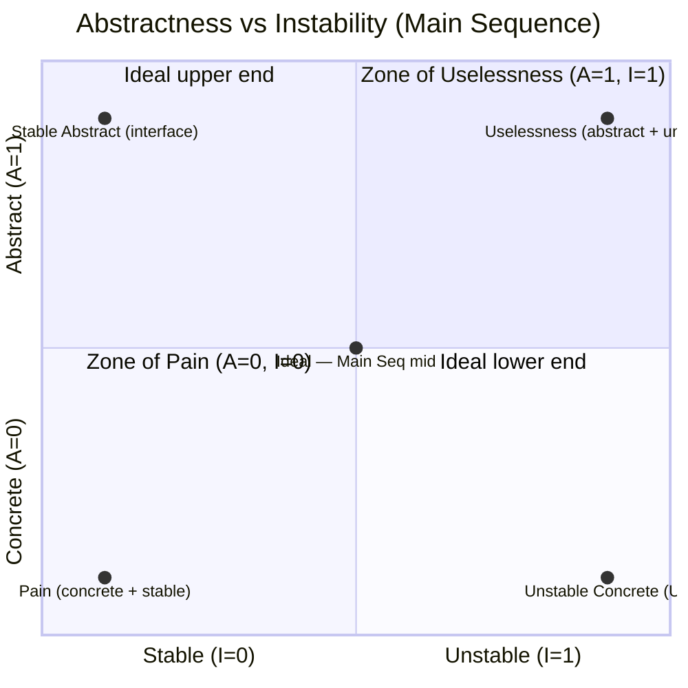
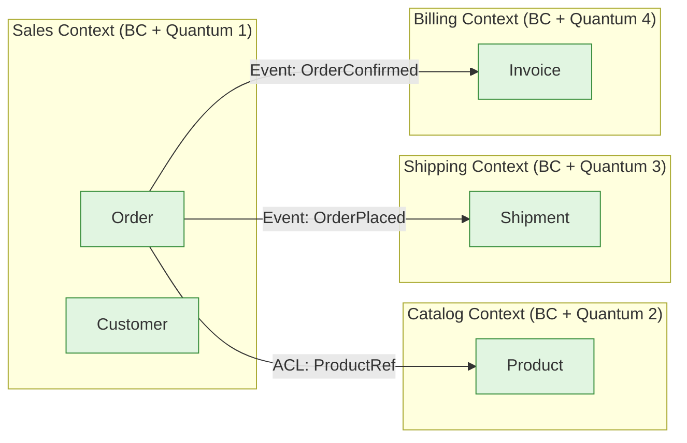
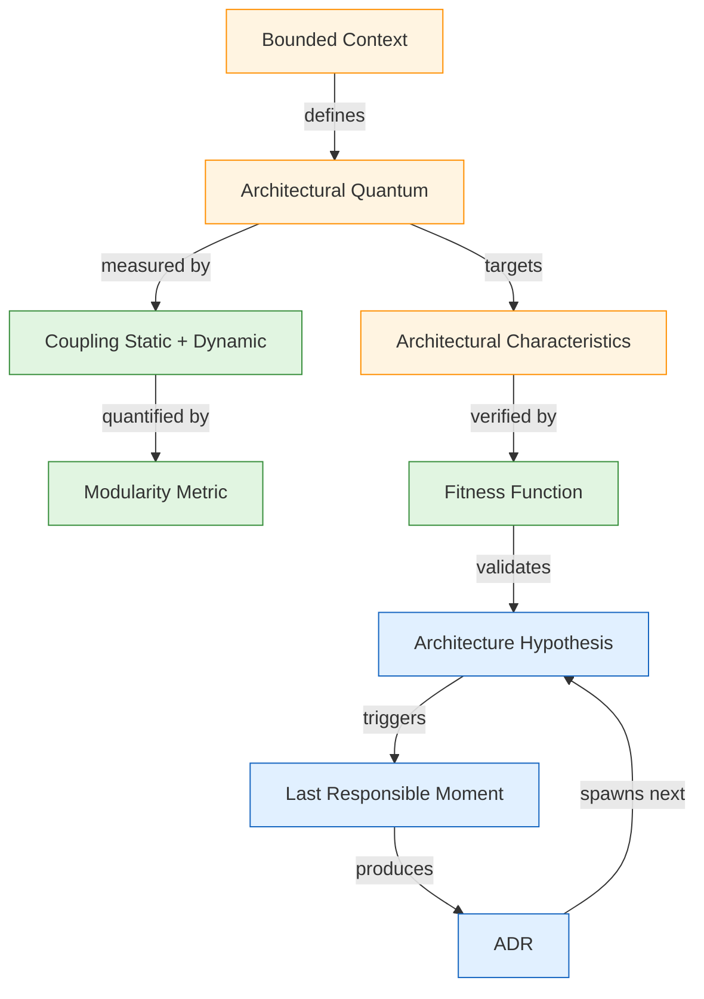

# 진화적 아키텍처 (Evolutionary Architecture)

Neal Ford, Rebecca Parsons, Patrick Kua *Building Evolutionary Architectures: Automated Software Governance* (2nd ed., 2022, O'Reilly) 의 핵심 8 개념. 정적 청사진이 아니라 **시간에 따라 안전하게 진화하는 아키텍처** 를 위한 자동화·측정·거버넌스 원칙.

**원전 참고**:
- Neal Ford, Rebecca Parsons, Patrick Kua — *Building Evolutionary Architectures*, 1st ed. (2017), 2nd ed. (2022)
- Neal Ford — *Fundamentals of Software Architecture* (2020)
- Mark Richards & Neal Ford — *Software Architecture: The Hard Parts* (2021)
- Henderson-Sellers, B. — *Object-Oriented Metrics: Measures of Complexity* (1996, LCOM)
- Robert C. Martin — *Clean Architecture* (Abstractness vs Instability metric)
- Eric Evans — *Domain-Driven Design* (Bounded Context 원전)

**핵심 원칙**:
- **"Guided" change** — 변경 자체는 막을 수 없으니, 측정으로 *유도*
- **Fitness function 우선 정의** — 비기능 요구를 코드로 표현, CI/CD 에 통합
- **Last responsible moment** — 결정을 가능한 한 늦게 (BUT 너무 늦으면 옵션 소실)
- **Architecture as hypothesis** — 청사진이 아니라 검증 대상 가설

**관련 카탈로그**:
- [solid.md](solid.md), [grasp.md](grasp.md) — 코드/클래스 수준 원칙
- [iso25010.md](iso25010.md) — 8 품질 특성 (fitness function 의 측정 대상)
- [12-factor.md](12-factor.md) — 클라우드 운영 12 원칙
- [code-smells.md](code-smells.md) — 진화 저해 신호

---

<a id="1-fitness-function"></a>
## 1. Architectural Fitness Function (아키텍처 적합도 함수)

**정의**: "An architectural fitness function provides an objective integrity assessment of some architectural characteristic(s)." — 한 개 이상의 아키텍처 특성에 대한 *객관적 무결성 평가* 를 제공하는 함수. Genetic Algorithm 의 fitness function 에서 차용된 개념.

**핵심 판단**: 비기능 요구사항(성능·보안·모듈성·결합도 등)을 **코드로 표현 가능한 측정식** 으로 바꿔 CI/CD 파이프라인에서 자동으로 검증. "괜찮은 것 같다" 가 아니라 "측정값 ≤ 임계값" 으로 답한다.

**유형 분류** (Ford et al., 2017):

| 분류 축 | 값 | 설명 |
|---|---|---|
| 범위 (Scope) | Atomic / Holistic | 단일 특성 vs 다중 특성 교차 |
| 빈도 (Cadence) | Triggered / Continual | 이벤트 기반 vs 상시 실행 |
| 결과 (Result) | Static / Dynamic | 고정 임계 vs 동적 임계 |
| 호출 (Invocation) | Automated / Manual | 자동화 vs 수동 |
| 가시성 (Proactivity) | Intentional / Emergent | 사전 정의 vs 운영 중 발견 |
| 적용 범위 (Coverage) | Domain-specific / Generic | 도메인 특화 vs 범용 |

**측정 방법**:
- **Static analysis**: ArchUnit (Java/Kotlin), NetArchTest (.NET), dependency-cruiser (JS/TS), ts-arch (TS), archlinter (Go), import-linter (Python)
- **Runtime metric**: p99 latency 임계, throughput, error budget burn rate
- **Hybrid**: chaos engineering (gameday) + SLO 검증
- **Security gate**: SAST/DAST/SCA 위반 0 건, OWASP ASVS 레벨 검증

**장점**:
- 아키텍처 의도가 *코드로* 남아 회귀 차단
- 새 팀원이 규칙을 *문서가 아닌 빌드 실패* 로 학습
- 진화 가능성의 *수치적 증거*

**한계·주의**:
- Fitness function 자체의 유지보수 비용 — 잘못 쓰면 false positive 폭증
- 측정 대상 선정이 비뚤어지면 (Goodhart's Law: "지표가 목표가 되면 좋은 지표가 아니다") 잘못된 진화 유도
- 도메인 특화 fitness function 은 비싸지만 ROI 가 높음

**실무 예시 — Kotlin / ArchUnit (Static Atomic Triggered)**:

```kotlin
// fitness function: 도메인 계층이 인프라 계층에 의존하지 않는다 (Clean Architecture)
// 위반 시 CI 단계의 architecture-test job 실패 → PR 차단
import com.tngtech.archunit.junit.AnalyzeClasses
import com.tngtech.archunit.junit.ArchTest
import com.tngtech.archunit.lang.ArchRule
import com.tngtech.archunit.lang.syntax.ArchRuleDefinition.noClasses

@AnalyzeClasses(packages = ["com.example.app"])
class CleanArchitectureFitnessTest {
    @ArchTest
    val `domain must not depend on infrastructure`: ArchRule =
        noClasses()
            .that().resideInAPackage("..domain..")
            .should().dependOnClassesThat()
            .resideInAnyPackage("..infrastructure..", "..web..", "..persistence..")
            .because("domain 은 outer ring 을 모른다 (DIP)")

    @ArchTest
    val `controllers should only be called from web layer`: ArchRule =
        noClasses().that().resideInAPackage("..domain..")
            .should().dependOnClassesThat().haveSimpleNameEndingWith("Controller")
}
```

**실무 예시 — TypeScript / dependency-cruiser (Holistic Continual)**:

```javascript
// .dependency-cruiser.cjs — 모놀리스 → 마이크로서비스 추출 시 경계 강제
module.exports = {
  forbidden: [
    { name: 'no-circular',
      severity: 'error',
      from: {},
      to: { circular: true } },
    { name: 'core-no-ui',
      severity: 'error',
      from: { path: '^src/core' },
      to:   { path: '^src/ui' },
      comment: 'core 도메인은 UI 의존 금지' },
    { name: 'feature-no-cross',
      severity: 'error',
      from: { path: '^src/features/([^/]+)' },
      to:   { path: '^src/features/(?!$1)' },
      comment: '피처간 횡단 의존 금지 — quantum 경계 보존' },
  ],
};
```

**실무 예시 — 런타임 Fitness (Dynamic)**:

```kotlin
// Micrometer + Prometheus — p99 latency SLO 검증
@Component
class PerformanceFitness(private val registry: MeterRegistry) {
    fun check(): FitnessResult {
        val p99 = registry.find("http.server.requests")
            .timer()?.takeSnapshot()?.percentileValues()
            ?.firstOrNull { it.percentile() == 0.99 }
            ?.value(TimeUnit.MILLISECONDS) ?: return FitnessResult.UNKNOWN
        // SLO: checkout endpoint p99 ≤ 300ms
        return if (p99 <= 300.0) FitnessResult.PASS
               else FitnessResult.FAIL("p99=${p99}ms > 300ms")
    }
}
```

**관련 항목**:
- [architectural-characteristics](#2-architectural-characteristics) — fitness function 의 측정 대상
- [iso25010.md](iso25010.md) — fitness function 으로 표현되는 8 품질 특성
- [maintainability](iso25010.md#7-maintainability-유지보수성), DORA 4 key metrics

---

<a id="2-architectural-characteristics"></a>
## 2. Architectural Characteristics (아키텍처 특성, "-ilities")

**정의**: "Architectural characteristics meet three criteria: it specifies a non-domain design consideration, it influences some structural aspect of the design, and it is critical or important to application success." — *비도메인* 설계 고려사항이면서, 구조에 영향을 주고, 성공에 결정적인 요소. *what* 이 아니라 *how well*.

**핵심 판단**: 도메인 기능과 직교하는 *비기능 요구* 의 집합. 모두 만족할 수는 없으므로 **상위 7±2** 만 명시적으로 우선순위화 (Ford 2020).

**3 대 분류**:

### 2.1 Operational Characteristics (운영 특성)
운영 중 관찰되는 능력 — DevOps / SRE 가 측정.

| 특성 | 정의 | 대표 지표 |
|---|---|---|
| Availability | 시스템 가동 가능한 시간 비율 | 99.9% / 99.99% / 99.999% |
| Continuity | 재해 복구 능력 | RTO, RPO |
| Performance | 응답 시간 / 처리량 | p99 latency, RPS |
| Scalability | 부하 증가 대응 능력 | 수평/수직 확장 비용 |
| Elasticity | 부하 *spike* 흡수 능력 | auto-scale 응답 시간 |
| Recoverability | 장애 후 복구 능력 | MTTR |
| Reliability | 명세 조건에서 동작 지속 능력 | MTBF |
| Robustness | 비정상 입력 / 부분 장애 견디기 | chaos test 통과율 |
| Security | 권한·기밀성·무결성 | CVSS, MTTP |

### 2.2 Structural Characteristics (구조 특성)
코드 / 설계 시점에 결정되는 능력 — Architect 가 측정.

| 특성 | 정의 | 대표 지표 |
|---|---|---|
| Configurability | 설정으로 동작 변경 가능 | feature flag 수 |
| Extensibility | 확장 지점의 유연성 | OCP 준수율 |
| Installability | 설치·배포 용이성 | IaC 자동화율 |
| Leverageability / Reuse | 자산 재사용 능력 | 공유 라이브러리 사용률 |
| Localization | 다국어·통화·시간대 대응 | i18n 커버리지 |
| Maintainability | 변경 비용 | Cyclomatic Complexity, MI |
| Portability | 환경 이전 능력 | 빌드 재현성, 멀티 OS 빌드 |
| Supportability | 운영 지원 능력 | 로그 / 메트릭 / 트레이스 적재율 |
| Upgradeability | 버전 업그레이드 비용 | dependency drift |

### 2.3 Cross-Cutting Characteristics (횡단 특성)
운영·구조 어느 쪽에도 깔끔히 들어가지 않는 특성.

| 특성 | 정의 | 대표 지표 |
|---|---|---|
| Accessibility | 광범위 사용자 접근 가능 | WCAG 2.1 AA 준수 |
| Archivability | 데이터 장기 보존 능력 | 보존 기간, 압축률 |
| Authentication | 신원 확인 | MFA 적용률 |
| Authorization | 권한 부여 | RBAC/ABAC 정책 정합성 |
| Legal | 규제 준수 | GDPR / PCI-DSS / SOC2 |
| Privacy | 개인정보 보호 | DPIA, 가명화율 |
| Usability | 사용성 | SUS score |

**Performability (성능 가능성)**: Ford 가 신조어로 정의한 합성 특성 — performance × scalability × elasticity 의 3중 균형. 단일 지표로 잡히지 않음.

**측정 방법**: 각 특성은 [fitness function](#1-fitness-function) 으로 코드화. 상위 7개를 정하고 나머지는 *implicit* 으로 둠.

**장점**:
- 비기능 요구를 *명시적으로 협상* 가능하게 만듦
- trade-off 가 시각화됨 (예: availability ↑ → consistency ↓, CAP)
- 진화 방향이 흐려질 때 우선순위 복귀 기준

**한계·주의**:
- **선택 과잉 함정**: 모든 -ility 가 "중요" 하다고 답하면 아무것도 중요하지 않음. 상위 3~5개로 제한
- **암묵적 특성 위험**: usability 같은 횡단 특성을 적지 않으면 무시되기 쉬움
- **측정 부재**: 정의만 있고 fitness function 이 없으면 "vanity ility" — 빈말

**실무 예시 — 우선순위 매트릭스 (도메인별 5순위)**:

```yaml
# architecture-characteristics.yaml — ADR-001 부속
domain: e-commerce-checkout
top_characteristics:
  - name: availability
    target: 99.95%        # error budget = 4.38h/month
    fitness: prom_alert + status_page
  - name: performance
    target: p99 < 300ms   # checkout latency
    fitness: k6_load_test + datadog_apm
  - name: security
    target: OWASP ASVS L2
    fitness: snyk + zap_scan
  - name: scalability
    target: 10k RPS peak
    fitness: load_test_quarterly
  - name: maintainability
    target: cyclomatic < 10, coverage > 80%
    fitness: sonarqube_gate
implicit:                  # 명시 안 했지만 자동 검증
  - portability: docker_buildx
  - configurability: 12-factor
```

**관련 항목**:
- [fitness-function](#1-fitness-function) — 특성을 코드로 검증
- [iso25010.md](iso25010.md) — 표준 8 특성 (Ford 의 -ilities 와 부분 중첩)
- [12-factor.md](12-factor.md) — operational 특성 표준 실천

---

<a id="3-architectural-quanta"></a>
## 3. Architectural Quanta (아키텍처 양자)

**정의**: "An independently deployable artifact with high functional cohesion, high static coupling, and synchronous dynamic coupling." — **독립 배포** 가능하고, **높은 기능 응집도** 를 가지며, **정적 결합** 이 내부에 집중되고, **동기 동적 결합** 으로 묶인 단위.

**핵심 판단**: "아키텍처를 몇 개의 quantum 으로 쪼갤 수 있는가" 가 곧 시스템의 진화 단위. quantum 경계 = 독립 진화 가능 단위 + 독립 fitness function 적용 가능 단위.

**3 가지 결합 조건** (Quantum = 모두 통과):

| 조건 | 정의 | 위반 시 |
|---|---|---|
| Independently Deployable | 다른 단위와 무관하게 배포 가능 | 동시 배포 강제 → 한 quantum |
| High Functional Cohesion | 한 도메인 책임으로 묶임 | 횡단 책임 → 분리 |
| High Static Coupling (within) | 내부 의존성은 안에 | DB 공유 등 외부와 강결합 → 한 quantum |
| Synchronous Dynamic Coupling | 동기 호출은 한 quantum 안에서 | 외부와 동기 호출 → 한 quantum |

> 비동기 (eventual consistency) 통신은 quantum 경계를 *유지* 한다. 동기 RPC + 공유 DB 는 quantum 을 *합친다*.

**아키텍처 스타일별 quantum 수**:

| 스타일 | Quantum 수 | 특징 |
|---|---|---|
| Layered Monolith | 1 | 한 배포 단위, 한 DB |
| Modular Monolith | 1 (논리적으로 N) | 한 배포, 모듈 분리 |
| Service-Based | 소수 (5~10) | macro service, 일부 공유 DB |
| Microservices | N (수십~수백) | 1 service = 1 quantum (이상적) |
| Service Mesh (with shared DB) | 1 | DB 공유로 quantum 합쳐짐 ← 흔한 함정 |
| Event-Driven (async) | N | 비동기로 quantum 독립 유지 |

**측정 방법**:
- 의존성 그래프 분석: `static_quanta = connected_components(static_dep_graph)`
- 동기 호출 그래프: `dynamic_quanta = scc(synchronous_call_graph)` (Tarjan SCC)
- 공유 데이터 검출: DB 스키마 공유 여부, 메시지 큐 topic 공유
- 도구: ArchUnit cycle detection, jdeps, graphviz + custom analysis

**장점**:
- 진화 단위가 명확 → 한 quantum 변경이 다른 quantum 에 영향 안 줌
- fitness function 을 quantum 별로 적용 가능
- 팀 토폴로지 (Skelton & Pais) 의 stream-aligned team 과 1:1 매핑

**한계·주의**:
- **분산 모놀리스 함정**: 마이크로서비스라고 부르지만 공유 DB / 동기 RPC 사슬 → quantum = 1
- **너무 작은 quantum**: 너무 잘게 쪼개면 분산 시스템 복잡도 폭증 (saga, distributed tracing, eventual consistency 비용)
- **데이터 quantum**: Mark Richards 가 *The Hard Parts* 에서 data quantum 개념 도입 — 데이터도 별도 quantum 으로 식별해야 함

**실무 예시 — Quantum 식별 알고리즘**:

```python
# quantum_analyzer.py — 정적/동적 결합 분석으로 quantum 식별
import networkx as nx

def identify_quanta(services: list[Service]) -> list[set[str]]:
    # 1) 정적 결합 그래프: shared DB, shared library
    static = nx.Graph()
    for s in services:
        static.add_node(s.name)
    for a in services:
        for b in services:
            if a != b and (
                a.shares_database_with(b)
                or a.shares_critical_lib_with(b)
            ):
                static.add_edge(a.name, b.name)

    # 2) 동기 호출 그래프: synchronous RPC = quantum 합침
    dynamic = nx.DiGraph()
    for s in services:
        dynamic.add_node(s.name)
        for target in s.synchronous_calls:
            dynamic.add_edge(s.name, target)
    sync_components = list(nx.strongly_connected_components(dynamic))

    # 3) Union — 정적 OR 동기 동적 결합으로 묶이면 한 quantum
    union = nx.Graph()
    union.add_edges_from(static.edges)
    for comp in sync_components:
        if len(comp) > 1:
            nodes = list(comp)
            for i in range(len(nodes)):
                for j in range(i+1, len(nodes)):
                    union.add_edge(nodes[i], nodes[j])

    return [set(c) for c in nx.connected_components(union)] or \
           [{s.name} for s in services]

# 결과 예: [{'order', 'payment-sync'}, {'inventory'}, {'shipping'}]
# → 'order' + 'payment-sync' 는 한 quantum (동기 호출로 묶임)
```

**관련 항목**:
- [coupling-static-dynamic](#4-coupling-static-vs-dynamic) — quantum 의 결합 차원
- [bounded-context-quanta](#6-bounded-context-quanta) — DDD bounded context 와의 관계
- [modularity-metric](#5-modularity-metric) — quantum 응집도 측정

---

<a id="4-coupling-static-vs-dynamic"></a>
## 4. Coupling — Static vs Dynamic (정적 vs 동적 결합)

**정의**: 결합은 *언제 관찰되는가* 에 따라 둘로 나뉜다.
- **Static Coupling**: 코드 / 의존성 / 빌드 시점에 존재 — "A 가 B 의 타입을 import"
- **Dynamic Coupling**: 런타임 호출 / 통신 시점에 존재 — "A 가 B 를 RPC 호출"

**핵심 판단**: 정적 결합 ≠ 동적 결합. 마이크로서비스는 정적 결합은 낮지만 (각자 빌드/배포) 동적 결합은 높을 수 있다 (RPC 사슬). [Architectural Quanta](#3-architectural-quanta) 의 경계는 *두 결합을 모두* 본다.

**Mark Richards 의 결합 7 유형** (*Software Architecture: The Hard Parts*, 2021):

| # | 유형 | 시점 | 정의 |
|---|---|---|---|
| 1 | Code Coupling | Static | 소스 코드 import / inheritance / type reference |
| 2 | Static Coupling | Static | 빌드 시점 의존성 (Maven, npm, go.mod) |
| 3 | Dynamic Coupling | Runtime | 런타임 호출 (REST, gRPC, queue) |
| 4 | Temporal Coupling | Runtime | 시간 순서에 의존 (A 가 끝나야 B 시작) |
| 5 | Communication Coupling | Runtime | 통신 프로토콜 (synchronous vs asynchronous) |
| 6 | Contract Coupling | Static + Runtime | API 계약 (strict schema vs loose) |
| 7 | Semantic Coupling | Runtime | 의미적 의존 (같은 도메인 개념 해석) |

**Static vs Dynamic 매트릭스**:

| | Static 약 | Static 강 |
|---|---|---|
| **Dynamic 약** | Best — 독립 quantum | 모놀리스 |
| **Dynamic 강** | 분산 모놀리스 (worst) | 모놀리스 (이상하지 않음) |

> "분산 모놀리스" = static 으로는 분리됐지만 dynamic 으로 한 덩어리. 마이크로서비스 안티패턴 No.1.

**측정 방법**:

```python
# Static coupling 측정
static_coupling = afferent_coupling(Ca) + efferent_coupling(Ce)
# Ca = 이 모듈을 import 하는 모듈 수, Ce = 이 모듈이 import 하는 모듈 수

# Dynamic coupling 측정 (분산 추적)
dynamic_coupling = count_synchronous_calls_per_minute
# OpenTelemetry trace → service A → B → C 호출 빈도
```

**도구**:
- **Static**: ArchUnit, jdeps, dependency-cruiser, jqassistant, Structure101
- **Dynamic**: OpenTelemetry + Jaeger / Tempo, AWS X-Ray, Datadog APM service map
- **Communication**: protobuf vs JSON Schema vs avro (계약 결합도)

**장점**:
- 두 결합을 분리하면 *진짜 위험* 이 보임 — 분산 모놀리스 검출
- 마이크로서비스 도입 의사결정의 정량 근거
- saga / orchestration 도입 필요성 판단

**한계·주의**:
- 비동기 통신은 dynamic coupling 을 *낮추지만* eventual consistency 비용을 발생시킴
- Contract coupling 을 너무 strict 하게 잡으면 (strict schema) 진화 어려움, 너무 loose 하면 런타임 깨짐
- semantic coupling 은 측정 거의 불가능 — 도메인 모델 공유 정도로만 추정

**실무 예시 — Kotlin / 동기 호출 사슬 식별**:

```kotlin
// dynamic coupling 측정 — Micrometer + custom dimension
@Aspect
class DynamicCouplingAspect(private val registry: MeterRegistry) {
    @Around("@annotation(rpcCall)")
    fun trackOutboundCall(joinPoint: ProceedingJoinPoint, rpcCall: RpcCall): Any? {
        val source = System.getProperty("service.name")
        val target = rpcCall.target
        registry.counter("rpc.outbound",
            "source", source,
            "target", target,
            "sync", rpcCall.synchronous.toString()
        ).increment()
        return joinPoint.proceed()
    }
}
// 결과 → service map: order→payment (sync, 1200/min), order→inventory (sync, 800/min)
// 동기 호출 사슬 → quantum 합쳐짐 → 비동기로 전환하거나 한 service 로 합쳐야 함
```

**실무 예시 — ArchUnit / 정적 결합 한도**:

```kotlin
@ArchTest
val `efferent coupling must be limited`: ArchRule =
    classes().that().resideInAPackage("..service..")
        .should(haveEfferentCouplingLessThan(15))
        .because("한 클래스가 15개 초과 클래스에 의존하면 변경 영향 광범위")

private fun haveEfferentCouplingLessThan(max: Int) =
    object : ArchCondition<JavaClass>("have Ce < $max") {
        override fun check(item: JavaClass, events: ConditionEvents) {
            val ce = item.directDependenciesFromSelf.size
            if (ce >= max) events.add(SimpleConditionEvent.violated(item,
                "${item.name}: Ce=$ce ≥ $max"))
        }
    }
```

**관련 항목**:
- [architectural-quanta](#3-architectural-quanta) — quantum 식별의 입력
- [modularity-metric](#5-modularity-metric) — 결합도 정량화
- [code-smell-shotgun-surgery](code-smells.md#11-shotgun-surgery) — 결합도 과다 신호

---

<a id="5-modularity-metric"></a>
## 5. Modularity Metric (모듈성 측정)

**정의**: 모듈성(modularity)을 정량화하는 지표 집합. 모듈성 = **응집도(cohesion) 높음** + **결합도(coupling) 낮음** + **순환 의존 없음**.

**핵심 판단**: "이 시스템은 모듈성이 좋다" 가 *측정 가능* 해야 진화의 회귀가 잡힌다. 정성적 판단은 시간이 갈수록 무너진다 (Lehman's 2nd Law: software entropy 증가).

**주요 지표**:

### 5.1 응집도 — Henderson-Sellers LCOM4 (Lack of Cohesion of Methods, 1996)

```
LCOM4 = 메서드 그래프의 연결 컴포넌트 수
        (메서드 A, B 가 같은 필드를 쓰면 연결됨)
```

- LCOM4 = 1 → 응집도 높음 (한 책임)
- LCOM4 > 1 → 클래스가 N 개로 쪼개질 수 있음 → SRP 위반 의심

| 변형 | 특징 |
|---|---|
| LCOM1 (Chidamber-Kemerer, 1991) | 메서드 쌍의 공통 필드 부재 카운트 |
| LCOM2 (Henderson-Sellers, 1995) | 정규화 — 0~1 범위 |
| LCOM4 (Hitz-Montazeri, 1995) | 연결 컴포넌트 수 — 가장 직관적 |
| TCC / LCC (Bieman-Kang, 1995) | 메서드 쌍의 직접/전이 응집 비율 |

### 5.2 결합도 — Martin Metrics (*Clean Architecture*)

```
Ca (Afferent Coupling)     = 이 모듈에 들어오는 의존 수 (incoming)
Ce (Efferent Coupling)     = 이 모듈이 나가는 의존 수 (outgoing)
I  (Instability)           = Ce / (Ca + Ce)            범위 0~1
A  (Abstractness)          = 추상 클래스 수 / 전체 클래스 수
D  (Distance from Main Seq) = |A + I − 1|              범위 0~1
```

**The Main Sequence**: `A + I = 1` 선. 이 선에서 멀어지면 (D 가 크면) **고통의 영역(Zone of Pain)** 또는 **무용의 영역(Zone of Uselessness)** 에 빠짐.



### 5.3 순환 의존 — Cycle Detection

```
cycles = strongly_connected_components(package_dep_graph)
        |where size > 1|
```

Tarjan SCC 알고리즘. 순환 의존이 있으면 두 모듈은 **물리적으로 한 quantum** — 따로 빌드/배포 불가.

### 5.4 종합 — Maintainability Index (MI, Microsoft Visual Studio)

```
MI = 171 − 5.2·ln(HV) − 0.23·CC − 16.2·ln(LOC)
   (HV = Halstead Volume, CC = Cyclomatic Complexity)
```

- MI ≥ 85 → 양호
- 65 ≤ MI < 85 → 주의
- MI < 65 → 개선 필요

**측정 도구**:
- **Java/Kotlin**: SonarQube, jqassistant, ck-metrics, structure101
- **C#/.NET**: NDepend, NetArchTest
- **JS/TS**: madge (cycle), dependency-cruiser, ts-arch
- **Python**: radon (CC, MI), pylint, import-linter
- **Go**: gocyclo, go-cleanarch
- **Rust**: cargo-deps, cargo-modules

**장점**:
- 진화의 *수치 회귀* 추적 가능 (sprint 별 LCOM4 추이)
- 리팩터링 우선순위 결정 (Zone of Pain 인 모듈부터)
- 신규 변경의 정량 영향 평가

**한계·주의**:
- **Goodhart's Law**: 지표가 KPI 가 되면 게이밍 발생 (LCOM4 줄이려고 의미 없는 getter 분리)
- **언어별 의미 다름**: Python duck typing 환경에서 abstractness 측정 어색
- **단일 지표 신화 금지**: MI 85 가 만능 아님 — 여러 지표 *교차 검증*
- **임계값은 도메인별**: CC 10 은 일반론, 게임 엔진 / 컴파일러는 더 높게 허용

**실무 예시 — Python radon + import-linter (모듈성 게이트)**:

```python
# tests/architecture/test_modularity.py
import subprocess

def test_cyclomatic_under_10():
    # radon — 메서드별 CC 측정, F-grade(>40) 차단
    result = subprocess.run(
        ["radon", "cc", "src/", "-nF", "-s", "--total-average"],
        capture_output=True, text=True)
    assert "F " not in result.stdout, f"CC F-grade 검출:\n{result.stdout}"

def test_no_circular_imports():
    # import-linter — 순환 의존 차단
    cfg = """
    [importlinter]
    root_packages = myapp
    [importlinter:contract:layers]
    name=Layers
    type=layers
    layers = ui : application : domain : infrastructure
    """
    # ... CI 에서 lint-imports 실행
```

**실무 예시 — LCOM4 계산 (개념)**:

```kotlin
// LCOM4 = 메서드 노드의 connected components
// 같은 필드를 참조하는 메서드끼리 edge
fun lcom4(clazz: KClass<*>): Int {
    val methods = clazz.declaredFunctions
    val fieldUsage: Map<KFunction<*>, Set<String>> =
        methods.associateWith { it.referencedFields() }
    val graph = mutableMapOf<KFunction<*>, MutableSet<KFunction<*>>>()
    methods.forEach { graph[it] = mutableSetOf() }
    for (i in methods.indices) {
        for (j in i+1 until methods.size) {
            if (fieldUsage[methods[i]]!!.intersect(fieldUsage[methods[j]]!!).isNotEmpty()) {
                graph[methods[i]]!!.add(methods[j])
                graph[methods[j]]!!.add(methods[i])
            }
        }
    }
    return countConnectedComponents(graph)
}
// LCOM4 > 1 → 클래스를 여러 개로 쪼갤 수 있음
```

**관련 항목**:
- [coupling-static-dynamic](#4-coupling-static-vs-dynamic) — Ca/Ce 측정 베이스
- [solid.md#1-single-responsibility-principle-srp](solid.md) — LCOM4 가 SRP 검증 지표
- [grasp.md#5-high-cohesion](grasp.md) — 응집도 원리
- [code-smells.md#2-large-class](code-smells.md) — LCOM4 > 1 의 결과물

---

<a id="6-bounded-context-quanta"></a>
## 6. Bounded Context ↔ Architectural Quanta (전략 DDD 와의 연결)

**정의**: Eric Evans 의 **Bounded Context** 는 도메인 모델이 *일관된 의미* 를 갖는 경계. Ford et al. 은 이상적으로 **1 Bounded Context = 1 Architectural Quantum** 이 진화적 아키텍처의 출발점이라고 본다.

**핵심 판단**: 도메인 경계 (Evans) 와 배포·결합 경계 (Ford) 가 *일치* 할 때 진화 비용이 최소. 어긋나면 한 도메인 변경이 여러 quantum 을 흔들거나, 한 quantum 안에 충돌하는 도메인 의미가 공존.

**관계 매트릭스**:

| Bounded Context | Quantum | 결과 | 진단 |
|---|---|---|---|
| 1 BC = 1 Quantum | ✓ | 이상적 | 진화 단위 = 도메인 단위 |
| N BC = 1 Quantum | 모놀리스 | 도메인 충돌 | 추출 후보 식별 |
| 1 BC = N Quantum | 분산 도메인 | 일관성 비용 | quantum 통합 또는 BC 재분할 |
| N BC = N Quantum (mismatched) | 의미 누수 | Anti-Corruption Layer 필요 | 경계 재정렬 |

**Context Map 7 패턴** (Evans, 2003):
1. **Partnership** — 두 BC 팀이 협력
2. **Shared Kernel** — 공유 모델 (위험 — quantum 합쳐짐)
3. **Customer-Supplier** — 상하 관계
4. **Conformist** — 하류가 상류 모델 그대로 수용
5. **Anticorruption Layer (ACL)** — 변환 계층
6. **Open Host Service (OHS)** — 공개 프로토콜
7. **Published Language** — 공통 언어

**측정 방법**:
- **Event Storming** (Alberto Brandolini) → BC 식별
- **Domain message flow** → context map 도출
- **Shared concept analysis** → BC 간 공유 개념 검출
- 도구: ContextMapper DSL, Domain Storytelling

**장점**:
- 도메인 진화와 코드 진화가 동기화
- 팀 토폴로지 (Conway's Law) 자연 정렬: 1 stream-aligned team = 1 BC = 1 quantum
- 마이크로서비스 도입 시 *경계 결정* 의 객관적 기준

**한계·주의**:
- **BC 식별 자체가 어려움** — 도메인 전문가 협업 필요, 사전 분석으론 부족
- **Premature decomposition** — 도메인을 모르고 BC 부터 그리면 잘못된 경계 → 재구성 비용 큼
- **Shared Kernel 함정** — "공통 모델" 이라 부르며 quantum 을 합쳐버림
- **현실 시스템은 1:1 부정확** — 데이터 quantum (Mark Richards) 이 BC 와 별도로 존재

**실무 예시 — Context Map → Quantum 매핑**:



→ 4 BC = 4 quantum. ACL 과 비동기 이벤트로 quantum 독립 유지.

**실무 예시 — Anti-Corruption Layer (Kotlin)**:

```kotlin
// 외부 Catalog quantum 의 Product 모델 → Sales quantum 의 ProductRef 로 변환
// Sales 가 Catalog 의 모델 변경에 영향받지 않게 격리
package sales.acl

class CatalogAntiCorruptionLayer(private val catalog: CatalogClient) {
    suspend fun fetchProductRef(productId: ProductId): ProductRef =
        catalog.findProduct(productId).let { external ->
            ProductRef(                       // Sales 도메인 언어로 변환
                id = ProductId(external.sku),
                displayName = external.title,
                unitPrice = Money.of(external.priceMinor, external.currency)
                // external.weightKg, external.barcode 등은 Sales 가 모름
            )
        }
}
// Catalog quantum 의 모델이 진화해도 Sales quantum 은 ACL 만 수정 → 격리됨
```

**관련 항목**:
- [architectural-quanta](#3-architectural-quanta) — quantum 의 도메인 측면
- [grasp.md](grasp.md) — Information Expert, Pure Fabrication 으로 BC 내부 책임 할당
- [solid.md](solid.md) — DIP 로 ACL 의존 방향 설계

---

<a id="7-last-responsible-moment"></a>
## 7. Last Responsible Moment (마지막 책임 순간)

**정의**: Mary Poppendieck (Lean Software Development, 2003) 에서 차용 — "Make decisions at the last responsible moment, where postponing the decision would result in significant cost or loss of options." — 결정을 *미루는 비용 < 결정 비용* 인 마지막 순간까지 결정을 *유보*.

**핵심 판단**: 진화적 아키텍처는 *결정 자체를 줄이는* 게 아니라 *결정 시점을 늦추는* 전략. 너무 일찍 결정하면 정보 부족, 너무 늦게 결정하면 옵션 소실.

**판단 프레임 — 결정 비용 곡선**:

```
결정 비용
   ↑
   |        결정 비용 ↑↑↑
   |       /
   |      /      옵션 소실
   |     /          ↓↓↓
   |____/_______________→ 시간
        ↑
   Last Responsible Moment (LRM)
   = "지금 결정 안 하면 옵션이 사라지거나, 결정 비용이 급증하는 직전"
```

**Real Options 이론** (Chris Matts):
- 옵션은 *가치* 가 있다 (financial option 처럼)
- 결정 = 옵션 행사 = 가치 소실
- 정보가 부족할 때 결정 = 옵션을 헐값에 행사
- **결정을 가능한 한 늦춰 옵션 유지** + **결정을 *해야 할 때* 결정**

**의사결정 분류** (Adrian Cockcroft):

| 분류 | 정의 | 결정 시점 |
|---|---|---|
| Type 1 (one-way door) | 되돌릴 수 없음 | 신중하게, 가능한 늦게 |
| Type 2 (two-way door) | 되돌릴 수 있음 | 빠르게, 실험적으로 |

**LRM 을 알아채는 신호**:
- 다음 sprint 에 *반드시* 필요해짐 → LRM 임박
- 결정 부재로 *blocker* 발생 → LRM 지남 (이미 늦음)
- 정보가 새로 들어옴 → LRM 재조정 가능

**측정 방법**:
- **Architecture Decision Records (ADR, Michael Nygard)** — 결정 시점 / 컨텍스트 / 대안 / 결과 기록
- **Decision Inventory** — 미결정 항목 추적
- **Information Threshold** — "X 정보가 들어오면 결정" 트리거 명시

**장점**:
- 잘못된 사전 결정으로 인한 redo 비용 제거
- 변화하는 요구에 *적응 가능*
- 결정의 정보 기반 강화

**한계·주의**:
- **Last Possible Moment 와 다름** — "가능한 마지막" 이 아니라 "*책임* 있는 마지막". 무한 유보는 분석 마비
- **암묵적 결정** — 결정 안 하면 *default 가 자동 결정됨*. 인지 못하면 LRM 이 지나도 모름
- **외부 의존성 결정** — 클라우드 / 라이브러리 선택은 lock-in 발생 후 되돌리기 어려움 → Type 1
- **결정 회피 변명 금지** — "LRM" 을 핑계로 *해야 할 때* 안 하면 그건 LRM 위반

**실무 예시 — ADR 템플릿 (Michael Nygard)**:

```markdown
# ADR-007: 결제 게이트웨이 선택

## Status
Accepted — 2024-03-15 (LRM: launch -8 weeks)

## Context
- Sprint 12 까지: 결제는 mock 으로 진행 (Type 2 결정 — 쉽게 교체 가능)
- Sprint 12 시점: 카드 결제 통합 차단됨 → 더 미루면 출시 지연
- 정보 확보: Stripe / Toss / KG 이니시스 비용·문서·SLA 비교 완료
- Type 분류: Type 1 (계약 + 보안 인증 + 코드 통합 비용 큼)

## Decision
Stripe 채택.

## Consequences
- 긍정: 글로벌 확장 용이, 문서 우수, fitness function 로 통합 검증 가능
- 부정: 한국 PG 대비 수수료 1.5% 높음 → 2년 후 재평가 ADR-XXX
- LRM 분석: 더 미뤘다면 launch -4 weeks 에 결정 → 통합 검증 시간 부족

## Alternatives Considered
- Stripe: ✓ 채택
- Toss: 국내 한정 (글로벌 확장 시 재선정 비용)
- 자체 PG 통합: 보안 인증 6개월 — LRM 한참 초과
```

**실무 예시 — 결정 인벤토리 (자동 트리거)**:

```python
# decision-inventory.py — 미결정 항목 + LRM 트리거
decisions = [
    {"id": "DEC-042", "topic": "DB 선택 (Postgres vs DynamoDB)",
     "trigger": "expected_load > 10k_rps OR launch_minus_weeks <= 6",
     "default_if_undecided": "Postgres",
     "type": 1,                                # one-way (마이그레이션 비싸)
     "status": "open"},
    {"id": "DEC-043", "topic": "Feature flag 도구",
     "trigger": "feature_flag_count > 20",
     "default_if_undecided": "LaunchDarkly trial",
     "type": 2,                                # two-way (교체 가능)
     "status": "open"},
]

def check_lrm(metrics: dict) -> list[str]:
    triggered = []
    for d in decisions:
        if d["status"] == "open" and eval_trigger(d["trigger"], metrics):
            triggered.append(f"{d['id']}: LRM reached — decide now")
    return triggered
```

**관련 항목**:
- [architecture-as-hypothesis](#8-architecture-as-hypothesis) — LRM 결정도 가설로 검증
- [fitness-function](#1-fitness-function) — 결정 후 검증 자동화
- [12-factor.md](12-factor.md) — 설정 외부화로 결정 유보 가능 영역 확대

---

<a id="8-architecture-as-hypothesis"></a>
## 8. Architecture as a Hypothesis (가설로서의 아키텍처)

**정의**: "Architects must shift their thinking from architecture as something static, completed once and then maintained, to architecture as a hypothesis, proven by engineering practices, fitness functions, and metrics." — 아키텍처는 *청사진* 이 아니라 *검증 대상 가설*. 시간이 흐르며 측정으로 *반증 또는 강화* 된다.

**핵심 판단**: Ford 의 책 핵심 주장. 전통 아키텍처는 "결정 후 유지" — 진화적 아키텍처는 "결정 = 가설 + 측정 = 검증 + 갱신". 과학적 방법을 아키텍처에 적용.

**Hypothesis-Driven Development (HDD) 의 아키텍처 적용**:

```
1. Observation       — "checkout latency 가 증가 추세"
2. Hypothesis        — "DB N+1 query 가 원인"
3. Prediction        — "JOIN 으로 묶으면 p99 -40%"
4. Experiment        — feature flag 로 10% traffic 노출
5. Measurement       — fitness function 으로 p99 비교
6. Conclusion        — 가설 채택 / 기각 / 수정
7. Iterate           — 새 observation 으로 다음 가설
```

**5 단계 진화 메커니즘**:

| 단계 | 활동 | 산출물 |
|---|---|---|
| Hypothesize | 변경의 가설 명시 | ADR + 예상 fitness 변화 |
| Build | 작은 단위 구현 | feature flag 보호된 변경 |
| Measure | fitness function 실행 | metric delta |
| Learn | 결과 해석 | 채택 / 기각 / 부분 채택 |
| Decide | 다음 가설 또는 종료 | 다음 ADR or 종료 ADR |

**적용 영역**:

| 영역 | 가설 예시 | fitness function |
|---|---|---|
| 성능 | "Redis 캐싱으로 p99 < 200ms" | p99 < 200ms (k6 test) |
| 확장성 | "kafka 분리로 5k RPS 처리" | RPS test pass |
| 모듈성 | "domain → infrastructure 의존 제거" | ArchUnit rule pass |
| 보안 | "JWT → mTLS 전환으로 0-trust" | OWASP ZAP zero high |
| 비용 | "spot instance 로 30% 절감" | cost dashboard < target |

**측정 방법**:
- **Fitness function 비교 (before/after)** — 가설 채택 기준
- **A/B test + Canary** — production 검증
- **Synthetic monitoring** — 가설 검증용 합성 트래픽
- **Chaos experiment** — Steady State Hypothesis (PCI: Principles of Chaos Engineering)

**Chaos Engineering 의 Steady State Hypothesis** (Netflix):
1. **Steady state 정의** — 정상 운영 지표 (예: 99% RPS pass)
2. **Hypothesis** — "X 장애가 발생해도 steady state 유지"
3. **Inject fault** — Chaos Monkey / Gremlin
4. **Verify** — 지표가 유지되는가
5. **Improve** — 깨지면 회복성 강화

**장점**:
- 결정의 *책임소재* 명확 — 가설 출처가 기록됨
- 아키텍처 회의가 *데이터 기반* 으로 변환
- 잘못된 결정의 *빠른 검출* 과 *빠른 롤백*
- 진화 비용의 *예측 가능성*

**한계·주의**:
- **모든 결정이 검증 가능하진 않음** — 정성적 결정 (개발자 경험, 학습 곡선) 은 측정 어려움
- **단기 측정 오류** — 짧은 기간 측정은 noise. 통계적 유의성 확보 필요
- **Confirmation bias** — 가설을 뒷받침하는 데이터만 보는 경향 → 사전에 *기각 조건* 명시
- **가설 인플레이션** — 모든 변경을 가설로 만들면 의식 과부하 → Type 1 결정에만 적용

**실무 예시 — Hypothesis-Driven ADR**:

```markdown
# ADR-019: 주문 조회 캐시 도입 (Hypothesis)

## Hypothesis
- **Claim**: Redis 캐시 도입 시 `/orders/:id` p99 < 100ms (현재 380ms)
- **Confidence**: 70% (유사 endpoint 에서 70% 캐시 hit)
- **Falsifiability**: 캐시 hit rate < 50% OR p99 > 200ms → 기각

## Experiment Plan
- Stage 1: 5% traffic, feature flag `order_cache_v1`
- Duration: 7일 (peak + off-peak 포함)
- Metrics: cache_hit_rate, p50/p99, redis_memory, db_qps

## Fitness Function
```yaml
fitness:
  - metric: p99_latency
    target: < 100ms
    measured_via: prometheus_histogram
    breaks_build_if: > 200ms
  - metric: cache_hit_rate
    target: > 70%
    breaks_build_if: < 50%
```

## Outcome (post-experiment, 2024-04-08)
- p99: 380ms → 78ms ✓ (cache_hit_rate 73%)
- redis memory: 1.2GB (예상 1GB — 약간 초과, 허용)
- **Verdict**: 가설 채택 → 100% rollout (ADR-020 으로 결정)
```

**실무 예시 — Kotlin Chaos Hypothesis**:

```kotlin
// Litmus chaos experiment + steady state verification
@ChaosExperiment("payment-service-pod-kill")
class PaymentChaosTest {
    @Hypothesis("payment service 1 pod 죽어도 99% 요청 성공")
    fun steadyStateUnderPodFailure(): SteadyStateResult {
        val baseline = metrics.successRate("payment.charge", window = "5m")
        chaos.killRandomPod("payment-service")
        Thread.sleep(60_000)  // 회복 관찰 시간
        val under = metrics.successRate("payment.charge", window = "1m")
        return SteadyStateResult(
            held = under > 0.99,
            baseline = baseline,
            observed = under,
            // 깨지면 → bulkhead / circuit breaker 강화 후 재실험
        )
    }
}
```

**관련 항목**:
- [fitness-function](#1-fitness-function) — 가설 검증 도구
- [last-responsible-moment](#7-last-responsible-moment) — 가설 시점 결정
- [iso25010.md](iso25010.md) — 가설의 측정 대상 = 8 품질 특성
- Postmortem culture (SRE), Steady State Hypothesis (Principles of Chaos)

---

## 8 개념 종합 매트릭스

| 개념 | 입력 | 출력 | 자동화 가능 | 측정 도구 |
|---|---|---|---|---|
| Fitness Function | 비기능 요구 | pass/fail | ★★★★★ | ArchUnit, k6, OWASP ZAP |
| Architectural Characteristics | 비즈니스 우선순위 | top 7±2 -ility | ★★★☆☆ | ADR + fitness mapping |
| Architectural Quanta | 의존성 그래프 | 진화 단위 N개 | ★★★★☆ | jdeps, dependency-cruiser |
| Coupling (Static / Dynamic) | 코드 + 런타임 트레이스 | Ca/Ce + service map | ★★★★☆ | OpenTelemetry, ArchUnit |
| Modularity Metric | 코드 | LCOM4, A, I, MI | ★★★★★ | SonarQube, radon |
| Bounded Context ↔ Quanta | 도메인 분석 | Context Map | ★★☆☆☆ | ContextMapper, Event Storming |
| Last Responsible Moment | 미결정 목록 + 트리거 | ADR | ★★★☆☆ | Decision Inventory |
| Architecture as Hypothesis | 가설 + 측정 | 채택/기각 | ★★★★☆ | Feature flag + A/B + fitness |



---

## 진화 거버넌스 적용 체크리스트

진화적 아키텍처 도입 시 점진 적용:

| 단계 | 활동 | 가시 효과 |
|---|---|---|
| 1 | Top 5 -ility 명시 (ADR-001) | 우선순위 합의 |
| 2 | 각 -ility 의 fitness function 1개 (ArchUnit + load test) | 회귀 차단 시작 |
| 3 | CI 에 fitness gate 통합 | PR 단계 검증 |
| 4 | Coupling/Modularity 지표 대시보드 (SonarQube) | 진화 가시화 |
| 5 | Architectural Quanta 식별 | 진화 단위 합의 |
| 6 | Bounded Context map 작성 | 도메인 ↔ 코드 정렬 |
| 7 | ADR 프로세스 도입 (LRM + Type 1/2) | 결정 추적 |
| 8 | Hypothesis-Driven ADR 도입 | 데이터 기반 결정 |
| 9 | Chaos engineering (steady state) | 가설 → 검증 자동화 |
| 10 | Postmortem → fitness function 추가 | 회귀 학습 루프 |

---

## 표준 인용

- Neal Ford, Rebecca Parsons, Patrick Kua — *Building Evolutionary Architectures: Automated Software Governance*, 2nd ed. (O'Reilly, 2022)
- Neal Ford — *Fundamentals of Software Architecture* (O'Reilly, 2020)
- Mark Richards, Neal Ford — *Software Architecture: The Hard Parts* (O'Reilly, 2021)
- Henderson-Sellers, B. — *Object-Oriented Metrics: Measures of Complexity* (Prentice Hall, 1996)
- Robert C. Martin — *Clean Architecture* (Prentice Hall, 2017), Component metrics (A, I, D)
- Eric Evans — *Domain-Driven Design* (Addison-Wesley, 2003)
- Vaughn Vernon — *Implementing Domain-Driven Design* (Addison-Wesley, 2013)
- Mary & Tom Poppendieck — *Lean Software Development* (Addison-Wesley, 2003) — Last Responsible Moment
- Chris Matts, Olav Maassen — *Commitment* (2013) — Real Options
- Michael Nygard — "Documenting Architecture Decisions" (2011) — ADR
- *Principles of Chaos Engineering* — https://principlesofchaos.org/ — Steady State Hypothesis
- Mel Conway — "How Do Committees Invent?" (1968) — Conway's Law
- Matthew Skelton, Manuel Pais — *Team Topologies* (IT Revolution, 2019)
- Chidamber, S.R., Kemerer, C.F. — "A Metrics Suite for Object Oriented Design" (IEEE TSE, 1994) — LCOM1
- Hitz, M., Montazeri, B. — "Measuring Coupling and Cohesion In Object-Oriented Systems" (1995) — LCOM4
