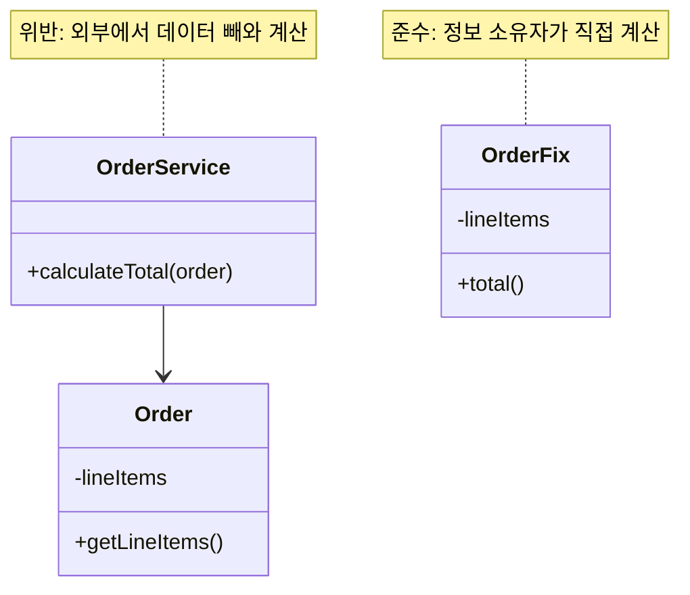
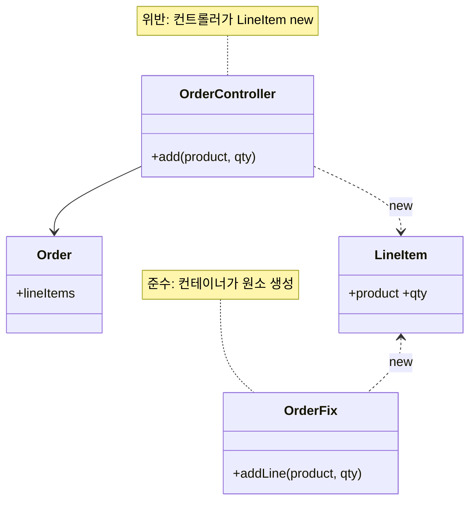
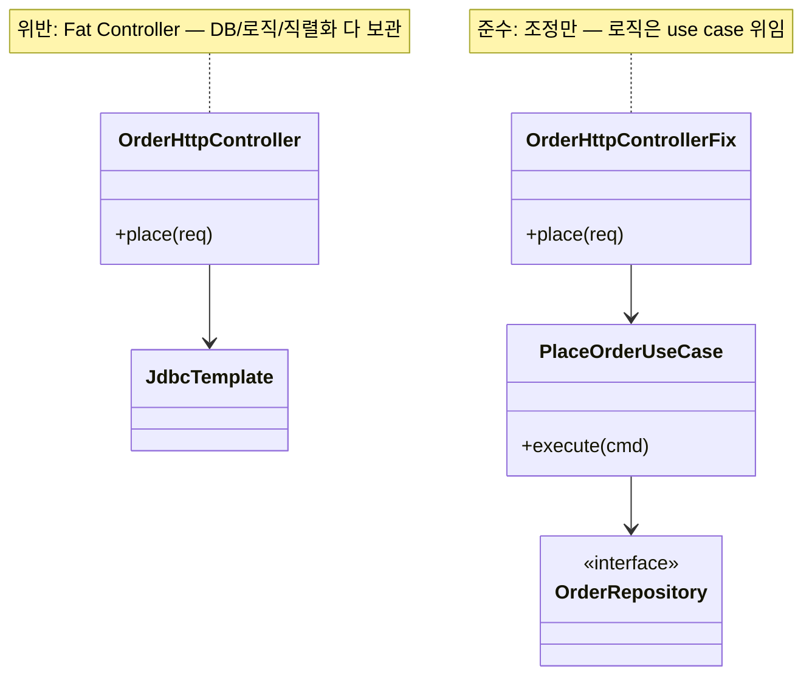
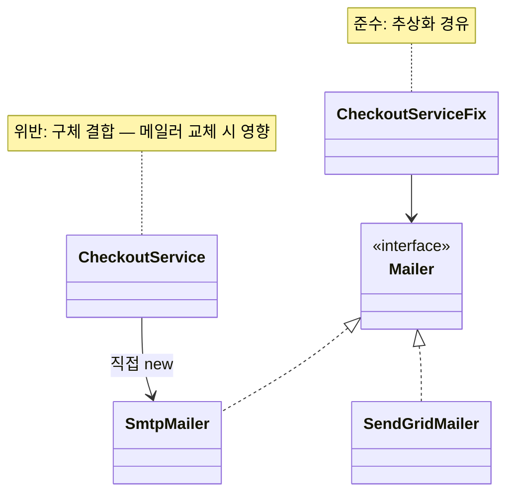
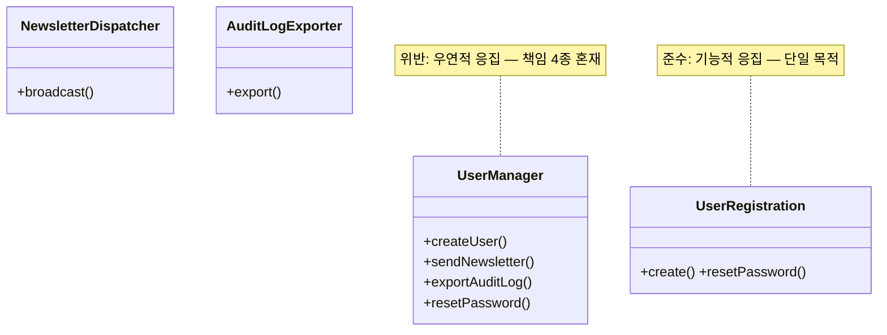
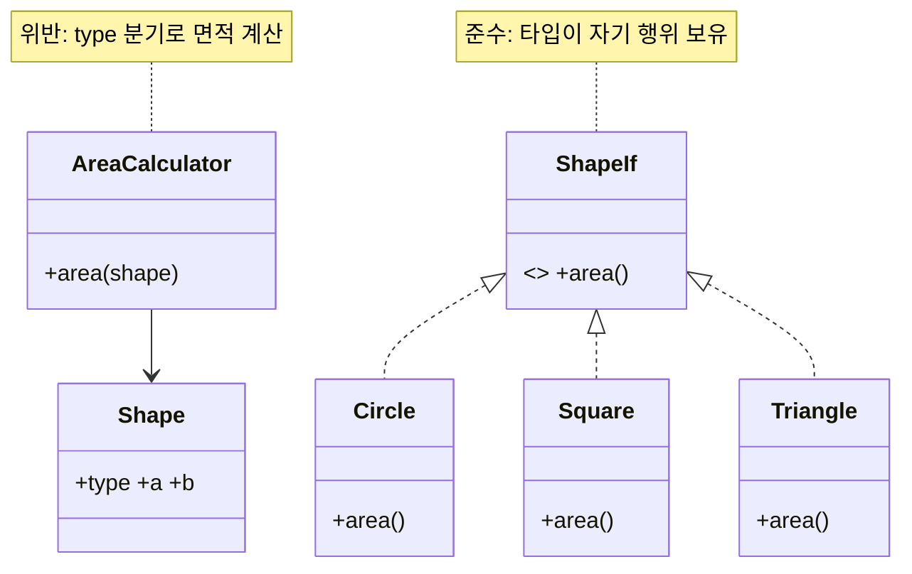
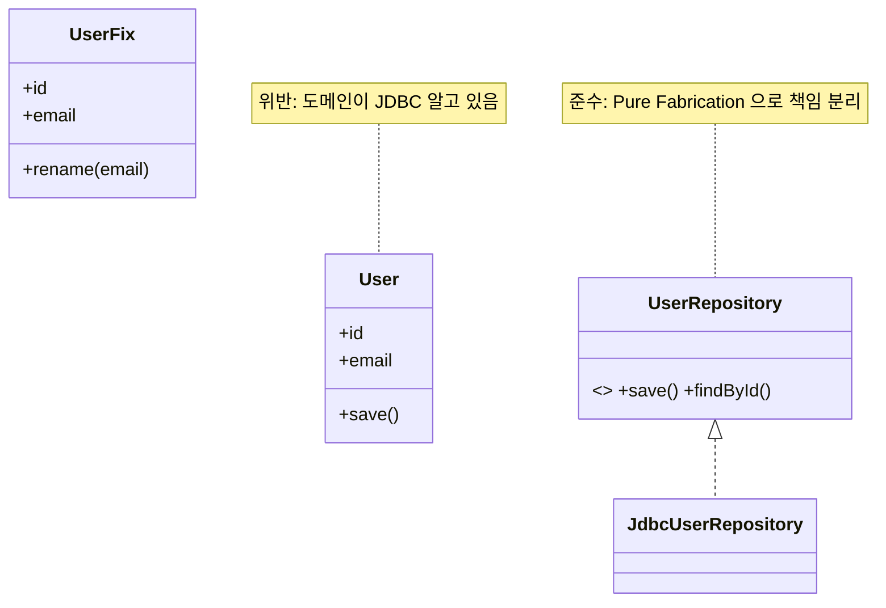
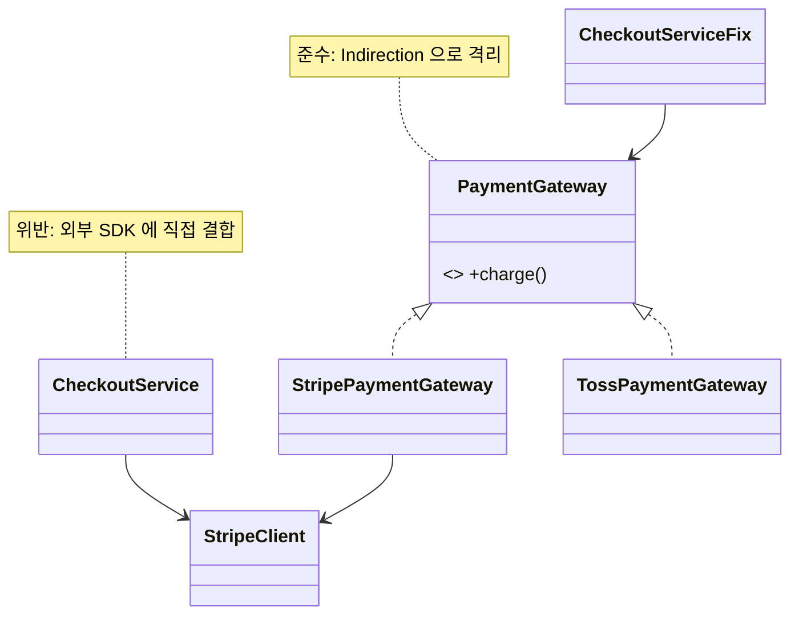
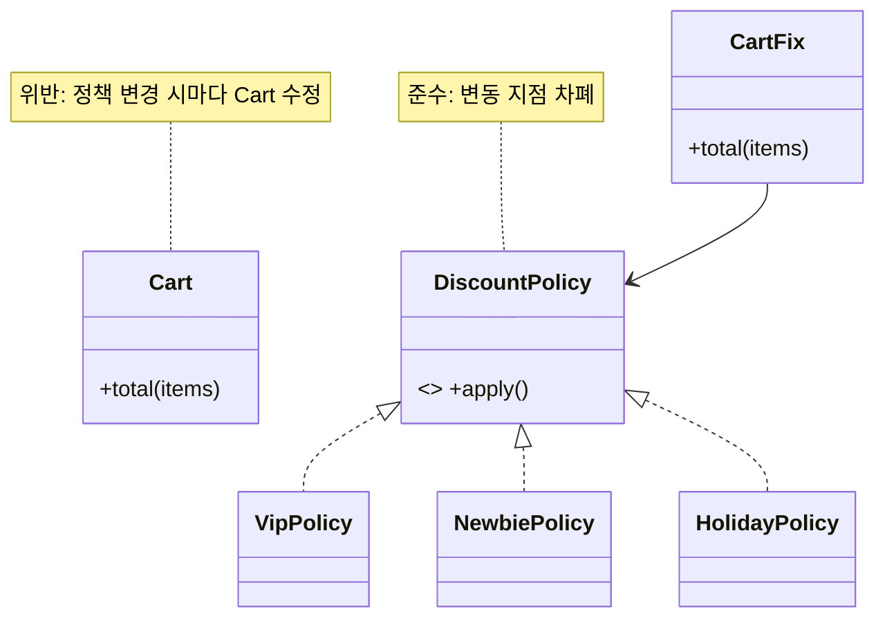

# GRASP 원칙

Craig Larman 이 *Applying UML and Patterns* 3rd ed. (2004) 에서 정리한 **객체에 책임을 할당하는 9 원칙** (General Responsibility Assignment Software Patterns). "어떤 객체가 어떤 책임을 가져야 하는가?" 라는 OOAD 의 근본 질문을 9 개의 표준 답변으로 정리. SOLID 가 *클래스 설계 후의 형태* 를 다룬다면 GRASP 는 *클래스에 책임을 배치하는 단계* 를 다룬다.

**원전**:
- Craig Larman, *Applying UML and Patterns: An Introduction to Object-Oriented Analysis and Design and Iterative Development*, 3rd ed. (2004), Chapter 17, 22
- Larry Constantine, Edward Yourdon, *Structured Design* (1979) — Coupling / Cohesion 원전 (Larman 인용)

---

<a id="1-information-expert"></a>
## 1. Information Expert (정보 전문가)

**정의**: "Assign a responsibility to the class that has the information needed to fulfill it." — 책임 수행에 필요한 *정보를 가진* 클래스에 책임을 할당하라.

**핵심 판단**: 데이터를 가진 객체가 그 데이터에 대한 행동도 함께 가진다. 외부에서 getter 로 데이터를 빼와 가공하는 대신 데이터 소유자가 직접 처리.

**특징**:
- "Tell, Don't Ask" 원리의 직접 적용
- 캡슐화 강화 — 데이터와 행위가 같은 클래스에 모임
- 시스템 전체에 일관되게 적용되어 책임 분산 효과 발생
- 새 책임을 배치할 첫 후보 — 다른 원칙은 이게 부적절할 때 적용

**장점**:
- 캡슐화 / 정보 은닉 자연 달성
- 객체간 메시지 전달 최소화 → 결합도 하락
- 책임 위치를 추론하기 쉬워 유지보수 용이

**단점/주의**:
- 도메인 객체가 영속성 / UI / 외부 통신 같은 *비도메인 책임* 까지 떠안으면 SRP 위반
- 이 경우 [Pure Fabrication](#7-pure-fabrication) 으로 도피

**위반 사례**:
- `OrderService.calculateTotal(order)` 가 `order.getLines().forEach { ... }` 로 외부에서 합계 계산
- 도메인 객체는 getter 만 노출하는 anemic domain model

**적용 사례**:
- `Order.getTotal()` 이 자신의 `lineItems` 합계를 직접 반환
- `Customer.isEligibleForDiscount()` 이 자신의 이력 기준으로 판단
- DDD 의 Entity / Value Object 메서드

**난이도**: 낮음 | **사용 빈도**: ★★★★★

```kotlin
// 위반: 외부에서 데이터를 빼와 계산 (anemic model)
class Order(val lineItems: List<LineItem>)
class OrderService {
    fun calculateTotal(order: Order): Money =
        order.lineItems.fold(Money.ZERO) { acc, it -> acc + it.subtotal() }
}

// 준수: 데이터 소유자가 책임 수행
class Order(private val lineItems: List<LineItem>) {
    // 자신의 line 합계는 자신이 안다 — Information Expert
    fun total(): Money =
        lineItems.fold(Money.ZERO) { acc, it -> acc + it.subtotal() }
}
```



**관련 원칙 / 패턴**:
- [srp](solid.md#1-single-responsibility-principle-srp-단일-책임-원칙), [high-cohesion](#5-high-cohesion)
- [code-smell-feature-envy](code-smells.md#19-feature-envy), [code-smell-data-class](code-smells.md#16-data-class)
- DDD Entity, Tell-Don't-Ask, [Strategy](../patterns/behavioral.md)

---

## 2. Creator (생성자)

**정의**: "Assign class B the responsibility to create an instance of class A if one or more of the following is true: B contains/aggregates A, B records A, B closely uses A, B has the initializing data for A." — B 가 A 를 포함·집계·기록·긴밀히 사용·초기화 데이터를 가질 때 B 에게 A 생성 책임을 부여.

**핵심 판단**: 생성자(creator)는 객체간 결합도를 결정한다. *이미 결합된 클래스* 가 생성도 담당하면 새로운 결합이 추가되지 않는다.

**특징**:
- "누가 new 하는가" 를 설계적으로 결정
- 컨테이너 / 집합체가 원소를 생성하는 패턴이 자연 발생
- Factory 패턴의 기본 직관 — Factory 는 Creator 가 너무 복잡할 때의 대안

**장점**:
- 생성 책임으로 인한 신규 결합 차단
- 객체 생명주기를 응집된 위치에서 관리
- 의존 그래프 단순화

**단점/주의**:
- 생성 로직이 복잡 (외부 자원·다중 의존)하면 Creator 가 과부하 → Factory 분리
- 영속성 reconstitution 은 Creator 가 아니라 Repository 책임

**위반 사례**:
- `OrderController` 가 `LineItem` 까지 직접 `new` (Order 가 컨테이너인데 통과)
- 무관한 클래스가 단순 편의로 다른 도메인 객체를 `new`

**적용 사례**:
- `Order.addLine(product, qty)` 가 내부에서 `LineItem` 생성
- `Document.createParagraph()` 컨테이너가 원소 생성
- Aggregate Root 가 자기 하위 entity 생성

**난이도**: 낮음 | **사용 빈도**: ★★★★☆

```kotlin
// 위반: 외부 컨트롤러가 LineItem 직접 생성 → 결합 폭증
class OrderController(private val order: Order) {
    fun add(product: Product, qty: Int) {
        // Controller 가 LineItem 구조까지 알게 됨
        order.lineItems.add(LineItem(product, qty))
    }
}

// 준수: 컨테이너(Order) 가 원소(LineItem) 생성 — Creator
class Order(private val _lines: MutableList<LineItem> = mutableListOf()) {
    val lines: List<LineItem> get() = _lines

    // Order 가 LineItem 을 집계하므로 생성 책임도 가짐
    fun addLine(product: Product, qty: Int) {
        _lines += LineItem(product, qty)
    }
}
```



**관련 원칙 / 패턴**:
- [low-coupling](#4-low-coupling), [information-expert](#1-information-expert)
- [code-smell-inappropriate-intimacy](code-smells.md#20-inappropriate-intimacy)
- Factory Method, Abstract Factory, [Builder](../patterns/creational.md)

---

## 3. Controller (컨트롤러)

**정의**: "Assign the responsibility for handling a system event to a class representing the overall 'system', a 'root object', a device the software runs within, or a major subsystem (façade controller); or to a class representing a use case scenario (use-case controller)."

**핵심 판단**: UI 이벤트 / 외부 요청을 받는 *첫 도메인 객체* 를 명확히 한다. Controller 는 *조정자* 이지 *비즈니스 로직 보관소* 가 아니다 — 두꺼워지면 [Bloated Controller](code-smells.md#2-large-class) 안티패턴.

**특징**:
- Facade Controller (시스템 / 루트 단위) vs Use-Case Controller (시나리오 단위)
- UI ↔ 도메인 사이의 단일 진입점
- 트랜잭션 / 인증 같은 횡단 관심사 위치로 자주 사용

**장점**:
- 입력 채널이 바뀌어도 (REST → CLI → gRPC) 도메인 보호
- Use case 단위 추적 / 로깅 / 권한 검사 일원화
- 도메인 모델이 UI 프레임워크에 결합되지 않음

**단점/주의**:
- 모든 use case 를 한 Controller 에 몰면 비대해짐 → Use-Case Controller 로 분할
- Controller 가 직접 로직 수행하면 [Anemic Domain Model](code-smells.md#16-data-class) + Transaction Script 안티패턴

**위반 사례**:
- HTTP handler 가 비즈니스 로직 + DB 쿼리 + 응답 직렬화 모두 작성 (Fat Controller)
- 도메인 객체가 `HttpServletRequest` / `HttpResponse` 같은 UI 타입에 의존

**적용 사례**:
- Spring `@RestController` 가 Use Case 서비스 위임
- Hexagonal Architecture 의 Inbound Adapter
- MVC 의 Controller 계층

**난이도**: 중간 | **사용 빈도**: ★★★★★

```kotlin
// 위반: Fat Controller — 비즈니스 로직까지 보관
@RestController
class OrderHttpController(private val db: JdbcTemplate) {
    @PostMapping("/orders")
    fun place(@RequestBody req: PlaceOrderReq): ResponseEntity<*> {
        // DB / 로직 / 직렬화 다 들어있음
        val customer = db.queryForObject("...", req.customerId)
        if (customer.balance < req.total) return ResponseEntity.badRequest().build()
        db.update("INSERT INTO orders ...")
        return ResponseEntity.ok(mapOf("id" to req.id))
    }
}

// 준수: Controller 는 조정만, Use Case 가 로직 보관 — Controller 원칙
@RestController
class OrderHttpController(private val placeOrder: PlaceOrderUseCase) {
    @PostMapping("/orders")
    fun place(@RequestBody req: PlaceOrderReq): ResponseEntity<OrderView> =
        // 입력 변환 → use case 위임 → 출력 변환만 담당
        ResponseEntity.ok(OrderView.from(placeOrder.execute(req.toCommand())))
}
```



**관련 원칙 / 패턴**:
- [srp](solid.md#1-single-responsibility-principle-srp-단일-책임-원칙), [low-coupling](#4-low-coupling)
- [code-smell-large-class](code-smells.md#2-large-class), [code-smell-long-method](code-smells.md#1-long-method)
- MVC, Hexagonal Inbound Adapter, [Facade](../patterns/structural.md), [Command](../patterns/behavioral.md)

---

<a id="4-low-coupling"></a>
## 4. Low Coupling (낮은 결합도)

**정의**: "Assign responsibilities so that (unnecessary) coupling remains low. Use this principle to evaluate alternatives." — 책임 할당 시 *불필요한* 결합을 최소화하라.

**핵심 판단**: 결합도는 *변경 파급 반경* 으로 측정한다. A 의 변경이 B 의 수정을 강제하면 A ↔ B 가 결합되어 있다. 결합을 *완전히* 없앨 수는 없고 *불필요한* 결합만 제거.

**특징**:
- 결합 유형: 내용 / 공통 / 외부 / 제어 / 스탬프 / 데이터 결합 (Yourdon-Constantine)
- 추상화를 통해 결합의 *방향* 을 뒤집을 수 있음 → [DIP](solid.md#5-dependency-inversion-principle-dip-의존-역전-원칙)
- "평가 원칙" — 두 대안 중 하나를 선택할 때의 기준

**장점**:
- 변경 영향 국소화
- 단위 테스트 격리 가능
- 컴포넌트 재사용성 향상
- 병렬 개발 가능 (모듈 간 인터페이스만 합의)

**단점/주의**:
- 무리한 디커플링은 [Speculative Generality](code-smells.md#18-speculative-generality) / [Middle Man](code-smells.md#22-middle-man) 유발
- 결합 자체가 나쁜 게 아니라 *불필요한* 결합이 나쁘다 — 도메인 응집이 강한 두 객체는 결합되어 있어야 자연스러움

**위반 사례**:
- 도메인 객체가 Spring `ApplicationContext` 직접 참조
- UI 컴포넌트가 ORM Entity 직접 import
- 클래스가 9 개의 협력자를 직접 생성 (생성 결합)

**적용 사례**:
- Repository 인터페이스로 영속성 결합 차단
- 이벤트 발행 / 구독으로 모듈간 직접 호출 제거
- DTO 경유로 계층간 결합 차단

**난이도**: 중간 | **사용 빈도**: ★★★★★

```kotlin
// 위반: 구체 클래스에 직접 결합 → 변경 파급 큼
class CheckoutService {
    private val mailer = SmtpMailer(host = "smtp.acme.com", port = 587)
    fun confirm(order: Order) {
        // SmtpMailer 가 SendGridMailer 로 바뀌면 여기 수정
        mailer.send(order.customer.email, "Order confirmed")
    }
}

// 준수: 추상화 경유 — Low Coupling
interface Mailer { fun send(to: String, body: String) }

class CheckoutService(private val mailer: Mailer) {
    // 구체 메일러 교체에 영향 안 받음
    fun confirm(order: Order) = mailer.send(order.customer.email, "Order confirmed")
}
```



**관련 원칙 / 패턴**:
- [dip](solid.md#5-dependency-inversion-principle-dip-의존-역전-원칙), [isp](solid.md#4-interface-segregation-principle-isp-인터페이스-분리-원칙), [protected-variations](#9-protected-variations)
- [code-smell-feature-envy](code-smells.md#19-feature-envy), [code-smell-inappropriate-intimacy](code-smells.md#20-inappropriate-intimacy), [code-smell-message-chains](code-smells.md#21-message-chains)
- [Mediator](../patterns/behavioral.md), [Observer](../patterns/behavioral.md), [Facade](../patterns/structural.md)

---

<a id="5-high-cohesion"></a>
## 5. High Cohesion (높은 응집도)

**정의**: "Assign responsibilities so that cohesion remains high. Use this to evaluate alternatives." — 책임 할당 시 응집도가 높게 유지되도록 하라.

**핵심 판단**: 응집도는 *클래스 내부 요소가 한 목적을 위해 얼마나 함께 일하는가* 의 정도. 낮은 응집은 *섞여 있는 책임* 의 신호 — 클래스 분해 신호.

**특징**:
- 응집 유형 (강도 순): 기능적 > 순차적 > 통신적 > 절차적 > 시간적 > 논리적 > 우연적
- [SRP](solid.md#1-single-responsibility-principle-srp-단일-책임-원칙) 와 표리 관계 — SRP 가 *원인* 이면 High Cohesion 이 *결과 측정*
- 모듈 / 패키지 / 함수 단위 모두 적용

**장점**:
- 한 책임에 집중된 클래스는 *이해 / 테스트 / 재사용* 모두 쉬움
- 변경 이유가 단일 — 회귀 위험 낮음
- 이름 짓기 쉬워짐 (이름이 안 잡히면 응집이 낮은 신호)

**단점/주의**:
- 극단적 응집은 [Lazy Class](code-smells.md#15-lazy-class) 폭증
- 절차적 응집을 기능적 응집으로 격상하려고 무리한 추상화하면 [Speculative Generality](code-smells.md#18-speculative-generality) 발생

**위반 사례**:
- `UtilHelper` / `Common` / `Misc` 같이 *연관 없는 함수* 가 모인 클래스 (논리적 응집)
- 시스템 시작 시 한 번에 호출되는 함수만 모은 `Initializer` (시간적 응집)

**적용 사례**:
- 도메인 Aggregate — 한 트랜잭션 경계 안의 객체만 모음
- Bounded Context — 한 도메인 언어로만 말하는 모듈
- 한 use case 만 처리하는 Application Service

**난이도**: 중간 | **사용 빈도**: ★★★★★

```kotlin
// 위반: 우연적 응집 — 관련 없는 책임이 한 클래스에
class UserManager(private val db: Database) {
    fun createUser(email: String) { /* ... */ }
    fun sendNewsletter(content: String) { /* 모든 사용자에게 발송 */ }
    fun exportAuditLog(path: Path) { /* 감사 로그 CSV 출력 */ }
    fun resetPassword(userId: Long) { /* ... */ }
}

// 준수: 기능적 응집 — 각 클래스가 한 목적만 수행
class UserRegistration(private val users: UserRepository) {
    fun create(email: String): UserId = users.save(User.of(email)).id
    fun resetPassword(userId: UserId) { /* ... */ }
}
class NewsletterDispatcher(private val mailer: Mailer, private val users: UserRepository) {
    fun broadcast(content: String) { users.all().forEach { mailer.send(it.email, content) } }
}
class AuditLogExporter(private val log: AuditLog) {
    fun export(path: Path) { /* ... */ }
}
```



**관련 원칙 / 패턴**:
- [srp](solid.md#1-single-responsibility-principle-srp-단일-책임-원칙), [information-expert](#1-information-expert)
- [code-smell-large-class](code-smells.md#2-large-class), [code-smell-long-method](code-smells.md#1-long-method), [code-smell-divergent-change](code-smells.md#10-divergent-change)
- DDD Aggregate, Bounded Context, [Facade](../patterns/structural.md)

---

<a id="6-polymorphism"></a>
## 6. Polymorphism (다형성)

**정의**: "When related alternatives or behaviors vary by type (class), assign the responsibility for the behavior — using polymorphic operations — to the types for which the behavior varies."

**핵심 판단**: *타입에 따라 행위가 달라지는* 분기를 `if-else` / `switch` 대신 *다형 메서드* 로 표현. 새 타입이 추가될 때 기존 분기를 건드리지 않게.

**특징**:
- [OCP](solid.md#2-openclosed-principle-ocp-개방-폐쇄-원칙) 의 GRASP 측 대응
- 동적 다형성 (virtual call) + 정적 다형성 (제네릭 / 함수 오버로드) 모두 포함
- 타입 분기가 *반복적* 으로 나타나면 적용 신호

**장점**:
- 새 타입 추가 시 기존 코드 무변경 (Open for extension)
- 분기 로직 제거 → 가독성 향상
- 테스트가 타입별로 격리

**단점/주의**:
- 타입 수가 *고정* 되어 있고 변경 없을 것이 확실하면 다형성은 과한 비용
- [LSP](solid.md#3-liskov-substitution-principle-lsp-리스코프-치환-원칙) 위반된 다형성은 더 위험 — 치환 가능성 보장 필수

**위반 사례**:
- `switch (shape.type)` 으로 도형별 면적 계산
- `if (user instanceof Admin) ...` 타입 캐스팅 분기
- 결제 수단별 `if-else` 체인

**적용 사례**:
- Strategy 패턴 (결제 / 정렬 / 압축 알고리즘)
- Visitor 패턴 (AST 순회)
- 컬렉션의 `Iterator<T>` 다형 순회

**난이도**: 중간 | **사용 빈도**: ★★★★☆

```kotlin
// 위반: 타입 분기로 행위 결정
enum class ShapeType { CIRCLE, SQUARE, TRIANGLE }
data class Shape(val type: ShapeType, val a: Double, val b: Double)

fun area(s: Shape): Double = when (s.type) {
    ShapeType.CIRCLE -> Math.PI * s.a * s.a
    ShapeType.SQUARE -> s.a * s.a
    // 새 도형 추가될 때마다 이 함수 수정
    ShapeType.TRIANGLE -> 0.5 * s.a * s.b
}

// 준수: 다형 메서드 — 타입이 자기 행위를 안다
sealed interface Shape { fun area(): Double }
class Circle(val r: Double) : Shape { override fun area() = Math.PI * r * r }
class Square(val side: Double) : Shape { override fun area() = side * side }
class Triangle(val b: Double, val h: Double) : Shape { override fun area() = 0.5 * b * h }
// 새 도형 추가 — 기존 코드 무변경
```



**관련 원칙 / 패턴**:
- [ocp](solid.md#2-openclosed-principle-ocp-개방-폐쇄-원칙), [lsp](solid.md#3-liskov-substitution-principle-lsp-리스코프-치환-원칙), [protected-variations](#9-protected-variations)
- [code-smell-switch-statements](code-smells.md#7-switch-statements), [code-smell-shotgun-surgery](code-smells.md#11-shotgun-surgery)
- [Strategy](../patterns/behavioral.md), [Visitor](../patterns/behavioral.md), Template Method, [State](../patterns/behavioral.md)

---

<a id="7-pure-fabrication"></a>
## 7. Pure Fabrication (순수 가공물)

**정의**: "Assign a highly cohesive set of responsibilities to an artificial or convenience class that does not represent a problem domain concept — something made up, to support high cohesion, low coupling, and reuse."

**핵심 판단**: 도메인 객체에 책임을 주면 응집이 떨어지거나 결합이 늘어날 때, *도메인에 존재하지 않는* 인공 클래스를 만들어 책임을 위임.

**특징**:
- "Information Expert" 가 도메인 객체로는 부적합할 때의 도피처
- DDD 의 Domain Service, Repository, Factory 가 모두 Pure Fabrication
- 도메인 모델의 순수성 보호

**장점**:
- 도메인 객체에 영속성 / 외부 통신 / 알고리즘 책임 불순물 차단
- 인공 클래스는 자유롭게 분해 / 재사용 가능
- 도메인 모델은 도메인 언어만 사용

**단점/주의**:
- 무분별한 Pure Fabrication 은 [Anemic Domain Model](code-smells.md#16-data-class) 유발 — 도메인 객체에 둘 만한 행위까지 빼앗으면 안 됨
- 인공 클래스 이름이 도메인을 *반영* 해야지 단순 `XxxManager` / `XxxHelper` 로 흐르면 응집 저하

**위반 사례**:
- 도메인 객체 `User` 가 자기 자신을 DB 에 저장 (`user.save()`) — JPA Active Record 안티패턴
- 도메인 객체가 직접 HTTP 호출 / 파일 IO

**적용 사례**:
- `UserRepository` (도메인엔 없는 영속화 추상)
- `PasswordHasher` (도메인엔 없는 알고리즘 보관소)
- `EmailDispatcher` / `Translator`

**난이도**: 중간 | **사용 빈도**: ★★★★☆

```kotlin
// 위반: 도메인 객체가 영속성 책임까지 보유 (Active Record)
class User(val id: Long, val email: String) {
    fun save() {
        // 도메인이 JDBC 를 알고 있음 — 응집 저하 + 결합 증가
        DriverManager.getConnection("...").use { /* INSERT ... */ }
    }
}

// 준수: Repository 라는 Pure Fabrication 에 책임 위임
class User(val id: UserId, val email: Email) {
    // 도메인 행위만 보유
    fun rename(newEmail: Email) = User(id, newEmail)
}
interface UserRepository {
    fun save(user: User): User
    fun findById(id: UserId): User?
}
// JdbcUserRepository / JpaUserRepository 등은 인프라 계층
```



**관련 원칙 / 패턴**:
- [dip](solid.md#5-dependency-inversion-principle-dip-의존-역전-원칙), [srp](solid.md#1-single-responsibility-principle-srp-단일-책임-원칙), [high-cohesion](#5-high-cohesion)
- [code-smell-data-class](code-smells.md#16-data-class), [code-smell-inappropriate-intimacy](code-smells.md#20-inappropriate-intimacy)
- Repository, Domain Service, [Factory](../patterns/creational.md), [Adapter](../patterns/structural.md)

---

<a id="8-indirection"></a>
## 8. Indirection (간접화)

**정의**: "Assign the responsibility to an intermediate object to mediate between other components or services so that they are not directly coupled."

**핵심 판단**: 두 객체 / 시스템을 *중간 객체* 가 매개. 둘이 서로의 변경을 모르게.

**특징**:
- 모든 SW 문제는 한 단계의 *간접화* 로 해결할 수 있다 — David Wheeler 격언
- [Pure Fabrication](#7-pure-fabrication) 의 특수 사례 — 매개 목적
- Adapter / Proxy / Facade / Bridge / Mediator 패턴의 공통 토대

**장점**:
- 두 측의 독립적 진화 가능
- 외부 시스템 / 레거시 / 변동성 격리
- 횡단 관심사 (로깅 / 캐싱 / 보안) 삽입 위치 확보

**단점/주의**:
- 과도한 간접화 = [Middle Man](code-smells.md#22-middle-man) / 성능 비용 / 추적 어려움
- "한 단계" 가 핵심 — 다단계 간접화는 [Message Chains](code-smells.md#21-message-chains) 로 흐름

**위반 사례**:
- 도메인이 외부 결제 SDK 의 구체 타입에 직접 의존
- 두 모듈이 서로의 내부 자료구조를 직접 참조

**적용 사례**:
- Hexagonal Port (도메인 ↔ 외부 시스템 매개)
- Anti-Corruption Layer (레거시 격리)
- API Gateway / BFF

**난이도**: 중간 | **사용 빈도**: ★★★★☆

```kotlin
// 위반: 도메인이 외부 SDK 타입에 직접 결합
class CheckoutService(private val stripe: com.stripe.StripeClient) {
    fun charge(order: Order) {
        // Stripe SDK 가 Toss / PayPal 로 바뀌면 도메인 코드 수정
        stripe.charges().create(mapOf("amount" to order.totalCents()))
    }
}

// 준수: Indirection 으로 외부 시스템 격리
interface PaymentGateway { fun charge(amount: Money): PaymentId }

class StripePaymentGateway(private val stripe: com.stripe.StripeClient) : PaymentGateway {
    // 외부 SDK 변환은 어댑터가 흡수
    override fun charge(amount: Money) =
        PaymentId(stripe.charges().create(mapOf("amount" to amount.cents)).id)
}
class CheckoutService(private val gateway: PaymentGateway) {
    fun charge(order: Order) = gateway.charge(order.total())
}
```



**관련 원칙 / 패턴**:
- [dip](solid.md#5-dependency-inversion-principle-dip-의존-역전-원칙), [low-coupling](#4-low-coupling), [pure-fabrication](#7-pure-fabrication)
- [code-smell-middle-man](code-smells.md#22-middle-man), [code-smell-message-chains](code-smells.md#21-message-chains)
- [Adapter](../patterns/structural.md), [Proxy](../patterns/structural.md), [Facade](../patterns/structural.md), [Mediator](../patterns/behavioral.md), Anti-Corruption Layer

---

<a id="9-protected-variations"></a>
## 9. Protected Variations (변경 보호)

**정의**: "Identify points of predicted variation or instability; assign responsibilities to create a stable interface around them."

**핵심 판단**: *예상되는 변동 지점* 을 식별하고 그 주위에 *안정 인터페이스* 를 둬서 변화가 인터페이스 너머로 새지 않게.

**특징**:
- GRASP 9 중 *가장 일반화된* 원칙 — 다른 원칙들의 모자 역할
- [OCP](solid.md#2-openclosed-principle-ocp-개방-폐쇄-원칙) 의 일반화 — OCP 는 "확장에 열림" 인 반면 PV 는 "모든 종류의 변동 차폐"
- David Parnas 의 *Information Hiding* (1972) 의 GRASP 식 재명명

**장점**:
- 변동 영향이 인터페이스 안쪽에 갇힘
- 외부 API / 레거시 / 정책 변화 흡수
- 시스템 전체 수명 연장

**단점/주의**:
- *모든 곳* 에 안정 인터페이스를 두면 [Speculative Generality](code-smells.md#18-speculative-generality) 와 비용 폭증
- 변동 *예측* 이 핵심 — 도메인 통찰 / 과거 변경 이력 / 외부 의존도 기준으로 선별
- 안정 인터페이스 자체가 자주 깨지면 PV 가 무효화됨 (Hyrum's Law)

**위반 사례**:
- 자주 바뀌는 외부 API 응답 스키마를 도메인 객체로 직접 사용
- 변동 큰 비즈니스 규칙을 코드에 hardcode (할인율 / 세율 / 정책)

**적용 사례**:
- 정책 / 규칙 엔진 (할인 규칙 / 검증 규칙)
- 데이터베이스 / 메시지 큐 / 외부 SaaS 어댑터
- 다국어 / 통화 / 시간대 처리
- Feature Flag / 설정 외부화

**난이도**: 높음 | **사용 빈도**: ★★★★☆

```kotlin
// 위반: 자주 바뀌는 할인 규칙을 코드에 hardcode
class Cart {
    fun total(items: List<LineItem>): Money {
        val sub = items.sumOf { it.subtotal() }
        // VIP 25%, 신규 10%, 시즌 15% — 정책 바뀔 때마다 Cart 수정
        return when {
            customer.isVip -> sub * 0.75
            customer.isNew -> sub * 0.90
            isHolidaySeason() -> sub * 0.85
            else -> sub
        }
    }
}

// 준수: 변동 지점을 DiscountPolicy 인터페이스로 차폐 — Protected Variations
interface DiscountPolicy { fun apply(customer: Customer, subtotal: Money): Money }

class Cart(private val policy: DiscountPolicy) {
    fun total(items: List<LineItem>): Money {
        val sub = items.sumOf { it.subtotal() }
        // 정책 변경은 DiscountPolicy 구현체 교체로 흡수
        return policy.apply(customer, sub)
    }
}
class VipPolicy : DiscountPolicy { override fun apply(c: Customer, s: Money) = s * 0.75 }
class HolidayPolicy : DiscountPolicy { override fun apply(c: Customer, s: Money) = s * 0.85 }
```



**관련 원칙 / 패턴**:
- [ocp](solid.md#2-openclosed-principle-ocp-개방-폐쇄-원칙), [dip](solid.md#5-dependency-inversion-principle-dip-의존-역전-원칙), [polymorphism](#6-polymorphism), [indirection](#8-indirection)
- [code-smell-shotgun-surgery](code-smells.md#11-shotgun-surgery), [code-smell-divergent-change](code-smells.md#10-divergent-change), [code-smell-switch-statements](code-smells.md#7-switch-statements)
- Information Hiding (Parnas), [Strategy](../patterns/behavioral.md), [Adapter](../patterns/structural.md), [Facade](../patterns/structural.md), Plugin

---

## 표준 인용

- Craig Larman, *Applying UML and Patterns: An Introduction to Object-Oriented Analysis and Design and Iterative Development*, 3rd ed. (2004), Chapter 17, 22
- Robert C. Martin, *Clean Architecture* (2017) — GRASP 와 SOLID 의 관계
- Larry Constantine, Edward Yourdon, *Structured Design* (1979) — Coupling/Cohesion 원전 (Larman 인용)
