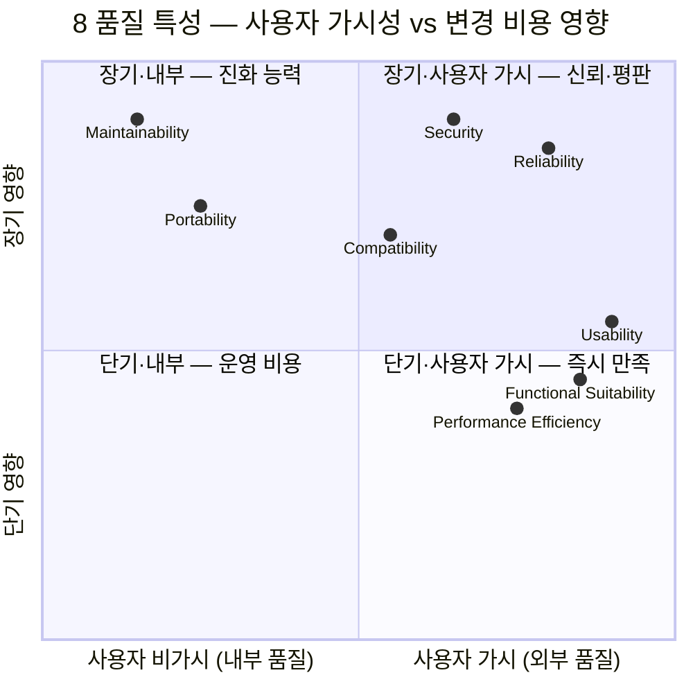
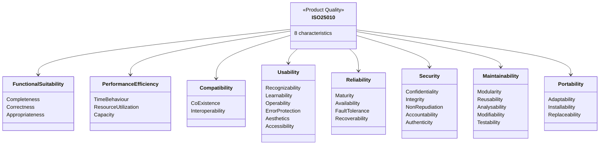

# ISO/IEC 25010 — 시스템 및 소프트웨어 품질 모델

ISO/IEC 25010:2011 (SQuaRE — Systems and software Quality Requirements and Evaluation) 에서 정의한 **소프트웨어 제품 품질 8 특성**. 각 특성은 다시 sub-characteristics 로 분해되며, ISO/IEC 25023:2016 이 측정 지표를 제공한다.

**원전**:
- ISO/IEC 25010:2011, *Systems and software engineering — Systems and software Quality Requirements and Evaluation (SQuaRE) — System and software quality models*
- ISO/IEC 25023:2016, *Measurement of system and software product quality*

ISO 25010 은 **사용 품질 (Quality in Use) — 5 특성** 과 **제품 품질 (Product Quality) — 8 특성** 으로 나뉜다. 본 문서는 제품 품질 8 특성을 다룬다.

---

## 1. Functional Suitability (기능 적합성)

**정의**: "Degree to which a product or system provides functions that meet stated and implied needs when used under specified conditions." — 명시·암묵적 요구사항을 충족하는 기능을 제공하는 정도.

**핵심 판단**: 요구사항 명세에 정의된 기능을 *빠짐없이*, *정확하게*, *문제 영역에 맞게* 제공하는가. 8 특성 중 가장 근본적 — 기능이 없으면 다른 품질도 무의미.

**Sub-특성**:
- **Functional Completeness (기능 완전성)**: 명세된 모든 task / 사용자 목표를 커버
- **Functional Correctness (기능 정확성)**: 요구된 정밀도로 올바른 결과 제공
- **Functional Appropriateness (기능 적절성)**: task 달성을 촉진하는 적절한 기능 제공

**측정 지표 예시**:
- 요구사항 커버리지: 구현된 요구사항 수 / 명세된 요구사항 수
- 기능 결함 밀도: defects per KLOC (1000 lines of code)
- 정확성: 정확한 결과 / 전체 테스트 케이스
- User Story 완료율 (sprint 단위)

**장점**: 비즈니스 가치 직결, 사용자 만족의 1차 조건
**약점**: 기능에만 집중하면 비기능 품질 (성능·보안·유지보수) 희생 가능

**검증 방법**: 요구사항 추적 매트릭스 (RTM), 인수 테스트 (UAT), 계약 테스트 (Pact / Spring Cloud Contract), behavior-driven testing (Cucumber / SpecFlow), boundary value analysis

**난이도**: 낮음~중간 | **사용 빈도**: ★★★★★

```python
# Functional Suitability — 계약 테스트 (Consumer-Driven Contract)
# 소비자(Consumer)가 기대하는 응답 계약을 명시하고 제공자(Provider)가 검증
import pact
pact = Consumer('OrderService').has_pact_with(Provider('PaymentService'))
(pact
 .given('결제 카드가 유효함')         # 사전 조건
 .upon_receiving('결제 요청')          # 트리거
 .with_request('POST', '/pay', body={'amount': 100})
 .will_respond_with(200, body={'status': 'OK'}))  # 기대 응답
# 요구사항 완전성·정확성을 자동 검증 → CI 에서 회귀 차단
```

**관련 원칙 / 패턴**: [patterns/integration.md](../patterns/integration.md) (계약 테스트), [grasp.md#1-information-expert](grasp.md#1-information-expert), TDD / BDD

---

## 2. Performance Efficiency (성능 효율성)

**정의**: "Performance relative to the amount of resources used under stated conditions." — 명시된 조건 하에서 사용된 자원 대비 성능.

**핵심 판단**: 응답 시간·처리량·자원 소비가 SLA 와 capacity plan 을 만족하는가. *충분히 빠른지* 가 아니라 *명시된 목표 대비 효율적인지*.

**Sub-특성**:
- **Time Behaviour (시간 효율성)**: 응답 / 처리 시간, throughput 이 요구 만족
- **Resource Utilization (자원 효율성)**: CPU / 메모리 / 디스크 / 네트워크 사용량이 요구 만족
- **Capacity (용량)**: 최대 처리 한계 (동시 사용자, 데이터 크기 등) 가 요구 만족

**측정 지표 예시**:
- p50 / p95 / p99 응답 시간 (latency)
- RPS / TPS (requests per second)
- CPU 사용률, 메모리 RSS, GC pause time
- Apdex score (Application Performance Index)
- Throughput per dollar (클라우드 비용 효율)

**장점**: 사용자 경험·인프라 비용 직결, 확장성 기반
**약점**: 과도한 최적화는 가독성 / 유지보수성 저하 (premature optimization)

**검증 방법**: load test (k6 / JMeter / Gatling), stress test, soak test, profiling (pprof / VisualVM / Chrome DevTools), APM (Datadog / New Relic), flame graph 분석

**난이도**: 중간~높음 | **사용 빈도**: ★★★★☆

```go
// Performance Efficiency — Redis 캐싱으로 시간 효율성 확보
// DB 조회를 캐시 hit 으로 우회 → p99 latency 80% 절감
func (s *UserService) Get(id string) (*User, error) {
    // 1) 캐시 조회 (TTL 5분)
    if u, err := s.cache.Get(ctx, "user:"+id); err == nil {
        return u, nil
    }
    // 2) miss 시 DB fallback + 캐시 채움
    u, err := s.db.FindUser(id)
    if err != nil { return nil, err }
    s.cache.Set(ctx, "user:"+id, u, 5*time.Minute)
    return u, nil
}
```

**관련 원칙 / 패턴**: [patterns/caching.md](../patterns/caching.md), [algorithms/](../algorithms/) (Big-O 최적화), CDN, connection pool, lazy loading

---

## 3. Compatibility (호환성)

**정의**: "Degree to which a product, system or component can exchange information with other products, systems or components, and/or perform its required functions while sharing the same hardware or software environment." — 같은 환경을 공유하거나 다른 시스템과 정보를 교환하면서 요구 기능을 수행하는 정도.

**핵심 판단**: 공존(co-existence) 가능한가, 외부 시스템과 상호운용(interoperate) 되는가. API / 프로토콜 / 데이터 포맷 / 버전 호환이 핵심.

**Sub-특성**:
- **Co-existence (공존성)**: 같은 하드웨어/소프트웨어 환경에서 자원 충돌 없이 동작
- **Interoperability (상호운용성)**: 다른 시스템과 데이터 교환·기능 협력

**측정 지표 예시**:
- 지원 OS / 브라우저 / 런타임 버전 수
- API 하위호환성: 신규 버전이 깨뜨리는 client 비율
- 표준 준수율 (REST / OpenAPI / gRPC / GraphQL)
- 다중 인스턴스 동시 실행 시 자원 충돌 발생률

**장점**: 생태계 통합 용이, 마이그레이션 비용 절감
**약점**: 호환성 유지 부담 (deprecation 정책, 다중 버전 운영)

**검증 방법**: contract test, API versioning test (Postman / Insomnia 회귀), cross-browser test (BrowserStack / Sauce Labs), 표준 준수 검증 (Swagger validator / Protobuf schema check), 다중 인스턴스 통합 시나리오 테스트

**난이도**: 중간 | **사용 빈도**: ★★★★☆

```yaml
# Compatibility — OpenAPI 버전 협상 (Accept header 기반)
# 동일 endpoint 가 v1 / v2 client 동시 지원 → 점진적 마이그레이션
paths:
  /users/{id}:
    get:
      parameters:
        - in: header
          name: Accept
          schema:
            enum:
              - "application/vnd.api+json;version=1"  # 구 client
              - "application/vnd.api+json;version=2"  # 신규 client
      responses:
        '200':
          description: 버전별 schema 반환 (deprecated 필드 유지)
```

**관련 원칙 / 패턴**: [patterns/integration.md](../patterns/integration.md), Adapter / Anti-Corruption Layer, semver, GraphQL field deprecation

---

<a id="usability"></a>

## 4. Usability (사용성)

**정의**: "Degree to which a product or system can be used by specified users to achieve specified goals with effectiveness, efficiency and satisfaction in a specified context of use." — 사용자가 효과·효율·만족도를 갖고 목표를 달성할 수 있는 정도.

**핵심 판단**: 사용자가 *학습 없이도* 핵심 기능을 인지·수행할 수 있는가. UI 일관성 + 접근성 + 오류 방어가 같이 평가된다.

**Sub-특성**:
- **Appropriateness Recognizability (적합성 인지)**: 사용자가 자신의 요구에 적합한지 인식
- **Learnability (학습성)**: 사용법 습득 용이성
- **Operability (운용성)**: 조작·제어의 쉬움
- **User Error Protection (사용자 오류 방어)**: 오류 방지 및 복구 지원
- **UI Aesthetics (UI 미적 특성)**: 만족스러운 상호작용을 만드는 시각 디자인
- **Accessibility (접근성)**: 광범위한 능력·특성의 사용자가 사용 가능 (WCAG 등)

**측정 지표 예시**:
- SUS (System Usability Scale, 0~100)
- Task completion rate / time
- 사용자 오류율
- WCAG 2.1 AA 준수율 (color contrast, ARIA, keyboard nav)
- NPS (Net Promoter Score)

**장점**: 사용자 채택률·이탈률 개선, 법적 접근성 요구 충족 (ADA / 한국 KWCAG)
**약점**: 정량 측정 어려움, 문화·언어별 차이 큼

**검증 방법**: 사용성 테스트 (think-aloud), A/B test, heuristic evaluation (Nielsen 10 원칙), accessibility audit (axe-core / Lighthouse / WAVE), eye tracking, heatmap (Hotjar)

**난이도**: 중간 | **사용 빈도**: ★★★★☆

```html
<!-- Usability — 접근성 (Accessibility) 적용 예 -->
<!-- 스크린리더 사용자, 키보드 사용자 모두 접근 가능 -->
<button
  aria-label="장바구니에 추가"             <!-- 시각 텍스트 없어도 의도 전달 -->
  aria-describedby="cart-help"             <!-- 추가 설명 연결 -->
  onclick="addToCart()"
  onkeydown="if(event.key==='Enter') addToCart()">  <!-- 키보드 활성화 -->
  <svg aria-hidden="true">...</svg>        <!-- 장식 아이콘은 숨김 -->
</button>
<span id="cart-help" class="sr-only">상품이 장바구니에 추가됩니다</span>
```

**관련 원칙 / 패턴**: WCAG 2.1, Material Design / HIG guideline, Don Norman *The Design of Everyday Things*, Progressive Disclosure

---

<a id="reliability"></a>

## 5. Reliability (신뢰성)

**정의**: "Degree to which a system, product or component performs specified functions under specified conditions for a specified period of time." — 명시 조건·기간 동안 명시 기능을 수행하는 정도.

**핵심 판단**: 장애·결함·재해 상황에서도 *명세된 기능을 유지* 또는 *빠르게 회복* 하는가. 가용성 SLA (99.9% / 99.99%) 가 대표 지표.

**Sub-특성**:
- **Maturity (성숙성)**: 정상 조건에서 신뢰성 요구 만족
- **Availability (가용성)**: 필요할 때 동작·접근 가능
- **Fault Tolerance (결함 허용성)**: 하드웨어/소프트웨어 결함에도 운용 지속
- **Recoverability (복구성)**: 중단 / 실패 시 데이터·상태 복원 능력

**측정 지표 예시**:
- 가용성 % (99.9% = 8.76h/year downtime, 99.99% = 52.56min/year)
- MTBF (Mean Time Between Failures)
- MTTR (Mean Time To Recovery)
- RTO (Recovery Time Objective), RPO (Recovery Point Objective)
- Error budget burn rate (SRE)

**장점**: 비즈니스 연속성·신뢰 확보, 금융·의료·인프라 필수
**약점**: 가용성 9 하나 추가마다 비용 지수 증가, 과한 redundancy 는 복잡도 폭증

**검증 방법**: chaos engineering (Chaos Monkey / Litmus / Gremlin), failover test, disaster recovery drill, fault injection, soak test, SLO/SLI tracking, postmortem 분석

**난이도**: 높음 | **사용 빈도**: ★★★★★

```java
// Reliability — Circuit Breaker (장애 격리) + Retry (일시 결함 흡수)
// Resilience4j 로 외부 API 결함이 자기 시스템으로 전파되지 않게 차단
CircuitBreaker cb = CircuitBreaker.ofDefaults("paymentApi");
Retry retry = Retry.ofDefaults("paymentApi");
Supplier<Payment> decorated = Decorators.ofSupplier(() -> paymentClient.charge(req))
    .withCircuitBreaker(cb)   // 50% 실패율 → OPEN (호출 차단)
    .withRetry(retry)          // 일시 결함은 3회 재시도
    .withFallback(ex -> Payment.failed("일시 장애, 재시도 부탁드립니다"))
    .decorate();
```

**관련 원칙 / 패턴**: [patterns/reliability.md](../patterns/reliability.md), Circuit Breaker, Bulkhead, Retry with backoff, NIST SP 800-160 Vol.2, SRE Error Budget

---

## 6. Security (보안)

**정의**: "Degree to which a product or system protects information and data so that persons or other products or systems have the degree of data access appropriate to their types and levels of authorization." — 권한에 맞는 데이터 접근만 허용하도록 정보를 보호하는 정도.

**핵심 판단**: CIA + 책임추적성·진본성 (CIA + AAA) 모두를 보장하는가. 단순 암호화가 아니라 *식별·인증·인가·감사* 전 단계가 일관되어야 한다.

**Sub-특성**:
- **Confidentiality (기밀성)**: 권한 있는 자만 데이터 접근
- **Integrity (무결성)**: 무권한 수정·삭제 방지
- **Non-repudiation (부인방지)**: 행위가 사후 부인되지 않도록 증거 보존
- **Accountability (책임추적성)**: 행위를 주체에 귀속 가능
- **Authenticity (진본성)**: 주체·자원의 정체가 주장과 일치

**측정 지표 예시**:
- CVSS score (취약점 심각도, 0~10)
- 평균 패치 적용 시간 (MTTP, Mean Time To Patch)
- SAST / DAST 검출 결함 수
- 인증 실패율, MFA 적용률
- 감사 로그 보존 기간 (규제 준수: GDPR / PCI-DSS / HIPAA)

**장점**: 규제 준수, 신뢰·평판 보호, 사고 손실 예방
**약점**: 보안 강화 ↔ 사용성 / 성능 trade-off (MFA, 암호화 오버헤드)

**검증 방법**: threat modeling (STRIDE / PASTA), penetration test, SAST (Snyk / SonarQube), DAST (OWASP ZAP / Burp), SCA (Dependabot / Trivy), red team exercise, OWASP Top 10 점검

**난이도**: 높음 | **사용 빈도**: ★★★★★

```typescript
// Security — JWT 검증 (Authenticity + Integrity + Non-repudiation)
// 서명 검증 실패 / 만료 / issuer 불일치 시 거부
import jwt from 'jsonwebtoken';
function authenticate(token: string): UserClaims {
  try {
    return jwt.verify(token, PUBLIC_KEY, {
      algorithms: ['RS256'],          // 알고리즘 고정 (none 공격 차단)
      issuer: 'auth.example.com',     // 발급자 검증 (진본성)
      audience: 'api.example.com',    // 수신자 검증
      maxAge: '1h',                   // 만료 강제
    }) as UserClaims;
  } catch (e) {
    auditLog.warn({ event: 'auth_fail', err: e.message });  // 책임추적성
    throw new UnauthorizedError();
  }
}
```

**관련 원칙 / 패턴**: [security/index.md](../security/index.md), [security/security-authn.md](../security/security-authn.md), OWASP ASVS, Zero Trust, defense in depth, principle of least privilege, [`professional-ethics.md`](professional-ethics.md) (보안·프라이버시 책임을 ACM/IEEE 윤리 코드 + GDPR/EU AI Act 규제 측면으로 보완 — quality-in-use 의 책임 차원)

---

<a id="maintainability"></a>

## 7. Maintainability (유지보수성)

**정의**: "Degree of effectiveness and efficiency with which a product or system can be modified to improve it, correct it or adapt it to changes in environment, and in requirements." — 개선·수정·환경 적응을 위한 변경의 효과·효율 정도.

**핵심 판단**: 변경 비용이 *예측 가능* 한가. 모듈성·분석성·테스트성이 떨어지면 변경 비용이 지수 증가 (Lehman's Laws — software entropy).

**Sub-특성**:
- **Modularity (모듈성)**: 한 컴포넌트 변경의 영향 최소화
- **Reusability (재사용성)**: 자산을 다른 시스템·맥락에서 사용 가능
- **Analysability (분석성)**: 결함 진단·변경 영향 파악 용이
- **Modifiability (수정 용이성)**: 결함 없이 수정 가능
- **Testability (테스트성)**: 테스트 기준 수립·시험 용이

**측정 지표 예시**:
- Cyclomatic Complexity (메서드당 10 이하 권장)
- Code Coverage (line / branch, 80%+ 일반 기준)
- Maintainability Index (MI, 0~100)
- Coupling (afferent / efferent) & Cohesion (LCOM)
- Change Failure Rate (DORA 4 key metric)
- Technical Debt Ratio (SonarQube)

**장점**: 장기 TCO 절감, feature velocity 유지, 인력 onboarding 가속
**약점**: 초기 설계 비용 증가, 과도한 추상화 위험 ([Speculative Generality](code-smells.md#18-speculative-generality))

**검증 방법**: 정적 분석 (SonarQube / golangci-lint / ESLint), code review, mutation testing (PIT / Stryker), architecture fitness function (ArchUnit), DORA 측정

**난이도**: 중간~높음 | **사용 빈도**: ★★★★★

```python
# Maintainability — SOLID 적용으로 모듈성·테스트성 확보
# Before: 한 클래스가 DB + 비즈니스 + 알림 다 처리 (변경 영향 광범위)
# After: 의존 역전 (DIP) 으로 분리 → 단위 테스트에서 mock 주입 가능
class OrderService:
    def __init__(self, repo: OrderRepository, notifier: Notifier):
        self._repo = repo          # 추상화에 의존 (DIP)
        self._notifier = notifier
    def place(self, order: Order) -> None:
        self._repo.save(order)     # 저장 메커니즘 교체 가능
        self._notifier.send(order) # 알림 채널 교체 가능
# 테스트: OrderService(FakeRepo(), FakeNotifier()) 로 격리 테스트
```

**관련 원칙 / 패턴**: [solid.md](solid.md), [grasp.md](grasp.md), [code-smells.md](code-smells.md), Clean Architecture, Hexagonal, DDD

---

## 8. Portability (이식성)

**정의**: "Degree of effectiveness and efficiency with which a system, product or component can be transferred from one hardware, software or other operational or usage environment to another." — 한 환경에서 다른 환경으로의 이전 효과·효율 정도.

**핵심 판단**: OS / 클라우드 / 런타임 / 의존성 변경 시 코드·설정 변경이 *최소* 인가. 12-factor app / 컨테이너화가 대표 실천.

**Sub-특성**:
- **Adaptability (적응성)**: 다른 / 진화하는 환경에 적응
- **Installability (설치성)**: 명시 환경에 설치 / 제거 용이
- **Replaceability (대체성)**: 같은 목적·환경에서 다른 명시 제품으로 대체 가능

**측정 지표 예시**:
- 설치 자동화율 (script / IaC 로 완결되는 비율)
- 빌드 재현성 (Bazel / Nix reproducible build)
- 환경별 코드 변경량 (dev / staging / prod)
- 제품 교체 비용 (lock-in 지표, vendor cost-of-switch)

**장점**: 멀티 클라우드 / 멀티 OS 운영, 벤더 lock-in 완화, 마이그레이션 비용 절감
**약점**: 환경 추상화 비용 (lowest common denominator), 플랫폼 고유 기능 활용 제약

**검증 방법**: 멀티 환경 CI matrix (Linux / macOS / Windows × Node 18/20/22), 컨테이너 이미지 검증 (docker scan / SBOM), IaC dry-run (Terraform plan), reproducible build 검증

**난이도**: 중간 | **사용 빈도**: ★★★★☆

```dockerfile
# Portability — 12-factor + 멀티 아키텍처 컨테이너
# 설정은 ENV, 빌드는 멀티 플랫폼, 의존성은 명시 lock
FROM --platform=$BUILDPLATFORM node:20-alpine AS build
WORKDIR /app
COPY package*.json ./
RUN npm ci --omit=dev          # lock 파일 기반 결정적 설치
COPY . .
RUN npm run build

FROM node:20-alpine
ENV NODE_ENV=production         # 환경별 동작은 ENV 만 변경 (12-factor #3)
COPY --from=build /app/dist /app
EXPOSE 8080
CMD ["node", "/app/server.js"]
# linux/amd64, linux/arm64 모두 빌드 → 클라우드·로컬 동일 이미지
```

**관련 원칙 / 패턴**: [12-factor.md](12-factor.md), Docker / OCI, Kubernetes, Terraform, Hexagonal Architecture (포트 분리), POSIX

---

### 8 특성 종합 매트릭스

| 특성 | 대표 측정 지표 | 검증 방법 | 대표 패턴/도구 | 난이도 | 빈도 |
|---|---|---|---|---|---|
| Functional Suitability | 요구사항 커버리지, defect density | 계약 테스트, UAT, BDD | Cucumber, Pact | 낮음~중간 | ★★★★★ |
| Performance Efficiency | p95/p99 latency, RPS, Apdex | load/stress test, profiling, APM | k6, JMeter, Datadog | 중간~높음 | ★★★★☆ |
| Compatibility | API 호환률, 표준 준수율 | contract test, cross-env matrix | OpenAPI, Pact, BrowserStack | 중간 | ★★★★☆ |
| Usability | SUS, task completion, WCAG 준수율 | 사용성 테스트, A/B, a11y audit | axe-core, Lighthouse, Hotjar | 중간 | ★★★★☆ |
| Reliability | 가용성 %, MTBF, MTTR, RTO/RPO | chaos engineering, DR drill | Chaos Monkey, Resilience4j | 높음 | ★★★★★ |
| Security | CVSS, MTTP, MFA 적용률 | threat modeling, pentest, SAST/DAST | OWASP ZAP, Snyk, Trivy | 높음 | ★★★★★ |
| Maintainability | Cyclomatic, MI, coverage, DORA | 정적 분석, mutation test, ArchUnit | SonarQube, Stryker | 중간~높음 | ★★★★★ |
| Portability | 설치 자동화율, 빌드 재현성 | 멀티 환경 CI, IaC dry-run | Docker, Terraform, Nix | 중간 | ★★★★☆ |





---

## 표준 인용

- ISO/IEC 25010:2011 — Systems and software Quality Requirements and Evaluation (SQuaRE) — Quality model
- ISO/IEC 25023:2016 — Measurement of system and software product quality
- ISO/IEC 25012:2008 — Data quality model (참조)
- NIST SP 800-160 Vol. 2 — Developing Cyber-Resilient Systems (Reliability/Security cross-reference)
