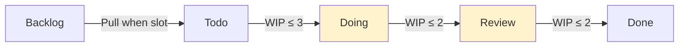

# SW 개발 프로세스·메트릭 (SW Development Process & Metrics)

Agile / Scrum / Kanban / XP / DORA / SPACE / Trunk-Based / GitOps / Platform Engineering 의 정평 있는 10 표준. **어떻게 일하는가** + **잘 일하는지 어떻게 측정하는가**.

**원전·표준 참고**:
- Jeff Sutherland, Ken Schwaber — *Scrum Guide* (2020 ed., scrumguides.org)
- David J. Anderson — *Kanban: Successful Evolutionary Change for Your Technology Business* (2010)
- Kent Beck — *Extreme Programming Explained*, 2nd ed. (2004)
- Nicole Forsgren, Jez Humble, Gene Kim — *Accelerate: The Science of Lean Software and DevOps* (2018) — DORA
- McConnell, Storey, Forsgren, Houck, Zimmermann — "The SPACE of Developer Productivity" (ACM Queue 2021)
- Paul Hammant — trunkbaseddevelopment.com
- Alexis Richardson (Weaveworks) — *GitOps* (2017 blog series)
- Manuel Pais, Matthew Skelton — *Team Topologies* (2019)
- Humanitec / Backstage Spotify — Platform Engineering 사례
- Matt Wynne — *BDD in Action* (Three Amigos)

**DORA 4 Key Metrics** (Elite ↔ Low performer):

| 메트릭 | Elite | High | Medium | Low |
|--------|-------|------|--------|-----|
| Deployment Frequency | 하루 N회 | 주~월 | 월~6개월 | 6개월 초과 |
| Lead Time for Changes | <1일 | <1주 | <6개월 | >6개월 |
| MTTR | <1시간 | <1일 | <1일 | >6개월 |
| Change Failure Rate | 0~15% | 16~30% | 16~30% | 46~60% |

**관련 카탈로그**:
- [12-factor.md](12-factor.md) — Cloud-native 운영 12 원칙
- [evolutionary-arch.md](evolutionary-arch.md) — Fitness Function (자동 메트릭)
- [sw-economics.md](sw-economics.md) — Story Point / WSJF (planning)
- [`../patterns/deployment.md`](../patterns/deployment.md) — Canary / Blue-Green
- [`../patterns/observability.md`](../patterns/observability.md) — SLO / Error Budget

---

<a id="1-scrum"></a>
## 1. Scrum (스크럼 프레임워크)

**정의**: "A lightweight framework that helps people, teams and organizations generate value through adaptive solutions for complex problems." — 복잡한 적응형 문제 해결을 위한 *경험주의 (empiricism)* 기반 경량 프레임워크. Jeff Sutherland & Ken Schwaber 가 1990 년대 초 정립, 2020 *Scrum Guide* 가 현행 정전 (canonical).

**핵심 판단**: 요구사항이 *불확실* 한 환경에서 짧은 반복으로 검증·적응하는가? 세 기둥 (3 Pillars) — **Transparency (투명성)**, **Inspection (검사)**, **Adaptation (적응)** 이 매 sprint 에서 작동하는가?

**3 Role + 5 Event + 3 Artifact**:

| 분류 | 구성 요소 | 책임 |
|------|-----------|------|
| **Role** (3 Accountability) | Product Owner | 가치 극대화, Product Backlog 관리 |
| | Scrum Master | Scrum 정착, 장애물 제거, 코칭 |
| | Developers | Sprint Backlog 실행, Increment 생성 |
| **Event** (5) | Sprint | 1~4주, 모든 작업 컨테이너 |
| | Sprint Planning | Sprint Goal + Sprint Backlog 결정 (max 8h / 1mo sprint) |
| | Daily Scrum | 15분, 개발자가 Sprint Goal 진척 검사 |
| | Sprint Review | 이해관계자 + 팀, Increment 검사 (max 4h) |
| | Sprint Retrospective | 팀 프로세스 개선 (max 3h) |
| **Artifact** (3) + Commitment | Product Backlog → Product Goal | 우선순위 정렬된 요구 목록 |
| | Sprint Backlog → Sprint Goal | Sprint 동안 수행 계획 |
| | Increment → Definition of Done | "Done" 기준을 만족하는 *유용한* 결과물 |

**장점**:
- 짧은 피드백 루프 (1~4주) → 시장 변화 대응
- 역할 분리로 책임 명확
- 경험주의 → 가설 검증 가능
- 가장 널리 채택된 Agile 프레임워크 (State of Agile 2023: 87%)

**단점·반패턴**:
- **Mechanical Scrum / Zombie Scrum**: 이벤트만 수행, 검사·적응 없음
- **ScrumBut**: "Scrum 하는데, 이건 빼고..." — 핵심 제거하면 실패
- **Velocity 의 인사고과화** → sandbagging (의도적 과소 추정)
- WIP 명시 한계 없음 (Kanban 보완 필요)
- 운영성 일감 (interrupt-driven) 에 부적합

**실제 사용**:
- Spotify, Atlassian, Microsoft 일부 팀
- LeSS / SAFe / Nexus 등 스케일링 프레임워크의 기반

**예제** — Sprint 정의 (YAML):

```yaml
# Sprint 정의 (Scrum Guide 2020 준수)
sprint:
  number: 24
  duration: 2_weeks                # 1~4주, 팀 합의 후 고정
  goal: "결제 모듈 PCI-DSS 인증 통과"  # Sprint Goal — 단일, 측정 가능
  
  capacity:
    developers: 5
    available_hours: 280           # 5명 × 8h × 7일 (event 제외)
    velocity_avg: 32_sp            # 직전 3 sprint 평균 (참고용)
  
  events:
    - planning:    {duration_h: 4, date: "2026-05-13"}
    - daily:       {duration_min: 15, time: "10:00"}
    - review:      {duration_h: 2, date: "2026-05-27"}
    - retro:       {duration_h: 1.5, date: "2026-05-27"}
  
  backlog:
    - {id: PAY-101, title: "카드번호 토큰화", sp: 8,  owner: dev}
    - {id: PAY-102, title: "TLS 1.3 강제",   sp: 3,  owner: dev}
    - {id: PAY-103, title: "감사 로그 추가",  sp: 5,  owner: dev}
  
  definition_of_done:
    - "PR review 2명 승인"
    - "단위 + 통합 테스트 통과"
    - "보안 스캔 (SAST) 0 critical"
    - "문서 업데이트"
    - "스테이징 배포 + QA sign-off"
```

**관련 항목**: [kanban](#2-kanban), [xp](#3-extreme-programming-xp), [three-amigos](#9-three-amigos), [sw-economics.md#story-point](sw-economics.md), [evolutionary-arch.md#fitness-function](evolutionary-arch.md#1-fitness-function)

---

<a id="2-kanban"></a>
## 2. Kanban (칸반 — Flow / Pull System)

**정의**: "A method for defining, managing and improving services that deliver knowledge work." — Toyota Production System 의 *간판 (看板)* 에서 유래, David J. Anderson 이 2010 년 SW 개발 맥락으로 정립. **시작하는 일을 멈추고, 끝내는 일을 시작하라 (Stop starting, start finishing)** 가 핵심 슬로건.

**핵심 판단**: WIP (Work In Progress) 한계가 명시적인가? Pull 방식인가 (push 방식이 아닌)? Lead Time 과 Cycle Time 을 측정하는가?

**6 Practice**:
1. **Visualize** — Kanban board (Todo / Doing / Review / Done)
2. **Limit WIP** — 컬럼마다 동시 진행 한계 (예: Doing ≤ 3)
3. **Manage Flow** — Cumulative Flow Diagram 으로 병목 식별
4. **Make Policies Explicit** — Definition of Done 컬럼별 명시
5. **Implement Feedback Loops** — Daily standup + Replenishment + Service Delivery review
6. **Improve Collaboratively** — 데이터 기반 (Little's Law) 점진 개선

**핵심 메트릭**:
- **Lead Time** = 요청 시점 ~ Done 시점 (고객 관점)
- **Cycle Time** = WIP 진입 ~ Done 시점 (팀 관점)
- **Throughput** = 단위 시간당 완료 작업 수
- **Little's Law**: `Lead Time = WIP / Throughput` — WIP 절반으로 줄이면 Lead Time 도 절반

**장점**:
- 운영성·이슈 처리·간헐적 요청에 강함
- Sprint 같은 시간 박스가 불필요 (continuous flow)
- Bottleneck 가시화 → 데이터 기반 개선
- Scrum 위에 얹어 (Scrumban) 보완 가능

**단점·반패턴**:
- **WIP 한계 무시** — 컬럼 한계 넘기면 Kanban 효과 0
- **목표 부재** — Sprint Goal 같은 단기 목표가 없어 방향성 부족
- 추정·계획 없음 → 장기 로드맵 어려움 (commitment date 추정에 Monte Carlo 등 별도 기법 필요)

**실제 사용**:
- Microsoft Engineering Excellence, Spotify Squads
- 운영팀 / SRE / DevOps 표준
- Trello / Jira / Linear / Azure Boards 의 board view

**예제** — Kanban Board (Mermaid):



```yaml
# Kanban 정책 명시 예
columns:
  todo:
    wip_limit: 5
    entry_criteria: "AC 명시 + 추정 완료"
    exit_criteria: "담당자 배정"
  
  doing:
    wip_limit: 3              # 핵심: 개발자 수보다 작거나 같게
    entry_criteria: "브랜치 생성"
    exit_criteria: "PR open + 자동 테스트 통과"
  
  review:
    wip_limit: 2
    entry_criteria: "PR open"
    exit_criteria: "2명 approve + Definition of Done"
  
  done:
    entry_criteria: "main merge + 배포 확인"

metrics:
  lead_time_p50_target: 5d
  lead_time_p85_target: 10d
  cycle_time_p50_target: 3d
  throughput_target: 8_per_week

class_of_service:
  - standard         # 일반 (FIFO)
  - fixed_date       # 마감 있음 (역산 예약)
  - expedite         # 긴급 (WIP 한계 무시, 1건만)
  - intangible       # 내부 개선 (기술 부채)
```

**관련 항목**: [scrum](#1-scrum), [dora-4-metrics](#4-dora-4-key-metrics), [space-framework](#5-space-framework), [sw-economics.md#wsjf](sw-economics.md), Lean SW Development (Mary Poppendieck)

---

<a id="3-xp"></a>
## 3. Extreme Programming (XP)

**정의**: "A lightweight methodology for small-to-medium-sized teams developing software in the face of vague or rapidly-changing requirements." — Kent Beck 가 1996 년 Chrysler C3 프로젝트에서 정립, 1999 *Extreme Programming Explained* 1판 / 2004 2판. **공학적 우수성 (engineering excellence)** 에 가장 충실한 Agile 방법론.

**핵심 판단**: 코드 품질·테스트·설계가 *프로세스 외 별도 활동* 이 아니라 **매일의 행위** 인가? 변경 비용을 *flat* 하게 유지하는가 (전통 모델은 시간이 지날수록 변경 비용 폭증)?

**5 Value**: Communication, Simplicity, Feedback, Courage, Respect

**12 Practice** (1판 — 4 그룹):

| 그룹 | Practice | 설명 |
|------|----------|------|
| **Fine-scale feedback** | Pair Programming | 2인 1키보드, 지식 확산 |
| | Planning Game | 비즈니스 + 개발 협력 추정 |
| | TDD (Test-Driven Development) | Red → Green → Refactor |
| | Whole Team | 고객 + 개발 + QA 동석 (on-site customer) |
| **Continuous process** | Continuous Integration | 매일 (또는 시간당) trunk 통합 |
| | Refactoring | 작은 단위 지속 개선 (Fowler refactoring catalog) |
| | Small Releases | 가능한 가장 작은 단위 배포 |
| **Shared understanding** | Coding Standards | 팀 공통 스타일 (자동 lint) |
| | Collective Code Ownership | 누구나 어떤 코드든 수정 |
| | Simple Design | YAGNI — 현재 필요한 만큼만 |
| | System Metaphor | 시스템 비유 (Ubiquitous Language 와 유사) |
| **Programmer welfare** | Sustainable Pace | 주 40h, 야근 금지 |

**장점**:
- TDD, CI, refactoring 등 **현대 SW 공학의 표준 practice 원천**
- 품질을 프로세스 끝에 두지 않고 일상에 분산
- 변경 비용 flat 화 → 후기 요구사항 변경 환영
- 12 practice 가 서로 보강 (synergy)

**단점·반패턴**:
- **Cherry-picking** — TDD 만 쓰고 CI 안 함, Pair 만 쓰고 refactoring 안 함 → 효과 절반 이하
- **On-site customer** 비현실 (대기업 / 규제 산업)
- 팀 규모 12명 이하 권장 (스케일링 어려움)
- "Programmer welfare" 가 강조되지만 실제 도입 시 가장 먼저 희생

**실제 사용**:
- ThoughtWorks 표준 practice 묶음
- GitHub / Stripe / Pivotal Labs / Shopify 엔지니어링 문화
- Scrum 보완재 — Scrum (관리) + XP (공학) 결합이 흔함

**예제** — TDD 사이클 (Kotlin):

```kotlin
// XP / TDD — Red → Green → Refactor

// ① RED: 실패하는 테스트 먼저
class CartTest {
    @Test fun `2개 상품 합산`() {
        val cart = Cart()
        cart.add(Item("커피", 4_500))
        cart.add(Item("쿠키", 3_000))
        assertEquals(7_500, cart.total())   // ← Cart 가 아직 없어 컴파일 실패
    }
}

// ② GREEN: 테스트 통과 최소 구현
class Cart {
    private val items = mutableListOf<Item>()
    fun add(item: Item) { items += item }
    fun total(): Int = items.sumOf { it.price }
}

// ③ REFACTOR: 통과 유지하며 설계 개선
// - Item 을 data class 로
// - total() 을 property 로
// - DSL 도입 검토 (Simple Design — 아직 필요 없으면 보류)
data class Item(val name: String, val price: Int)
class Cart {
    private val _items = mutableListOf<Item>()
    val items: List<Item> get() = _items.toList()
    val total: Int get() = _items.sumOf { it.price }
    fun add(item: Item) = _items.add(item)
}
```

**관련 항목**: [scrum](#1-scrum), [trunk-based-development](#6-trunk-based-development), [pair-mob-programming](#10-pair-mob-programming), [solid.md](solid.md), [code-smells.md](code-smells.md) (refactoring), [refactoring-techniques.md](refactoring-techniques.md)

---

<a id="4-dora-4-metrics"></a>
## 4. DORA 4 Key Metrics

**정의**: DevOps Research and Assessment (DORA, Google Cloud 2018 인수) 가 2014~2024 *State of DevOps* 보고서를 통해 검증한 **SW 전달 성과 4 메트릭**. 책 *Accelerate* (Forsgren, Humble, Kim 2018) 가 통계적 근거 제시 — 4 메트릭이 좋은 조직은 *조직 성과 (수익·시장점유율·고객만족)* 도 좋다는 인과 모델.

**핵심 판단**: SW 전달 효율을 *주관적 인상* 이 아니라 *4 가지 객관 메트릭* 으로 측정하는가? Elite ↔ Low performer 격차를 인지하는가?

**4 메트릭 + 성능 등급** (State of DevOps Report 2023~2024 기준):

| 메트릭 | 정의 | Elite | High | Medium | Low |
|--------|------|-------|------|--------|-----|
| **Deployment Frequency** | 프로덕션 배포 빈도 | 하루 N회 (on-demand) | 주~월 1회 | 월~6개월 1회 | 6개월 초과 1회 |
| **Lead Time for Changes** | 코드 commit ~ 프로덕션 배포까지 | <1일 | <1주 | <6개월 | >6개월 |
| **MTTR (Mean Time To Restore)** | 장애 발생 ~ 복구까지 | <1시간 | <1일 | <1일 | >6개월 |
| **Change Failure Rate** | 배포 중 장애 유발 비율 | 0~15% | 16~30% | 16~30% | 46~60% |

> 주: 2021~2022 보고서에는 5번째 메트릭 **Reliability** (운영 안정성) 가 추가됐다 — SLO 달성률.

**메트릭 쌍 의미**:
- **속도 (Throughput)**: Deployment Frequency + Lead Time
- **안정성 (Stability)**: MTTR + Change Failure Rate
- **속도 ↔ 안정성은 트레이드오프가 아니다** — Elite 는 *둘 다 우수*. 이 발견이 *Accelerate* 의 핵심 주장.

**24 Capabilities** (DORA 가 4 메트릭에 영향 준다고 검증한 역량 — 발췌):
- Trunk-Based Development
- Continuous Integration / Continuous Delivery
- Loosely Coupled Architecture
- Test Automation
- Database Change Management
- Working in Small Batches
- Customer Feedback
- Generative Culture (Westrum)

**장점**:
- 업계 표준 — 모든 DevOps 조직이 같은 언어로 비교
- 통계적 검증 (10년+ 32,000+ 응답자)
- 4개로 단순 → 측정 비용 낮음
- 도구 자동화 가능 (GitHub / GitLab / Datadog 등에서 dashboard 제공)

**단점·반패턴**:
- **Vanity metric 화** — Deployment Frequency 만 올리려 의미 없는 commit 양산
- **개인 평가용 오용** — DORA 는 *조직 시스템* 메트릭, 개인 인사고과 X
- 4 메트릭으로 모든 개발 활동 측정 불가 → SPACE 로 보강 (다음 항목)

**실제 사용**:
- Google Cloud DORA assessment
- GitHub Insights, GitLab Value Stream Analytics
- Datadog DORA dashboard
- *Accelerate State of DevOps Report* 매년 발행

**예제** — DORA 메트릭 SQL 추출 (PostgreSQL):

```sql
-- Lead Time for Changes — commit ~ prod deploy 까지 시간
-- (gh_commits + deploys 테이블 가정)
SELECT
  PERCENTILE_CONT(0.5) WITHIN GROUP (ORDER BY ts) AS p50_lead_time_h,
  PERCENTILE_CONT(0.95) WITHIN GROUP (ORDER BY ts) AS p95_lead_time_h
FROM (
  SELECT EXTRACT(EPOCH FROM (d.deployed_at - c.committed_at)) / 3600 AS ts
  FROM deploys d
  JOIN commits c ON c.sha = d.commit_sha
  WHERE d.environment = 'prod'
    AND d.deployed_at > NOW() - INTERVAL '90 days'
) t;

-- Deployment Frequency — 주당 평균 prod 배포 수
SELECT COUNT(*)::float / 13 AS deploys_per_week
FROM deploys
WHERE environment = 'prod'
  AND deployed_at > NOW() - INTERVAL '90 days';

-- MTTR — incident open ~ resolved 까지 시간
SELECT
  PERCENTILE_CONT(0.5) WITHIN GROUP (ORDER BY ttr) AS p50_mttr_h
FROM (
  SELECT EXTRACT(EPOCH FROM (resolved_at - opened_at)) / 3600 AS ttr
  FROM incidents
  WHERE severity IN ('sev1', 'sev2')
    AND opened_at > NOW() - INTERVAL '90 days'
) t;

-- Change Failure Rate — 배포 중 incident 유발 비율
SELECT
  COUNT(*) FILTER (WHERE caused_incident) * 100.0 / COUNT(*) AS cfr_pct
FROM deploys
WHERE environment = 'prod'
  AND deployed_at > NOW() - INTERVAL '90 days';
```

**관련 항목**: [space-framework](#5-space-framework), [trunk-based-development](#6-trunk-based-development), [gitops](#7-gitops), [`../patterns/deployment.md`](../patterns/deployment.md), [`../patterns/observability.md`](../patterns/observability.md), [evolutionary-arch.md#fitness-function](evolutionary-arch.md#1-fitness-function)

---

<a id="5-space-framework"></a>
## 5. SPACE Framework (개발자 생산성 5 차원)

**정의**: "Developer productivity is about more than an individual's activity levels or the efficiency of the engineering systems relied on to ship software to customers, and it cannot be measured by a single metric." — Microsoft Research + GitHub 가 2021 *ACM Queue* 에 발표한 **개발자 생산성 5 차원 측정 프레임워크**. DORA 가 *팀·조직* 의 SW 전달 성과를 본다면, SPACE 는 *개인·팀의 생산성과 웰빙* 까지 포함.

**핵심 판단**: 생산성을 *하나의 메트릭* (LoC / commit 수 / story point) 으로 측정하지 않는가? 5 차원에서 *복수 메트릭* 을 보는가? *세 차원 이상* 동시에 측정하는가 (SPACE 권장)?

**5 차원** (Satisfaction · Performance · Activity · Collaboration · Efficiency):

| 차원 | 의미 | 개인 메트릭 | 팀 메트릭 | 시스템 메트릭 |
|------|------|-------------|-----------|---------------|
| **S**atisfaction & Well-being | 만족·번아웃·웰빙 | 직무 만족도 설문, eNPS | 팀 응집도 | 도구 만족도 |
| **P**erformance | 산출물·결과 | 코드 리뷰 품질 | 기능 인도 빈도 | 신뢰성 (SLO) |
| **A**ctivity | 활동량 | commit 수, PR 수 | 코드 리뷰 횟수 | 빌드·배포 횟수 |
| **C**ollaboration & Communication | 협업·소통 | 코드 리뷰 응답 시간 | 지식 공유 | 문서 발견성 |
| **E**fficiency & Flow | 흐름·중단 없음 | Deep work 시간 | Handoff 횟수 | CI 빌드 시간 |

**활용 원칙** (Forsgren et al. 권고):
1. **3 차원 이상 동시 측정** — 단일 차원 메트릭은 왜곡 위험
2. **다양한 분석 단위 결합** — 개인 + 팀 + 시스템 동시
3. **자기 보고 (perception) + 시스템 메트릭 동시** — 후자만으로는 만족·웰빙 측정 불가
4. **개인 평가용으로 쓰지 않기** — Goodhart's Law 회피
5. **목표 (goal) ↔ 신호 (signal) ↔ 메트릭 (metric)** 분리 — GQM 모델

**장점**:
- DORA 의 사각지대 보완 — 개인 웰빙, 협업, 인지 부하
- 다차원 → 단일 메트릭 왜곡 방지
- 자기 보고 포함 → 정량 데이터로 안 잡히는 신호 포착
- 학술적 근거 (ACM Queue peer-reviewed)

**단점·반패턴**:
- **설문 피로** — Satisfaction 메트릭은 응답률 하락
- 측정 비용이 DORA 보다 큼 (설문 + 시스템 통합)
- 5 차원 모두 측정해도 *해석* 이 어려움 → 데이터 분석 역량 필요
- 5 차원 균형이 아니라 **3 차원 선택** 이 현실적

**실제 사용**:
- Microsoft Developer Velocity Lab
- GitHub Engineering 내부 측정
- Atlassian Team Health Monitor
- Pluralsight Flow / LinearB / Jellyfish 등 SaaS

**예제** — SPACE 메트릭 카드 (YAML):

```yaml
# 팀 SPACE 카드 — 분기별 검토 (3 차원 선택형)
team: payment-platform
quarter: 2026Q2

dimensions_tracked: [satisfaction, performance, efficiency]   # 3 차원

satisfaction:
  source: 분기 설문 (n=12, response=92%)
  metrics:
    - {key: enps, value: +35, target: ">30"}
    - {key: burnout_score, value: 2.1, scale: "1~5 (낮을수록 좋음)", target: "<2.5"}
    - {key: tooling_satisfaction, value: 4.2, scale: "1~5", target: ">4"}

performance:
  source: GitHub + production telemetry
  metrics:
    - {key: deploy_freq_per_week, value: 18, target: ">14"}
    - {key: incident_count_sev1_2, value: 1, target: "<3"}
    - {key: slo_availability, value: 99.92, target: ">99.9"}

efficiency:
  source: GitHub API + meeting calendar
  metrics:
    - {key: pr_review_time_p50_h, value: 4.2, target: "<8"}
    - {key: ci_build_time_p95_min, value: 11, target: "<15"}
    - {key: meeting_load_h_per_dev, value: 8.5, target: "<10"}

dimensions_not_tracked:    # 이번 분기 의도적 제외
  - activity: "벤치마크 활용보다 왜곡 위험 큼"
  - collaboration: "다음 분기 도입 예정 (knowledge graph 도구 도입 후)"

# 주의: 개인 평가에 사용 금지 — 팀·시스템 단위로만 활용
```

**관련 항목**: [dora-4-metrics](#4-dora-4-key-metrics), [scrum](#1-scrum), [pair-mob-programming](#10-pair-mob-programming), [platform-engineering-idp](#8-platform-engineering-idp), Westrum Organizational Culture

---

<a id="6-trunk-based-development"></a>
## 6. Trunk-Based Development

**정의**: "A source-control branching model, where developers collaborate on code in a single branch called 'trunk' (main in Git), resist any pressure to create other long-lived development branches by employing documented techniques." — Paul Hammant 가 정립하고 trunkbaseddevelopment.com 으로 정전화. **모든 개발자가 trunk (main) 에 매일 (또는 시간당) 통합** 하는 분기 전략.

**핵심 판단**: feature branch 의 수명이 *몇 시간~1 일* 인가? trunk 가 *항상 출시 가능 (always releasable)* 상태인가? Feature flag 로 미완성 코드를 trunk 에 안전하게 머지하는가?

**스타일 2 종**:

| 스타일 | 대상 팀 | 방식 |
|--------|---------|------|
| **Trunk-Only** | 소규모 (2~3명) | 직접 trunk 에 push, CI 가 검증 |
| **Short-Lived Feature Branch** | 10명 이하 | PR 수명 <1일, merge 후 즉시 삭제 |

**원칙 (Hammant)**:
- 브랜치 수명 <1일 (이상적), <2일 (현실적)
- main 항상 deployable
- 미완성 기능은 **feature flag** 로 사용자에게 숨김
- 큰 변경은 **branch by abstraction** 으로 trunk 안에서 점진 마이그레이션
- CI 빠른 피드백 (<10분 권장)
- main 보호 — required review + status check

**vs GitFlow**:

| 항목 | Trunk-Based | GitFlow (Vincent Driessen 2010) |
|------|-------------|----------------------------------|
| 브랜치 종류 | main + 단명 feature | main + develop + feature + release + hotfix |
| 브랜치 수명 | <1일 | 며칠~몇주 |
| 통합 빈도 | 매일 N회 | sprint/release 단위 |
| 적합 | Continuous Delivery / SaaS | 버전 릴리스 제품 (모바일·라이브러리·CLI) |
| DORA 영향 | Elite 의 96% 가 채택 | merge hell 빈발 |
| 2020 이후 | 주류 | Driessen 본인이 deprecate 선언 (2020) |

**장점**:
- merge conflict 최소화 (자주 통합 → 작은 diff)
- CI/CD 와 자연스러운 정합
- DORA Elite 의 96% 채택 (2023 보고서)
- 코드 리뷰가 작아 빠름

**단점·반패턴**:
- **trunk 가 broken** 이면 모든 개발자 영향 → CI 와 회귀 테스트 필수
- Feature flag 운영 복잡도 (flag 청소 안 하면 기술 부채)
- 신입·OSS 기여자에게 익숙치 않음
- 버전 릴리스 모델 (mobile / library) 에는 부적합

**실제 사용**:
- Google (전사), Facebook (단일 trunk monorepo), Microsoft Office
- Netflix, Etsy, GitHub (자기 자신)
- *Accelerate* DORA 책의 24 capability 중 하나

**예제** — Feature Flag + Branch by Abstraction (Kotlin):

```kotlin
// Trunk-Based — 미완성 기능을 main 에 안전 머지

// 1. Feature flag 인터페이스
interface FeatureFlags {
    fun isEnabled(key: String, userId: String? = null): Boolean
}

// 2. Branch by Abstraction — 기존 결제 (V1) 와 새 결제 (V2) 공존
interface PaymentGateway {
    fun charge(amount: Money): PaymentResult
}

class PaymentRouter(
    private val v1: PaymentGatewayV1,
    private val v2: PaymentGatewayV2,
    private val flags: FeatureFlags,
) : PaymentGateway {
    override fun charge(amount: Money): PaymentResult =
        when {
            flags.isEnabled("payment.v2.enabled") -> v2.charge(amount)
            else                                  -> v1.charge(amount)
        }
}

// 3. CI 보호 (.github/workflows/ci.yml)
// on: pull_request
// jobs.test:
//   - run: ./gradlew test       # <10 분
//   - run: ./gradlew lint
// jobs.merge-protection:
//   - required-status-checks: [test, lint]
//   - required-reviewers: 1
//   - dismiss-stale-reviews: true

// 4. 작업 흐름
// $ git switch -c add-v2-charge-handler         # 단명 브랜치
// $ # ... 변경 (수 시간)
// $ git push && gh pr create                    # PR
// $ # ... CI 통과 + review approve              # <1 일
// $ gh pr merge --squash --delete-branch        # main 으로
// $ # ... 다음 작업도 동일 사이클

// 5. flag 청소 (기능 안정화 후 1~2 주)
// - v2 가 100% prod 전환되면 v1 제거 + flag 제거
// - 안 청소하면 *flag debt* 누적
```

**관련 항목**: [xp](#3-extreme-programming-xp) (CI), [dora-4-metrics](#4-dora-4-key-metrics), [gitops](#7-gitops), [`../patterns/deployment.md`](../patterns/deployment.md), [evolutionary-arch.md](evolutionary-arch.md)

---

<a id="7-gitops"></a>
## 7. GitOps

**정의**: "An operating model for cloud-native applications, where Git is the single source of truth for declarative infrastructure and applications." — Weaveworks 의 Alexis Richardson 이 2017 블로그 시리즈로 정립, CNCF OpenGitOps WG 가 4 원칙으로 표준화 (2021). **Git 이 인프라·앱의 단일 진실원**, 변경은 *pull request → Git merge → 자동 동기화* 로만.

**핵심 판단**: 클러스터·인프라의 *현재 상태* 가 *Git 의 선언* 과 일치하는가? `kubectl apply` 같은 *수동 명령* 이 아니라 *Git 변경* 만이 배포를 유발하는가? Drift 가 자동 감지·복구되는가?

**OpenGitOps 4 원칙** (CNCF Working Group 2021):

1. **Declarative** — 시스템 desired state 가 *선언적으로* 표현
2. **Versioned and Immutable** — desired state 는 Git 에 *immutable* 히 저장
3. **Pulled Automatically** — *SW agent* 가 Git 에서 자동으로 pull
4. **Continuously Reconciled** — agent 가 *지속적으로* actual ↔ desired 차이를 *수렴 (reconcile)*

**Pull vs Push 비교**:

| 모델 | 방식 | 보안 | 예시 |
|------|------|------|------|
| **Push CD** (전통) | CI 가 클러스터에 `kubectl apply` push | CI 가 cluster credential 필요 (큰 표면) | Jenkins → kubectl |
| **Pull CD** (GitOps) | 클러스터 안 agent 가 Git pull | Cluster credential 외부 노출 0 | ArgoCD / Flux |

**도구**:
- **Argo CD** (CNCF Graduated) — Kubernetes GitOps, web UI 강력
- **Flux** (CNCF Graduated) — Kubernetes GitOps, GitOps Toolkit 으로 컴포넌트화
- **Jenkins X** — GitOps + Tekton + Helm
- **Atlantis** — Terraform PR 자동화
- **Crossplane** — multi-cloud GitOps

**장점**:
- 감사성 — 모든 변경이 Git 이력 (누가·언제·무엇을·왜)
- 롤백 = `git revert` (한 줄)
- Cluster credential 외부 노출 0 → 보안 표면 최소
- DR (재해 복구) — Git 만 있으면 클러스터 재구축
- 환경 일관성 (dev/staging/prod) — 동일 manifest 트리

**단점·반패턴**:
- **Secret 관리** — Git 에 평문 secret 금지 → Sealed Secrets / SOPS / External Secrets Operator 필요
- **Drift 발생 시 디버깅** — manifest 만 보면 인지 어려움
- **Helm vs Kustomize** 종교 전쟁
- 학습 곡선 (Kubernetes + Git + reconciler 동작 모델)

**실제 사용**:
- Weaveworks (창시자), Intuit (ArgoCD 원작자)
- Spotify, Adobe, Volvo Cars, BMW Group (Argo CD)
- AWS EKS, GKE, Azure AKS 가 GitOps 1급 지원

**예제** — Argo CD Application + Flux (YAML):

```yaml
# Argo CD Application — Git 의 manifest 폴더를 클러스터에 동기화
apiVersion: argoproj.io/v1alpha1
kind: Application
metadata:
  name: payment-service
  namespace: argocd
spec:
  project: default
  
  source:
    repoURL: https://github.com/acme/k8s-config.git
    targetRevision: HEAD                        # main branch
    path: apps/payment-service/overlays/prod    # Kustomize overlay
  
  destination:
    server: https://kubernetes.default.svc
    namespace: payment
  
  syncPolicy:
    automated:
      prune: true                # Git 에서 삭제된 리소스 자동 제거
      selfHeal: true             # actual ↔ desired drift 자동 수렴
    syncOptions:
      - CreateNamespace=true
      - PrunePropagationPolicy=foreground
    retry:
      limit: 5
      backoff: {duration: 5s, factor: 2, maxDuration: 3m}

---
# Flux Kustomization — 동일 패턴, Flux 버전
apiVersion: kustomize.toolkit.fluxcd.io/v1
kind: Kustomization
metadata:
  name: payment-service
  namespace: flux-system
spec:
  interval: 1m                   # 1분마다 reconcile
  path: ./apps/payment-service/overlays/prod
  prune: true
  sourceRef:
    kind: GitRepository
    name: k8s-config
  healthChecks:
    - apiVersion: apps/v1
      kind: Deployment
      name: payment-api
      namespace: payment
  timeout: 5m
```

```bash
# 변경 흐름 (GitOps)
$ git switch -c bump-payment-image
$ # ... overlays/prod/kustomization.yaml 의 image tag 변경
$ git push && gh pr create
$ # ... PR review → main merge
# 이후 자동:
#   1. Argo CD 가 1분 내 Git 변경 감지
#   2. 새 manifest fetch → actual state 와 diff
#   3. drift 감지 → kubectl apply 수렴
#   4. healthCheck Pass → Synced/Healthy 상태로
# 롤백:
$ git revert <bad-commit> && git push
# → 1분 내 자동 롤백
```

**관련 항목**: [12-factor.md](12-factor.md), [trunk-based-development](#6-trunk-based-development), [dora-4-metrics](#4-dora-4-key-metrics), [platform-engineering-idp](#8-platform-engineering-idp), [`../patterns/deployment.md`](../patterns/deployment.md)

---

<a id="8-platform-engineering-idp"></a>
## 8. Platform Engineering / IDP (Internal Developer Platform)

**정의**: "Platform engineering is the discipline of designing and building toolchains and workflows that enable self-service capabilities for software engineering organizations in the cloud-native era." — Humanitec / CNCF 정의. **개발자에게 self-service 추상화 (golden path)** 를 제공하여 인지 부하를 줄이는 *내부 제품 (internal product)* 으로서의 플랫폼.

**핵심 판단**: 개발자가 *Kubernetes / Terraform / IAM* 깊은 지식 없이 *YAML 한 장* 으로 환경을 셀프 프로비저닝 가능한가? 플랫폼이 *내부 고객 (개발자) 을 위한 제품* 으로 운영되는가 (DevEx 메트릭 추적)? *Golden Path* 가 정의돼 있는가?

**개념 분리**:

| 개념 | 의미 |
|------|------|
| **Platform Engineering** | 내부 플랫폼을 만드는 *활동* |
| **IDP** (Internal Developer Platform) | 그 *결과물* 인 self-service 플랫폼 |
| **IDP** (Internal Developer Portal) | UI 진입점 (Backstage, Port, Cortex) |
| **Golden Path** | 권장 기술 경로 (도구·언어·패턴 셋) |
| **Paved Road** (Netflix 용어) | 동일 개념 |

**Team Topologies (Skelton & Pais 2019) 4 팀 유형**:

| 팀 유형 | 역할 |
|---------|------|
| **Stream-aligned team** | 가치 흐름에 정렬된 제품팀 (대다수) |
| **Platform team** | Stream-aligned 팀의 self-service 플랫폼 제공 |
| **Enabling team** | 단기 코칭 (한 기간만 협업) |
| **Complicated-subsystem team** | 깊은 전문성 영역 (ML / 비디오 인코딩) |

**3 Interaction Mode**: Collaboration · X-as-a-Service · Facilitating

**핵심 컴포넌트**:
- **CLI / API**: `myco env up` 한 줄로 namespace + DB + queue 프로비저닝
- **Portal** (Backstage / Port / Cortex): 서비스 카탈로그, 문서, 템플릿
- **Templates**: 신규 서비스 scaffolding ("create new service" 버튼)
- **Observability**: 표준 logging / metrics / tracing 기본 탑재
- **Security**: 표준 secret 관리, RBAC, mTLS 자동
- **CI/CD**: 표준 파이프라인 (테스트 → 빌드 → 배포)

**장점**:
- 인지 부하 감소 (Cognitive Load Theory) → 개발자 흐름 보존
- 모범 사례 자동 적용 (security / observability)
- onboarding 단축 (Day 1 → Day 1 deploy)
- 표준화로 운영 비용 절감

**단점·반패턴**:
- **Build vs Buy** — Backstage 도입에 풀타임 2~5명 (Spotify 사례) 필요
- **Ivory tower platform** — 플랫폼팀이 개발자 needs 무시
- **Tool consolidation 함정** — 도구만 통합하고 path 정의 없음
- **너무 이른 도입** — 팀 5명 이하면 ROI 부정
- **Backstage 운영 비용** — 자체 호스팅 시 K8s 클러스터 + DB + plugin 유지보수

**실제 사용**:
- Spotify Backstage (CNCF Incubating)
- Netflix Paved Road
- Twilio, Airbnb, American Airlines IDP
- Humanitec, Port, Cortex, Configure8 등 상용

**예제** — Backstage 카탈로그 + Score (YAML):

```yaml
# Backstage 서비스 카탈로그 — catalog-info.yaml
apiVersion: backstage.io/v1alpha1
kind: Component
metadata:
  name: payment-service
  description: "결제 처리 핵심 서비스"
  annotations:
    github.com/project-slug: acme/payment-service
    backstage.io/techdocs-ref: dir:.
    pagerduty.com/integration-key: ${PAGERDUTY_KEY}
  tags: [payment, java, pci-dss]
  links:
    - {url: https://payment.acme.io, title: "Production"}
    - {url: https://runbook.acme.io/payment, title: "Runbook"}
spec:
  type: service
  lifecycle: production
  owner: team-payment
  system: commerce
  dependsOn:
    - resource:postgres-payment
    - component:auth-service
    - component:notification-service
  providesApis:
    - payment-api
  consumesApis:
    - auth-api

---
# Score — 워크로드 명세 표준 (CNCF Sandbox, score.dev)
# 개발자는 이 한 파일만 작성, 플랫폼이 K8s/ECS/Compose 등으로 변환
apiVersion: score.dev/v1b1
metadata:
  name: payment-service
containers:
  api:
    image: ghcr.io/acme/payment-service:1.4.2
    variables:
      DATABASE_URL: ${resources.db.uri}
      AUTH_API_URL: ${resources.auth.url}
    resources:
      requests: {cpu: "200m", memory: "512Mi"}
      limits:   {cpu: "1000m", memory: "1Gi"}
service:
  ports:
    http: {port: 8080, targetPort: 8080}
resources:
  db:
    type: postgres
    properties:
      version: "15"
  auth:
    type: service
    properties:
      service: auth-service
```

**관련 항목**: [gitops](#7-gitops), [dora-4-metrics](#4-dora-4-key-metrics), [space-framework](#5-space-framework), [12-factor.md](12-factor.md), Cognitive Load Theory

---

<a id="9-three-amigos"></a>
## 9. Three Amigos / Example Mapping

**정의**: "Whenever there is something to discuss about a story, get the Three Amigos — Business, Development, Testing — together." — George Dinwiddie 가 명명 (2010 이전), Matt Wynne / Seb Rose 가 *Discovery: Explore Behaviour Using Examples* (Leanpub 2021) 에서 **Example Mapping** 으로 구체화. 요구사항 도출 단계에서 **세 관점 (비즈니스·개발·테스트)** 이 함께 *구체적 예시* 로 요구를 명료화.

**핵심 판단**: 요구사항이 PO 머릿속에만 있다가 코드까지 가는가, 아니면 *세 관점 + 예시* 로 사전 명료화되는가? 결함의 *상류 (요구) 차단* 이 가능한가? BDD given/when/then 시나리오가 살아 있는가?

**Three Amigos 3 관점**:

| 관점 | 질문 |
|------|------|
| **Business** (PO / BA) | "왜 (Why) 이 기능이 필요한가? 어떤 가치를 만드는가?" |
| **Development** (Dev) | "어떻게 (How) 구현 가능한가? 기술적 제약은?" |
| **Testing** (QA) | "무엇 (What) 을 어떻게 확인하나? 어떤 케이스가 부서질까?" |

**Example Mapping 4 카드 색** (Matt Wynne):

| 색 | 카드 | 내용 |
|----|------|------|
| 노랑 | Story | 사용자 스토리 (1장) |
| 파랑 | Rule | 비즈니스 규칙 (~4장 권장) |
| 초록 | Example | 규칙을 보여주는 구체적 예 (각 rule 당 1~3장) |
| 빨강 | Question | 답을 모르는 질문 (다음 회의로) |

세션 25분 안에 끝나는 게 목표. 4 rule 초과면 story 가 너무 큼 → 쪼개기.

**BDD 시나리오 형식** (Gherkin):

```gherkin
Given <초기 상태>
When  <행동>
Then  <기대 결과>
```

**장점**:
- 결함의 *상류 차단* — 코드 작성 전 명료화 → 재작업 80% 감소 (보고)
- 세 관점이 *같은 단어* 사용 → Ubiquitous Language
- 인수 테스트가 *예시 그대로* → 살아있는 문서화
- 누구나 진행 가능 (별도 자격 불필요)

**단점·반패턴**:
- **Three Amigos 없이 PO 만** — 다시 명세서 던지기로 회귀
- **Example Mapping 을 추정에 쓰기** — 도구는 *발견*, 추정은 별도
- **Gherkin 을 코드처럼** — given/when/then 안에 클릭·버튼 등 UI 디테일 넣으면 깨지기 쉬움
- BDD 도구 (Cucumber / SpecFlow) 학습 비용

**실제 사용**:
- Cucumber.io / SpecFlow / Behave / Gauge
- Atlassian, GitHub, ThoughtWorks 의 표준 discovery practice
- LeanPub *Discovery* 책 + cucumber.io/blog

**예제** — Example Mapping 세션 (Markdown) + Gherkin:

```markdown
# Example Mapping — Story PAY-203

Story (노랑): "회원은 포인트로 결제할 수 있다"

Rule 1 (파랑): 포인트는 잔액 이내만 사용 가능
  Example (초록): 잔액 5000p, 결제 3000p → 성공, 잔여 2000p
  Example (초록): 잔액 1000p, 결제 3000p → 실패 (잔액 부족)
  Example (초록): 잔액 0p, 결제 0p → 성공 (0 결제는 허용)

Rule 2 (파랑): 만료 임박 포인트가 먼저 차감 (FEFO)
  Example (초록): 5/20만료 2000p + 6/30만료 3000p, 4000p 결제
                  → 5/20분 2000p + 6/30분 2000p 차감, 잔여 1000p

Rule 3 (파랑): 최소 사용 단위는 100p
  Example (초록): 250p 결제 시도 → 실패 (100 단위 아님)
  Example (초록): 200p 결제 → 성공

Questions (빨강):
  - "환불 시 차감된 포인트는 복구되는가?" → PO 에게 확인 필요
  - "외화 결제와 포인트 혼합 가능한가?" → 다음 세션
```

```gherkin
# 위 Example 들이 그대로 인수 테스트로
Feature: 포인트 결제

  Background:
    Given 회원 "alice" 가 로그인되어 있다

  Scenario: 잔액 이내 포인트 결제 성공
    Given alice 의 포인트 잔액은 5000p 이다
    When alice 가 3000p 로 결제한다
    Then 결제는 성공한다
    And  alice 의 포인트 잔액은 2000p 가 된다

  Scenario: 잔액 초과 포인트 결제 실패
    Given alice 의 포인트 잔액은 1000p 이다
    When alice 가 3000p 로 결제 시도한다
    Then "잔액 부족" 오류가 발생한다
    And  alice 의 포인트 잔액은 1000p 로 유지된다

  Scenario Outline: FEFO 차감 — 만료 임박 포인트 먼저
    Given alice 의 포인트가 다음과 같다
      | 만료일      | 잔액   |
      | 2026-05-20 | 2000p |
      | 2026-06-30 | 3000p |
    When alice 가 <결제액> 로 결제한다
    Then 5/20 만료분에서 <소진_5> 가, 6/30 만료분에서 <소진_6> 가 차감된다

    Examples:
      | 결제액 | 소진_5 | 소진_6 |
      | 1500p | 1500p  | 0p     |
      | 4000p | 2000p  | 2000p  |
```

**관련 항목**: [scrum](#1-scrum), [xp](#3-extreme-programming-xp) (TDD), [pair-mob-programming](#10-pair-mob-programming), [iso25010.md](iso25010.md) (Functional Suitability), DDD Ubiquitous Language, ATDD (Acceptance Test-Driven Development)

---

<a id="10-pair-mob-programming"></a>
## 10. Pair Programming / Mob Programming

**정의**:
- **Pair Programming**: "Two programmers working together at one workstation. One, the driver, writes code while the other, the observer or navigator, reviews each line of code as it is typed in." — XP 원전 practice. Driver ↔ Navigator 역할 교대.
- **Mob Programming / Ensemble Programming**: "All the brilliant people working on the same thing, at the same time, in the same space, and at the same computer." — Woody Zuill (2012 Hunter Industries 시작), Llewellyn Falco *Mob Programming Guidebook* (2017) 정립. 3명 이상 (보통 4~6명) 이 *한 키보드* 로 작업.

**핵심 판단**: 코드 리뷰가 *PR 단계 사후* 가 아니라 *작성 중 실시간* 으로 일어나는가? 지식이 *한 명에게* 고립되지 않고 팀 전체로 확산되는가? Bus factor > 1 인가?

**Pair Programming 스타일**:

| 스타일 | 방식 | 적합 |
|--------|------|------|
| **Driver-Navigator** | 1명 타이핑, 1명 전략 사고 | 일반 |
| **Ping-Pong** | A 가 실패 테스트, B 가 통과 코드, B 가 실패 테스트, A 가 통과 코드 ... | TDD 학습 |
| **Strong-Style Pairing** (Llewellyn Falco) | "아이디어가 키보드에 가려면 다른 사람 머리를 거쳐야" — Navigator 가 지시, Driver 가 타이핑만 | 멘토링 |
| **Backseat / Tour Guide** | 경험자가 Driver, 신입이 Navigator (관찰·질문) | onboarding |

**Mob Programming Cadence**:
- Driver 교대 주기: 5~15분 (보통 7~10분)
- Navigator 들은 합의 후 Driver 에게 *영어로* 지시 (Driver 의 머리를 거치지 않음)
- 휴식: 60분마다 5분
- Retrospective: 매일 끝 15분

**장점**:
- 코드 리뷰 *실시간* → PR 단계 리뷰 시간 절감
- 지식 확산 (knowledge silo 제거) → bus factor 향상
- 결함율 감소 (Cockburn & Williams 2000 연구: 결함 15% 감소, 시간 15% 추가 — 순효과 양호)
- onboarding 가속 (혼자 학습 대비 ~30% 단축)
- 어려운 문제 해결력 증가 (다관점)

**단점·반패턴**:
- **외향성 편향** — 내향형 개발자는 번아웃 위험 → 일정 비율 솔로 시간 보장
- **잘못된 페어링** — 권력 격차가 큰 페어 (시니어 ↔ 인턴, manager ↔ IC) 는 학습 효과 저하
- **Pair Anti-Patterns** — 한 명이 폰만 봄, 한 명이 모든 결정
- 단순 작업에 mob 적용은 낭비
- 비용 인식 (2배 인건비) — 실제로는 결함 감소·지식 확산으로 상쇄, 그러나 *경영진 설득 필요*

**효과 연구**:
- Cockburn & Williams 2000 — *The Costs and Benefits of Pair Programming* (XP 2000): 결함 -15%, 시간 +15%
- Hunter Industries (Woody Zuill) — 3~5년 mob 전환 후 *defect rate 1/10, throughput 2 배*
- *Code Together* (Tovinen 2021) — 원격 mob 도구 (Visual Studio Live Share, Tuple) 효과 검증

**실제 사용**:
- Pivotal Labs / VMware Tanzu Labs — 100% pair programming 표준
- Hunter Industries — mob programming 원조
- ThoughtWorks — pair / mob 혼합
- 도구: Tuple (Mac), Visual Studio Live Share, JetBrains Code With Me, tmux + pair

**예제** — Pair / Mob 운영 룰 (Markdown):

```markdown
## Pair Programming Rules (팀 합의)

1. **세션 길이**: 90분 + 15분 휴식, 1일 최대 2 세션 (4 PR/일 페이스)
2. **역할 교대**: Pomodoro 25분마다 Driver ↔ Navigator
3. **TDD 모드**: 페어 시 ping-pong (A: red, B: green, A: green-refactor)
4. **솔로 시간 보장**: 매일 오전 1 슬롯은 solo (이메일·문서·집중 작업)
5. **페어 매칭**: 매일 random 매칭 (Mobster app), 단 권력격차 페어 시 멘토링 모드
6. **휴식권**: 누구나 "잠시 쉴게요" 가능, 이유 묻지 않음
7. **disagree-and-commit**: Navigator 의견이 통과 안 되면 한 번 더 설명 후 Driver 결정

## Mob Programming Rules

- **구성**: 4~6명. 7명 이상은 효과 저하 (Llewellyn Falco)
- **Driver 교대**: 7분 타이머 (mob.sh 같은 CLI 도구)
- **Strong-Style**: 아이디어는 Navigator → Driver, Driver 는 키보드만
- **결정**: "아무도 반대 안 함" 으로 진행 (consensus 아닌 consent)
- **장소**: 화이트보드 + 큰 모니터, 원격은 Tuple/Live Share + 음성
- **Retrospective**: 매일 15분, 무엇이 잘됐고 무엇을 바꿀지
- **금지**: 자기 노트북·폰 (멤버는 mob 화면만)
```

```bash
# mob.sh — Mob Programming CLI 도구 (mob.sh)
# Driver 교대 자동화 + git 통합

$ mob start 7              # 7분 타이머, 자동 wip 브랜치 생성
$ # ... 작업 ...
$ mob next                 # 시간 종료, 변경사항 push 후 다음 driver 가 pull
$ # 다음 driver:
$ mob start
$ # ... 작업 ...
$ mob done                 # 세션 종료, wip 브랜치 squash 후 main 통합 준비
```

**관련 항목**: [xp](#3-extreme-programming-xp), [scrum](#1-scrum), [three-amigos](#9-three-amigos), [space-framework](#5-space-framework) (Collaboration), [trunk-based-development](#6-trunk-based-development), Bus Factor

---

## 부록 — 메트릭 함정 (Anti-Pattern Quick Reference)

| 함정 | 증상 | 대응 |
|------|------|------|
| **Vanity Metric** | LoC, commit 수만 측정 | 결과 메트릭 (DORA) 으로 전환 |
| **Goodhart's Law** | "지표가 목표가 되면 좋은 지표가 아니다" | 메트릭 다양화 (SPACE 3+ 차원) |
| **Individual KPI 오용** | DORA/SPACE 를 인사고과 | 팀·시스템 단위로만 사용 |
| **Hawthorne Effect** | 측정한다고 알면 행동 변경 | 자동 메트릭 + 익명 설문 |
| **Survivorship Bias** | 성공 사례만 표본 | 실패 incident postmortem 도 측정 |
| **Local Optimization** | 한 팀 DORA 만 좋게 | Value Stream 전체 측정 |
| **Velocity 인사고과화** | story point 부풀리기 (sandbagging) | velocity 는 *계획* 도구로 한정 |
| **Mechanical Scrum** | event 만 수행, 검사·적응 없음 | 3 Pillar (투명·검사·적응) 회복 |
| **Flag Debt** | feature flag 안 청소 | 만료일 + 자동 정리 잡 |
| **Ivory Tower Platform** | 플랫폼팀이 개발자 needs 무시 | DevEx 메트릭 + 내부 NPS |
