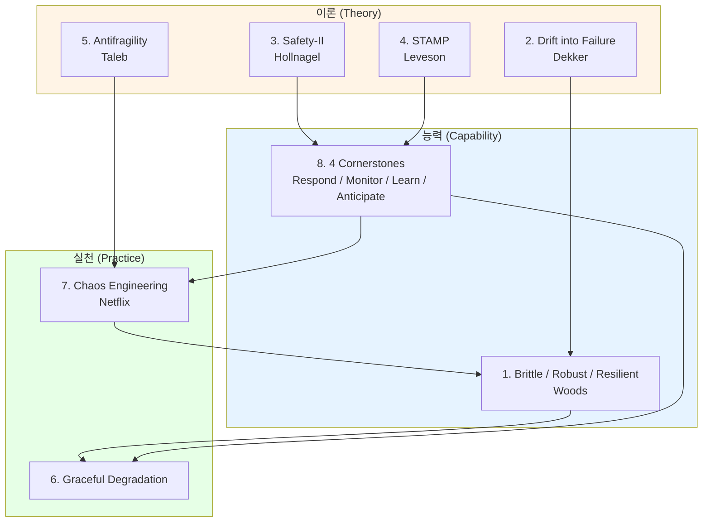
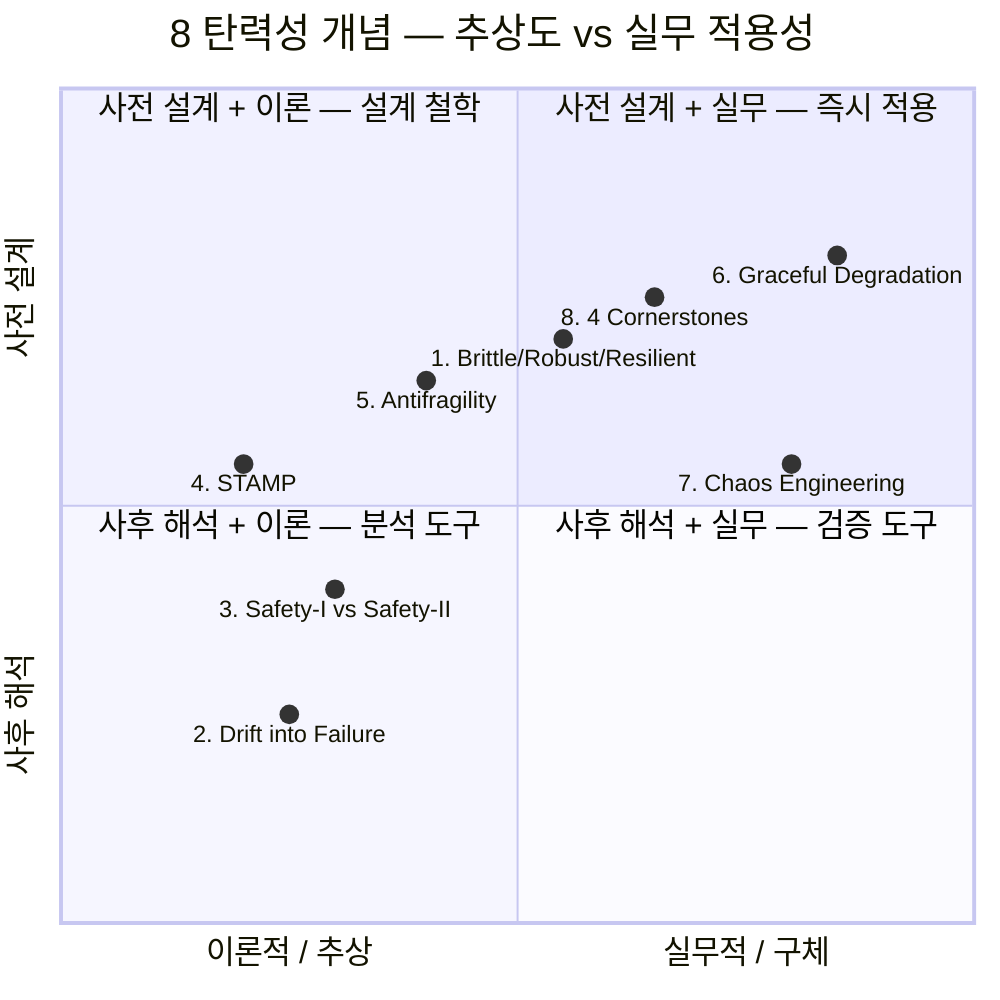

# 탄력성 이론 (Resilience Theory)

[`../patterns/reliability.md`](../patterns/reliability.md) (Circuit Breaker / Retry / Bulkhead 등 *구현*) 의 **이론적 기반** 8 개념. 안전 공학·복잡 시스템 이론·진화 시스템 이론에서 정평 있는 표준.

**원전 참고**:
- Erik Hollnagel — *Safety-I and Safety-II: The Past and Future of Safety Management* (2014)
- Erik Hollnagel — *Resilience Engineering in Practice* (2011) — 4 cornerstones
- Sidney Dekker — *Drift into Failure: From Hunting Broken Components to Understanding Complex Systems* (2011)
- Nancy Leveson — *Engineering a Safer World: Systems Thinking Applied to Safety* (MIT Press, 2011) — STAMP
- Nassim Nicholas Taleb — *Antifragile: Things That Gain from Disorder* (2012)
- Netflix — *Principles of Chaos Engineering* (https://principlesofchaos.org)
- David D. Woods — Resilience Engineering 학파

**핵심 원칙**:
- **Failure is normal** — 복잡 시스템에서 사고는 예외가 아니라 통계적 정상
- **Resilience > Reliability** — 부서지지 않음(reliability) 보다 *회복+적응*(resilience) 이 더 중요
- **Adapt to variability** — Safety-II: 실패의 부재가 아닌 *성공의 변동성* 이해
- **Hypothesis-driven failure** — Chaos Engineering 으로 *상상한 실패* 가 아닌 *실제 실패* 검증

**관련 카탈로그**:
- [`../patterns/reliability.md`](../patterns/reliability.md) — Circuit Breaker / Bulkhead / Backpressure (구현)
- [`../patterns/observability.md`](../patterns/observability.md) — Three Pillars / SLO (측정)
- [iso25010.md](iso25010.md) — Reliability 품질 특성
- [12-factor.md](12-factor.md) — Disposability, Logs (운영 관점)
- [`../patterns/deployment.md`](../patterns/deployment.md) — Canary / Blue-Green (배포 안전)

---

<a id="1-brittleness-robustness-resilience"></a>

## 1. Brittleness vs Robustness vs Resilience (부서짐 vs 견딤 vs 회복)

**정의**: 시스템이 외부 충격·내부 변동에 반응하는 세 가지 *질적으로 다른* 양식을 구분하는 분류. David D. Woods 가 *Essential Characteristics of Resilience* (2006) 에서 정형화.

- **Brittleness (부서짐)**: 정상 작동 영역 (envelope) 의 경계에 도달하면 *즉시 붕괴*. 부분 손상 없이 전체 실패. 회복 = 재구축.
- **Robustness (견딤)**: 예측된 교란 범위 내에서는 *원래 성능 유지*. 그러나 envelope 밖 사건에는 brittle 과 같이 무너진다 (cliff edge).
- **Resilience (회복+적응)**: 예측 *못한* 교란을 마주해도 (a) 성능을 점진 저하시키고 (graceful degradation), (b) 회복하고, (c) 다음을 위해 envelope 자체를 *확장* 한다.

**이론적 배경**:
- David D. Woods (Ohio State University) — *Four concepts for resilience and the implications for the future of resilience engineering* (Reliability Engineering & System Safety, 2015)
- Hollnagel & Woods, *Resilience Engineering: Concepts and Precepts* (2006)
- Robust = "designed-in tolerance for known disturbances"
- Resilient = "the ability to extend performance, and shift priorities, when surprised"

**핵심 차이**:

```
충격 강도 →
                   Brittle           Robust             Resilient
정상 성능 ━━━━━━━━╋━━━━━━━━━━━━━━━━━╋━━━━━━━━━━━━━━━━━╋━━━━━━━━━━━
                  │ (즉시 절벽)     │ (예측 범위 유지)│ (점진 저하)
                  ▼                 │                  │
0 ━━━━━━━━━━━━━━━━━━━━━━━━━━━━━━━━━▼━━━━━━━━━━━━━━━━━━╲━━━━━━━━
                                    (cliff edge)         ╲ recovery
                                                          ╲___ 적응 후
                                                              envelope 확장
```

**실무 적용**:
- **Brittle 예시**: 단일 DB master, replica 없음. master 죽으면 전체 다운
- **Robust 예시**: master + standby + 자동 failover. 알려진 장애 (HW 고장) 흡수. 단, 양쪽 datacenter 동시 정전 같은 *envelope 밖* 사건엔 무력
- **Resilient 예시**: 다중 리전 + Chaos Engineering 으로 *예상 못한* 실패 시나리오를 사전 발견하고 envelope 확장. Netflix 가 AWS us-east-1 전체 장애에도 일부 기능으로 서비스를 *지속* 한 사례

**한계**:
- "resilient" 라는 단어가 마케팅 용어로 남용 — 실제로는 robust 수준에 그치는 시스템에 자주 붙는다
- 측정 어려움: brittleness 는 *발생 후* 에야 명확해진다. 사전에는 stress test / chaos experiment 로 *근사* 만 가능
- Trade-off: 완전 resilient 시스템은 비용·복잡도가 robust 의 수배. 비즈니스 가치 대비 정당화 필요

**반례·오해**:
- 오해: "redundancy 가 많으면 resilient" → 단순 중복은 robustness. *적응* 능력이 없으면 새로운 실패 모드엔 무력
- 오해: "resilience = 무중단" → resilience 는 *부분 저하 허용* 을 핵심으로 한다. 100% uptime 목표는 오히려 brittle 한 설계 유도
- 반례: Knight Capital 2012 — *robust* 한 배포 시스템이었으나 *예상 못한* 구버전 코드 잔류로 45 분만에 $440M 손실 → robust ≠ resilient

**실무 예시**:
- Netflix Hystrix (구) / Resilience4j: Circuit Breaker 로 *graceful degradation* 구현 → resilience 의 1차 도구
- AWS Well-Architected Framework — Reliability Pillar 의 "Design for failure" 원칙
- Erlang/OTP "let it crash" 철학: 개별 프로세스는 brittle 하게 두고 *Supervisor tree* 가 resilience 책임

**관련 항목**: [2. Drift into Failure](#2-drift-into-failure), [5. Antifragility](#5-antifragility), [6. Graceful Degradation](#6-graceful-degradation), [iso25010.md#5-reliability](iso25010.md) (Reliability 품질 특성)

**난이도**: 중간 | **사용 빈도**: ★★★★★

---

<a id="2-drift-into-failure"></a>

## 2. Drift into Failure (점진적 안전 마진 잠식)

**정의**: 복잡 시스템이 *정상 운영 중에* 점진적으로 안전 경계를 침식하며 결국 재앙적 실패에 도달하는 현상. 단일 결함 (root cause) 이 아니라 *수많은 정상적 결정의 누적* 이 원인.

> "Complex system failures are not surprises, they are inevitable." — Sidney Dekker

**이론적 배경**:
- Sidney Dekker — *Drift into Failure: From Hunting Broken Components to Understanding Complex Systems* (Ashgate, 2011)
- Jens Rasmussen — *Risk Management in a Dynamic Society: A Modelling Problem* (1997). "operating point migrates toward boundary of safe operation"
- Diane Vaughan — *The Challenger Launch Decision* (1996), "normalization of deviance"
- Charles Perrow — *Normal Accidents* (1984), 복잡성·tight coupling 이 사고를 *통계적으로 정상* 으로 만든다

**핵심 메커니즘**: Rasmussen 의 *3 force model*

```
        효율성 압력 (관리)
              ↓
   ┌──────────────────────┐
   │   안전 작동 영역     │
   │  ╲                   │
   │   ╲  ← drift 방향    │
   │    ╲                 │     사용 부하 (사용자/시간)
   │     ╲ ◯ 운영점       │ ←─────────────
   │      ╲               │
   │       ╲ ✗ ← 사고     │
   └────────╲─────────────┘
       경제·작업량 압력  안전 경계 (boundary of acceptable performance)
```

각 결정은 *국소적으로 합리적* 이다:
1. 효율성 향상 위해 안전 마진 1% 축소 → OK
2. 작업량 늘어서 절차 일부 생략 → 사고 없으면 "정상화"
3. 비용 절감 위해 redundancy 1 단 제거 → 평소엔 차이 없음
4. ... 누적 → 어느 날 평범한 외란이 *재앙* 으로

**실무 적용**:
- **Postmortem 의 한계**: "root cause" 단일 지목은 잘못. drift 는 *모든 결정* 이 기여한다 — Blameless Postmortem (Etsy / Google SRE) 의 이론적 근거
- **Operational Surprise 추적**: 사고 직전 *경고 신호 (weak signal)* 를 체계적으로 수집 (near-miss, 알림 빈도 변화, MTTR 추이)
- **Boundary 가시화**: SLO error budget = 안전 경계의 정량 표현. 소진 속도가 drift 의 *측정 지표*

**한계**:
- 사후 해석 도구로는 강력하나 *예측* 도구로는 약함. "drift 가 있다" 는 사후 명확, 사전엔 모호
- 측정 가능한 지표 정립 어려움 — error budget 외엔 표준 metric 부재
- 조직 정치와 결합: "drift 인정" = "관리 실패 인정" 이라 정치적으로 회피된다

**반례·오해**:
- 오해: "drift 막으려면 절차 강화" → 절차 폭증이 오히려 *작업 우회 (workaround)* 를 유발해 drift 가속. Dekker 의 핵심 경고
- 오해: "single root cause" 식 분석으로 충분 → drift 는 *복수 원인의 시스템적 상호작용*. "5 Whys" 만으로는 닿지 않는 layer

**실무 예시**:
- **Challenger (1986)**: O-ring 저온 위험 데이터가 *15 번의 정상 발사* 로 "normalized" 되며 안전 경계가 잠식
- **Boeing 737 MAX MCAS (2018-2019)**: 단일 AOA 센서 의존, 시뮬레이터 훈련 면제, 인증 self-delegation 등 *개별로는 정당해 보였던* 결정들의 누적
- **Knight Capital (2012)**: 구버전 코드 deploy flag 재사용, manual deploy checklist 의존, repo cleanup 누락 → 45분 / $440M 손실. 각 결정은 평소엔 무해
- **AWS S3 outage (2017)**: typo 한 줄. 그러나 *해당 명령에 reboot 검증 없음* + *대규모 reboot 미테스트* 가 drift

**관련 항목**: [3. Safety-I vs Safety-II](#3-safety-i-vs-safety-ii), [4. STAMP](#4-stamp), [`../patterns/observability.md`](../patterns/observability.md) (SLO / Error Budget), Blameless Postmortem

**난이도**: 높음 | **사용 빈도**: ★★★★☆

---

<a id="3-safety-i-vs-safety-ii"></a>

## 3. Safety-I vs Safety-II (안전의 두 패러다임)

**정의**: Erik Hollnagel 이 *Safety-I and Safety-II* (2014) 에서 제안한 안전 관점의 두 패러다임. 전통적 "사고 방지" 관점 (Safety-I) 과, 사고가 아닌 *성공의 변동성* 을 이해해 회복력을 키우는 관점 (Safety-II) 을 구분.

| 측면 | Safety-I | Safety-II |
|---|---|---|
| 정의 | "as few things as possible go wrong" | "as many things as possible go right" |
| 초점 | 사고·실패·일탈 | 정상 작동의 변동성 |
| 접근 | reactive — 사고 발생 후 분석 | proactive — 평소 작동을 학습 |
| 인간 | hazard (제거 대상) | resource (적응 능력) |
| 가정 | bimodal — 작동 또는 실패 | continuous — 모든 작동은 *변동* 의 결과 |
| 방법 | RCA, FTA, FMEA | FRAM, work-as-done 관찰 |

**이론적 배경**:
- Erik Hollnagel — *Safety-I and Safety-II: The Past and Future of Safety Management* (Ashgate, 2014)
- Hollnagel — *FRAM: The Functional Resonance Analysis Method* (2012)
- "Work-as-imagined vs Work-as-done" — 절차서 (imagined) 와 실제 작업 (done) 의 gap 이 변동성의 근원
- Resilience Engineering 학파 (Hollnagel, Woods, Wreathall, Leveson)

**Safety-I 의 한계** (Hollnagel 의 비판):
1. **희소성**: 사고는 통계적으로 드물어 *충분한 표본* 부재
2. **편향**: 사고만 보면 "왜 잘 작동했는지" 모름
3. **반사실 (counterfactual)**: "이렇게 했어야" 는 사후 가능, 사전엔 정보 부족
4. **인간 = 문제** 관점이 자동화 과신 → 새로운 실패 모드 생성

**Safety-II 의 핵심 통찰**:
- 같은 작업이 99,999 번 성공하고 1 번 실패한다면, *왜 99,999 번 성공했는가* 가 더 많은 정보를 준다
- 인간은 절차에 *맞춰* 일하지 않고, 절차를 *적응* 시켜 일한다. 그 적응이 일상의 회복력 원천
- "적응" 은 평소엔 invisible — 사고 시에만 드러난다 ("우리도 평소에 이렇게 했어요")

**실무 적용**:
- **Operational Reviews**: 사고만 보지 말고 *성공한 incident response* 의 패턴을 분석. "왜 이번엔 빨리 복구됐는가?"
- **Near-miss / Save 추적**: 사고로 *이어지지 않은* 위험 상황 수집. 평소 작동의 변동 폭을 가시화
- **Game Day / Chaos Drill 사후**: 단순 fail/pass 가 아니라 *대응자가 어떻게 적응했는가* 를 학습
- **Postmortem template 갱신**: "what went well" 섹션을 의무화 (Google SRE Book 권장)

**한계**:
- "사고 방지" 와 "성공 학습" 은 보완 관계 — Safety-II *대체* 가 아닌 *추가*. 그러나 실무에선 "Safety-II 도입 = Safety-I 폐기" 로 오해되기 쉽다
- 측정 인프라 필요: 평소 작동의 변동성을 정량화하려면 distributed tracing / structured logging 이 필수 ([`../patterns/observability.md`](../patterns/observability.md))
- 조직 문화: blameless 가 정착되지 않은 곳에선 "성공의 변동성" 도 결국 평가 도구로 오용

**반례·오해**:
- 오해: "Safety-II = 자동화 줄이기" → 자동화는 그대로, *인간의 적응 능력을 자원으로 인정* 이 핵심
- 오해: "Safety-II = soft 한 접근, 정량성 약함" → FRAM 등 정량 도구 존재. Datadog / Honeycomb 등 관측성 도구가 Safety-II 데이터 수집 인프라

**실무 예시**:
- Google SRE — *blameless postmortem* + *"what went well"* 섹션 = Safety-II 실천
- Netflix Chaos Engineering — *예상 못한* 적응 과정을 사전에 노출 = Safety-II 의 hypothesis-driven 변형
- Etsy Operations Center — *day-to-day operations* 변동성 관찰 문화 (Dekker 영향)
- 의료 분야 *positive deviance* 연구 (잘 작동하는 병동의 일상 관찰) → 동일 철학

**관련 항목**: [2. Drift into Failure](#2-drift-into-failure), [4. STAMP](#4-stamp), [8. Resilience Capabilities](#8-resilience-4-cornerstones), [`../patterns/observability.md`](../patterns/observability.md)

**난이도**: 높음 | **사용 빈도**: ★★★☆☆

---

<a id="4-stamp"></a>

## 4. STAMP / Systems-Theoretic Accident Model (제어 실패로서의 사고)

**정의**: Nancy Leveson (MIT) 이 *Engineering a Safer World* (2011) 에서 제안한 시스템 이론 기반 사고 모델. 사고를 "*구성요소 고장의 누적*" 이 아닌 "*제어 구조의 실패 — safety constraints 가 적절히 강제되지 않은 상태*" 로 정의한다.

**기본 가정**:
- 안전 = *시스템 속성*, 구성요소 속성 아님 (emergent property)
- 사고 = *부적절한 제어* 의 결과 (control failure), 단순 결함 누적 아님
- 시스템 = *제어 루프* 의 위계 — 각 레벨이 하위 레벨에 *safety constraints* 를 강제

**이론적 배경**:
- Nancy Leveson — *Engineering a Safer World: Systems Thinking Applied to Safety* (MIT Press, 2011)
- STAMP = **S**ystems-**T**heoretic **A**ccident **M**odel and **P**rocesses
- 분석 도구: **STPA** (System-Theoretic Process Analysis) — hazard analysis 절차
- 사고 분석: **CAST** (Causal Analysis based on STAMP)
- Jay Forrester 의 *System Dynamics* 와 제어 이론에 기반

**STAMP 의 사고 분류 — 4 가지 Unsafe Control Action (UCA)**:
1. 필요한 제어가 *주어지지 않음* (control not provided)
2. 부적절한 제어가 *주어짐* (unsafe control provided)
3. 적절한 제어가 *너무 늦거나 너무 이른 시점에* 주어짐 (wrong timing)
4. 제어가 *너무 일찍 중단* 되거나 *너무 오래* 적용됨 (wrong duration)

**제어 구조 다이어그램 (단순화)**:

```
   ┌──────────────────────┐
   │ Regulatory Body      │  ← safety constraint: certification rules
   └─────────┬────────────┘
             │ control / feedback
   ┌─────────▼────────────┐
   │ Company Management   │  ← constraint: safety policy
   └─────────┬────────────┘
             │
   ┌─────────▼────────────┐
   │ Operations Team      │  ← constraint: procedures, runbooks
   └─────────┬────────────┘
             │
   ┌─────────▼────────────┐
   │ Controlled Process   │  ← physical system / software
   │   (production env)   │
   └──────────────────────┘
```

각 화살표 = 제어 신호. 반대 방향 = feedback. *어느 한 화살표에서든 UCA 가 발생* 하면 사고 가능.

**실무 적용**:
- **STPA 절차**:
  1. 시스템 목적·losses 정의 ("사용자 데이터 유출" "5분 이상 다운")
  2. Hazards 정의 ("인증되지 않은 요청이 처리됨")
  3. Control structure 도식화
  4. 각 control action 에 대해 4 UCA 유형 점검
  5. Causal scenarios 도출 → mitigation 설계
- **소프트웨어 사례**: 마이크로서비스 간 제어 흐름을 STAMP 모델로 그리면 *missing safety constraint* (예: rate limit 미적용 경로) 가 가시화
- **CI/CD STAMP**: 배포 파이프라인 = 제어 구조. "test stage 가 fail 시에도 deploy 가 진행됨" = UCA 유형 1

**한계**:
- 학습 곡선 가파름 — 제어 이론 배경 필요
- 도구 부족: STPA 전용 상용 도구가 항공·자동차 외엔 제한적 (XSTAMPP 같은 오픈소스 존재)
- *반복적* 분석 필요 — 시스템 변경마다 control structure 갱신
- 소프트웨어 단독보다는 *socio-technical 시스템* (조직 + 소프트웨어) 에서 가장 가치 발휘

**반례·오해**:
- 오해: "STAMP = 결함 트리 (FTA) 의 변형" → FTA 는 *bottom-up* 의 결함 누적 모델. STAMP 는 *top-down* 의 제어 실패 모델. 본질적으로 다른 패러다임
- 오해: "STAMP 는 안전 critical 산업 전용" → Leveson 은 *모든 복잡 시스템* (금융, 소프트웨어 포함) 에 적용 가능함을 주장. 실제로 우주항공·의료·핵 외에도 사이버보안 분야에서 채택 증가

**실무 예시**:
- **NASA**: 우주선 시스템 안전 분석 표준의 일부
- **자동차 ISO 26262 / SOTIF (ISO 21448)**: STPA 명시적 권장
- **Boeing 737 MAX 사후 분석** (MIT): STAMP/CAST 로 *FAA delegation* + *Boeing 내부 압력* 의 제어 실패 도식화
- **사이버보안**: Young & Leveson (2014) "Inside Risks" — STAMP 를 위협 모델링에 적용
- **AWS 사후 분석** (학술): S3 outage 등을 STAMP 로 재분석한 연구 다수

**관련 항목**: [2. Drift into Failure](#2-drift-into-failure), [3. Safety-I vs Safety-II](#3-safety-i-vs-safety-ii), [`../security/`](../security/) (threat modeling), [iso25010.md#5-reliability](iso25010.md)

**난이도**: 매우 높음 | **사용 빈도**: ★★★☆☆

---

<a id="5-antifragility"></a>

## 5. Antifragility (충격으로 강해지는 시스템)

**정의**: Nassim Nicholas Taleb 이 *Antifragile: Things That Gain from Disorder* (2012) 에서 제안한 개념. fragile (충격에 약함) — robust (충격에 견딤) — antifragile (충격으로 *오히려 강해짐*) 의 3 단계 분류. 단순 회복 (resilience) 을 넘어 *변동성·실패·스트레스로부터 이득* 을 얻는 속성.

> "Some things benefit from shocks; they thrive and grow when exposed to volatility, randomness, disorder, and stressors and love adventure, risk, and uncertainty." — Taleb

**Triad 분류**:

| 속성 | 충격 반응 | 예시 |
|---|---|---|
| Fragile | 손상 / 붕괴 | 도자기, monolithic legacy, single point of failure |
| Robust | 변화 없음 | 바위, fault-tolerant 시스템 |
| Antifragile | 강화 | 면역계, 근육 (운동), 진화, Chaos Engineering 을 적용한 시스템 |

**이론적 배경**:
- Nassim Nicholas Taleb — *Antifragile: Things That Gain from Disorder* (Random House, 2012)
- *The Black Swan* (2007), *Skin in the Game* (2018) 의 연장선
- **Hormesis** (생물학): 저용량 스트레스가 시스템을 강화 (백신, 운동, 단식)
- **Optionality**: 비대칭적 보상 — 손실은 제한, 이득은 무한 (convex payoff)
- **Via Negativa**: 추가가 아닌 *제거* 로 강해진다 (불필요 의존성 제거)

**Antifragile 의 메커니즘**:
1. **Convexity (볼록성)**: 작은 충격이 *큰 이득* 으로 비대칭 변환되는 구조
2. **Hormetic stressors**: *작고 잦은* 스트레스가 *드물고 큰* 충격에 대한 면역 형성
3. **Skin in the game**: 의사결정자가 *결과의 대가* 를 지는 구조 → 자기 교정
4. **Barbell strategy**: 극단의 안전 (대부분 자원) + 극단의 위험 (소량) 조합. 중간 risk 회피

**실무 적용**:
- **Chaos Engineering** = Antifragility 의 IT 구현 — 작고 잦은 fault injection 으로 시스템과 *팀의 대응 능력* 을 강화
- **Game Days**: 정기 장애 시뮬레이션. 단순 RTO 검증 (robust) 을 넘어 매번 *새 문제 발견* → *runbook 진화* (antifragile)
- **Postmortem culture**: 사고가 *기록과 학습 자산* 으로 전환되면 조직이 antifragile. 사고를 숨기면 fragile
- **Microservices**: 작은 서비스의 잦은 실패가 *전체* 강화. monolith 의 드문 큰 실패가 fragile
- **Canary / Blue-Green deploy**: 작은 batch 의 잦은 실패 노출 → big-bang deploy 의 드문 재앙 회피

**의사 코드 (개념 설명)**:

```kotlin
// Antifragile = 실패가 시스템 capability 를 *증가* 시키는 구조
class AntifragileSystem<T>(
    private val operation: () -> T,
    private val learnings: MutableList<FailureLearning> = mutableListOf()
) {
    fun execute(): Result<T> = runCatching(operation)
        .onFailure { error ->
            // 1. 실패를 자산으로 기록
            val learning = analyzeRootCause(error)
            learnings += learning
            // 2. 다음 실행에 학습을 *반영* — 시스템이 강해짐
            adjustGuardrails(learning)
            // 3. 비대칭 보상: 손실은 제한, 학습은 무한 누적
        }

    // Robust 와의 차이: robust 는 onFailure 에서 *recovery* 만, 시스템은 그대로
    //                 antifragile 은 onFailure 가 *영구적 capability 향상* 으로 이어진다
}
```

**한계**:
- "antifragile" 마케팅 남용 — 대부분 시스템은 robust 수준에 그친다
- *측정 어려움*: convexity 정량화는 옵션 가격 (Black-Scholes) 수준의 수학 필요
- **국소적** antifragility 가 **전역적** fragility 를 만들 수 있다 (예: 작은 서비스 각각은 antifragile 이나 의존성 매트릭스가 cascading failure 유발)
- 충격 강도엔 *상한* 이 있다 — antifragile 시스템도 "ruin" (회복 불가) 임계점 너머엔 fragile

**반례·오해**:
- 오해: "antifragile = resilient + 학습 능력" → 부분적으로 맞지만 *비대칭 보상 구조* 가 핵심. 학습만으로 antifragile 아님
- 오해: "chaos engineering 도입 = antifragile 달성" → Chaos Engineering 은 *수단*. 학습이 *시스템 변경으로 이어지지 않으면* 그냥 robust
- 반례: Google SRE 의 *Error Budget* — antifragile 처럼 보이나 본질은 robust + 학습. Taleb 의 엄격한 정의로는 *convex payoff* 가 부족

**실무 예시**:
- **Netflix Simian Army** — Chaos Monkey, Latency Monkey, Chaos Gorilla. 작은 실패 의도 주입 → 시스템·문화 강화. Antifragility 의 가장 유명한 IT 실천
- **AWS Multi-AZ + Multi-Region**: 한 AZ 다운이 *향후 설계 학습* 으로 이어지는 구조 (postmortem 공개)
- **Linux kernel**: 수십 년 *수많은 bug* → 매번 검토 + 통합 → 견고함의 누적. 진화론적 antifragility
- **금융**: barbell portfolio — 90% 국채 + 10% 고위험 = 손실 제한 + 상승 무한

**관련 항목**: [1. Brittleness vs Robustness vs Resilience](#1-brittleness-robustness-resilience), [7. Chaos Engineering Principles](#7-chaos-engineering-principles), [`../patterns/deployment.md`](../patterns/deployment.md) (Canary), [`../patterns/observability.md`](../patterns/observability.md)

**난이도**: 높음 | **사용 빈도**: ★★★★☆

---

<a id="6-graceful-degradation"></a>

## 6. Graceful Degradation (점진적 성능 저하)

**정의**: 시스템 일부 구성요소가 실패하거나 부하 임계를 넘었을 때 *전체 실패* 대신 *기능을 부분 축소* 하여 핵심 가치를 유지하는 설계 원칙. "all-or-nothing" 의 반대 — 80% 기능을 100% 사용자에게 제공.

**핵심 질문**: "이 기능이 죽으면 *전체 페이지* 가 죽는가, *그 기능만* 죽는가?"

**이론적 배경**:
- IBM *Fault-Tolerant Computing* 연구 (1970s~) — graceful degradation 용어 정착
- David Parnas — *Designing Software for Ease of Extension and Contraction* (1979) — 정보 은닉으로 부분 실패 격리
- Fred Brooks — *No Silver Bullet* (1986) — 본질적 복잡성은 점진적 저하로 다뤄야
- Hollnagel의 resilience 4 cornerstones 중 "Respond" 영역 (다음 항목 참조)
- Web 분야: *Progressive Enhancement* (Steven Champeon, 2003) — 동일 철학의 frontend 표현

**Graceful Degradation 의 4 레벨**:

| 레벨 | 동작 | 예시 |
|---|---|---|
| L0 — Total failure | 전체 다운 | "사이트 접속 불가" |
| L1 — Read-only mode | 쓰기 차단, 읽기 유지 | DB master 장애 시 replica 만으로 서비스 |
| L2 — Reduced functionality | 부가 기능 차단, 핵심 유지 | 추천 시스템 다운 → 검색은 동작, "추천" 영역만 숨김 |
| L3 — Cached / stale data | 실시간 데이터 대신 캐시 | 가격 정보 stale, 주문은 가능 |
| L4 — Full functionality | 정상 | — |

**실무 적용**:
- **Feature Flag**: 장애 발생 기능을 *런타임* 차단 → graceful degradation 의 1차 도구
- **Circuit Breaker fallback**: 외부 API 죽으면 *기본값* 반환 ([`../patterns/reliability.md`](../patterns/reliability.md) §1)
- **Static fallback**: CDN 의 정적 페이지가 backend 다운 시 노출 (Cloudflare Always Online)
- **Stale-while-revalidate** (HTTP RFC 5861): 캐시 만료돼도 일시 노출, 비동기로 갱신

**Kotlin 구현 예 — Fallback Chain**:

```kotlin
// Graceful Degradation = fallback 우선순위 chain
// "가장 정확한 데이터" → "조금 오래된 데이터" → "기본값" 순으로 시도
class ProductPriceService(
    private val realtimeApi: PriceApi,        // L4 - 실시간
    private val cache: PriceCache,            // L3 - 캐시 (5분)
    private val staticDefault: PriceCatalog,  // L2 - 정적 카탈로그 (어제 기준)
) {
    suspend fun getPrice(productId: String): PriceResult = runCatching {
        // 1) 실시간 시도 (1초 timeout + circuit breaker)
        circuitBreaker.call {
            withTimeout(1_000) { realtimeApi.fetch(productId) }
        }
    }.recoverCatching {
        // 2) 실시간 실패 → 캐시 fallback (UI 에 "stale" 표시)
        cache.get(productId)?.copy(isStale = true)
            ?: throw CacheMissException()
    }.recoverCatching {
        // 3) 캐시도 miss → 정적 카탈로그 fallback (구매 가능, "예상 가격" 표시)
        staticDefault.get(productId).copy(isApproximate = true)
    }.getOrElse {
        // 4) 모두 실패해도 *주문 페이지 전체 다운* 은 막는다
        PriceResult.Unavailable
    }
}
// 핵심: 어느 단계에서든 *사용자가 결제까지 도달* 할 수 있다
```

**한계**:
- *상태 일관성* 위험: stale data 로 동작한 사용자가 신선 데이터와 충돌 → reconciliation 필요
- 어떤 기능이 "non-critical" 인지 *비즈니스 합의* 필요 — 기술 결정 단독으로 불가
- **Silent degradation 위험**: 사용자가 *저하 상태* 를 모르면 신뢰 손상. "지금 정보가 일시적으로 부정확할 수 있습니다" 배너 등 *명시* 가 중요
- 테스트 부담: degraded path 도 정상 path 만큼 테스트 필요 (Chaos Engineering 의 영역)

**반례·오해**:
- 오해: "graceful degradation = 에러 페이지를 예쁘게" → 본질은 *기능 일부 유지*, UI 만 다듬는 게 아니다
- 오해: "fallback 만 있으면 graceful" → fallback 이 *primary 와 비슷한 부하* 를 견디지 못하면 cascading failure (예: 캐시도 같은 DB 의존)
- 반례: GitLab 2017 outage — primary DB 실패 후 *백업 복구 절차가 미테스트* 라 6시간 다운. fallback 자체가 brittle 했던 사례

**실무 예시**:
- **Amazon 상품 페이지**: 추천 / 리뷰 / 재고 / 가격 각각 독립 fallback. 한 영역 다운이 결제 차단으로 이어지지 않는다
- **GitHub**: 검색 다운 시 "검색 일시 불가" 배너 + 나머지 정상. 전체 다운 회피
- **Twitter/X**: 트렌드 / DM / 검색 각각 부분 다운 가능. 타임라인은 유지
- **Stripe** Idempotency + Fallback: 결제 처리 중 네트워크 장애 시 *retry 안전* + *수동 reconciliation* 경로
- **Frontend Progressive Enhancement**: JS 다운 시 SSR HTML 로 핵심 기능 동작 (form submit 등)

**관련 항목**: [1. Brittleness vs Robustness vs Resilience](#1-brittleness-robustness-resilience), [5. Antifragility](#5-antifragility), [`../patterns/reliability.md`](../patterns/reliability.md) (Circuit Breaker fallback), Feature Flag, [`../patterns/caching.md`](../patterns/caching.md) (stale-while-revalidate)

**난이도**: 중간 | **사용 빈도**: ★★★★★

---

<a id="7-chaos-engineering-principles"></a>

## 7. Chaos Engineering Principles (혼돈 공학 원칙)

**정의**: "운영 환경에서 *통제된 실험* 을 통해, 시스템이 격렬한 조건에도 *원하는 동작을 유지할 자신감* 을 구축하는 학문." — Netflix *Principles of Chaos* (https://principlesofchaos.org)

단순 fault injection 이 아니라 *hypothesis-driven 실험* — "이런 충격에서 시스템이 *이렇게* 동작할 것이다" 를 가설로 두고 검증.

**이론적 배경**:
- Netflix — *Principles of Chaos Engineering* (2014, https://principlesofchaos.org)
- Casey Rosenthal & Nora Jones — *Chaos Engineering: System Resiliency in Practice* (O'Reilly, 2020)
- Bruce Wong & Casey Rosenthal — *Chaos Engineering* (O'Reilly Short Book, 2017)
- ACM Queue — *Chaos Engineering* (Basiri et al., 2016)
- Antifragility 이론의 IT 구현 (5 항 참조)

**5 핵심 원칙** (Principles of Chaos):

1. **Build a hypothesis around steady-state behavior** — 정상 상태의 *측정 가능한* 지표 (예: 분당 주문 수, p99 latency) 를 정의하고, 실험 중 이 지표가 유지될 것이라는 *가설* 수립
2. **Vary real-world events** — 실제 발생하는 사건을 다양화 (서버 다운, 네트워크 지연, DNS 실패, 디스크 풀, AZ outage)
3. **Run experiments in production** — staging 만으로는 *실제 트래픽·실제 의존성* 의 emergent behavior 재현 불가. 단, 안전장치 필수
4. **Automate experiments to run continuously** — 일회성 실험은 가치 제한. CI/CD 의 일부로 *정기 자동화*
5. **Minimize blast radius** — 가장 작은 영역에서 시작, 안전 확인 후 점진 확대. *abort condition* 명시 필수

**실험 설계 절차**:

```
1) Steady State 정의       — "정상" 의 정량 지표
   예: success_rate > 99.5%, p99_latency < 500ms
   ▼
2) Hypothesis 수립         — 이 실험에서 steady state 가 유지될 것
   예: "결제 API 의 10% 가 500ms 지연돼도 success_rate 는 유지"
   ▼
3) Blast Radius 정의       — 영향 범위 (사용자·트래픽·시간)
   예: "us-east-1 의 1% canary, 10분, abort 조건 = error rate > 1%"
   ▼
4) Fault Injection         — 실제 fault 주입
   예: tc qdisc 로 network delay 500ms 추가
   ▼
5) Observe & Measure        — 정량 지표 비교
   ▼
6) Conclude
   - 가설 유지 → 다음 실험으로 (blast radius 확대)
   - 가설 깨짐 → 약점 발견. fix → 재실험
```

**의사 코드 — Chaos Experiment Framework**:

```kotlin
// Chaos Experiment = (Hypothesis, FaultInjection, BlastRadius, AbortCondition)
data class ChaosExperiment(
    val name: String,
    val steadyState: () -> Boolean,             // 정상 지표 측정
    val hypothesis: String,                      // 인간이 읽는 가설
    val faultInjection: suspend () -> Unit,      // 실제 fault 주입
    val cleanup: suspend () -> Unit,             // fault 제거
    val blastRadius: BlastRadius,                // 1% canary 등
    val abortCondition: () -> Boolean,           // 즉시 중단 조건
    val duration: Duration,
)

suspend fun ChaosExperiment.run(): ExperimentResult {
    require(steadyState()) { "사전 정상 상태 위반 — 실험 시작 금지" }
    try {
        faultInjection()
        val deadline = System.currentTimeMillis() + duration.inWholeMilliseconds
        while (System.currentTimeMillis() < deadline) {
            if (abortCondition()) {
                return ExperimentResult.Aborted("abort condition triggered")
            }
            delay(1_000)
        }
        val held = steadyState()
        return if (held) ExperimentResult.HypothesisHeld
               else ExperimentResult.HypothesisRefuted(findings = collectFindings())
    } finally {
        cleanup()  // 실패해도 반드시 fault 제거 (blast radius 봉쇄)
    }
}
```

**Chaos 도구 분류**:

| 도구 | 영역 | 비고 |
|---|---|---|
| Chaos Monkey | EC2 인스턴스 임의 종료 | Netflix Simian Army 의 시조 |
| Chaos Gorilla | AWS AZ 전체 종료 시뮬레이션 | |
| Litmus | Kubernetes 네이티브 chaos | CNCF incubation |
| Chaos Mesh | Kubernetes chaos (PingCAP) | |
| Gremlin | 상용 chaos platform | enterprise 친화 |
| AWS FIS (Fault Injection Simulator) | AWS 통합 | 2021~ |
| Toxiproxy | 네트워크 layer fault injection | Shopify 개발 |

**한계**:
- *조직 성숙도 전제*: monitoring · runbook · on-call 이 없으면 chaos 는 진짜 chaos 가 된다
- *production 실험 신뢰* 확보까지 수개월~수년 — 작은 실험부터 *공유 학습* 축적 필요
- **Sample bias**: chaos 가 *예상한* 실패만 검증. *상상 못한* 실패 (예: 새 third-party 의존성) 는 여전히 sample 밖
- 측정 인프라 비용 — observability 가 부실하면 실험 결과 해석 불가

**반례·오해**:
- 오해: "chaos engineering = chaos monkey 만 돌리기" → 단순 random fault 는 *fault injection*. Chaos Engineering 은 *hypothesis-driven 실험* 이 본질
- 오해: "production 에서 하면 위험" → blast radius 통제 없이는 그렇다. 통제된 1% canary 실험이 *상상한 staging 실험* 보다 안전 (실제 의존성 반영)
- 오해: "Disaster Recovery drill 과 동일" → DR drill 은 *알려진 시나리오 재현*. Chaos Engineering 은 *모르는 약점 탐색*
- 반례: 2014 Knight Capital 사고는 chaos engineering 으로 *발견 가능* 했을 deploy chaos. 그러나 당시엔 도구도 문화도 없었다

**실무 예시**:
- **Netflix** — 2010s 부터 production chaos 일상화. Simian Army 공개 → 산업 표준화
- **Amazon** — *GameDay* 행사로 팀 전체 chaos 훈련. AWS FIS 출시 (2021)
- **Google** — *DiRT* (Disaster Recovery Testing) program. 회사 전체 단위 fault drill
- **LinkedIn** — *Waterbear* — production traffic 일부에 latency 주입
- **Stripe** — 결제 시스템 chaos. 결제 *idempotency* 가 모든 실험의 전제

**관련 항목**: [5. Antifragility](#5-antifragility), [6. Graceful Degradation](#6-graceful-degradation), [8. Resilience Capabilities](#8-resilience-4-cornerstones), [`../patterns/reliability.md`](../patterns/reliability.md), [`../patterns/observability.md`](../patterns/observability.md)

**난이도**: 높음 | **사용 빈도**: ★★★★☆

---

<a id="8-resilience-4-cornerstones"></a>

## 8. Resilience Capabilities — 4 Cornerstones (Hollnagel)

**정의**: Erik Hollnagel 이 *Epilogue: Resilience Engineering Precepts* (2006) 및 *Resilience Engineering in Practice* (2011) 에서 정형화한, *회복력 있는 시스템* 이 갖춰야 할 4 가지 기본 능력. resilience 를 막연한 속성이 아닌 *측정·설계 가능한 capability* 로 분해.

**4 Cornerstones**:

| 능력 | 시간 지향 | 질문 | 다른 표현 |
|---|---|---|---|
| **Respond** | 현재 (actual) | "지금 일어나고 있는 일에 어떻게 대응할 것인가?" | knowing what to do |
| **Monitor** | 곧 (critical) | "곧 일어날 수 있는 일을 어떻게 알 것인가?" | knowing what to look for |
| **Learn** | 과거 (factual) | "이미 일어난 일에서 무엇을 배울 것인가?" | knowing what has happened |
| **Anticipate** | 미래 (potential) | "앞으로 일어날 수 있는 일을 어떻게 예상할 것인가?" | knowing what to expect |

```
              Anticipate (미래)
              "potential"
                   ▲
                   │
  Learn (과거) ◀── ┼── ▶ Monitor (곧)
  "factual"        │     "critical"
                   ▼
              Respond (현재)
              "actual"
```

**이론적 배경**:
- Erik Hollnagel — *Epilogue: Resilience Engineering Precepts* (in Hollnagel, Woods & Leveson eds., *Resilience Engineering: Concepts and Precepts*, 2006)
- Hollnagel — *Resilience Engineering in Practice: A Guidebook* (2011) — 4 cornerstones 의 정식 명명
- *Resilience Assessment Grid* (RAG) — 4 cornerstones 각각에 대한 진단 도구
- David Woods — graceful extensibility 이론 (Anticipate 의 확장)

### 8.1 Respond (대응)

**정의**: 일상 변동 / 예상 외 사건 / 위협에 *적절히 대처* 하는 능력. 사전 정의된 대응 + 즉흥적 적응 모두 포함.

**구성 요소**:
- 사전 정의 (planned response): runbook, incident response playbook
- 즉흥 (improvised response): 학습된 일반 원리로 새 상황에 대응
- 실행 자원: on-call 인력, 권한, 도구 접근권

**소프트웨어 실무**:
- **Incident Response Playbook** (PagerDuty, Atlassian)
- **Runbook 자동화** (Rundeck, AWS Systems Manager)
- **On-call rotation** + 명확한 escalation path
- **Auto-remediation**: Kubernetes liveness probe → 자동 재시작은 *자동화된 Respond*

### 8.2 Monitor (감시)

**정의**: 시스템 자체 및 환경에서 *영향을 줄 수 있는 변화* 를 인지하는 능력. 단순 dashboard 가 아니라 *무엇을 봐야 하는지를 아는 능력*.

**핵심 차이**: "지표가 많다" ≠ "monitor 능력이 좋다". *의미 있는 leading indicator* 식별이 본질.

**소프트웨어 실무**:
- **Leading indicators**: 사고 *이전* 의 weak signal — error rate 증가, latency 분산 확대, queue depth 증가
- **SLI/SLO/SLO burn rate** ([`../patterns/observability.md`](../patterns/observability.md))
- **Anomaly detection** — Datadog Watchdog, ML 기반 이상 탐지
- **Three Pillars of Observability** — Logs / Metrics / Traces
- **Distributed Tracing** — emergent behavior 가시화 (OpenTelemetry)

### 8.3 Learn (학습)

**정의**: 경험으로부터 *올바른 교훈* 을 추출하는 능력. 성공·실패 *모두* 에서. Safety-II 와 직결 (3 항 참조).

**핵심 차이**: postmortem 만 한다고 learn 능력이 있는 게 아니다. *교훈이 시스템 변경으로 이어지는가* 가 척도.

**소프트웨어 실무**:
- **Blameless Postmortem** (Google SRE, Etsy)
- **Action items 추적** — postmortem 결론의 *실제 implementation 완료율*
- **"What went well" 분석** — Safety-II 실천 (3 항)
- **Cross-team learning** — 다른 팀 사고에서 학습 (Amazon 의 *Correction of Error* 공유)
- **사고 데이터베이스** — 검색 가능한 사고 아카이브 + 패턴 분석

### 8.4 Anticipate (예측)

**정의**: 미래의 *위협·기회·요구 변화* 를 예측하는 능력. 정량 예측이 아닌 *시나리오 사고*.

**Hollnagel 의 강조**: anticipate ≠ forecasting (예측). 정확한 미래 예측이 아니라 *"이런 일이 일어날 수 있다" 는 가능성 공간* 의 인식.

**소프트웨어 실무**:
- **Threat Modeling** (STRIDE, PASTA) — 보안 영역의 anticipate
- **Capacity Planning** — 트래픽 성장 예측 + headroom 확보
- **Chaos Engineering** (7 항) — anticipate 의 검증 도구. *상상한 미래* 를 *실측*
- **Tabletop Exercise** — "X 가 일어나면 어떻게?" 의 종이 시뮬레이션
- **Pre-mortem** (Gary Klein) — "이 프로젝트가 실패했다고 가정하고 *왜* 실패했을지" 사전 분석

**4 Capabilities 통합 진단 — RAG (Resilience Assessment Grid)**:

각 cornerstone 에 대해:
- 무엇을 (what)?
- 어떻게 (how)?
- 얼마나 자주 (how often)?
- 누가 (by whom)?

소프트웨어 팀 RAG 예시:

| Capability | What | How | How often |
|---|---|---|---|
| Respond | P1 incident 대응 | runbook + on-call | 24/7 |
| Monitor | SLO burn rate | Datadog alert | continuous |
| Learn | postmortem action 완료 | sprint review tracking | weekly |
| Anticipate | next quarter risk | Chaos Game Day | monthly |

**한계**:
- 4 cornerstones 가 *균형* 잡혀야 — 한 영역이 약하면 다른 영역도 무력해진다 (예: Anticipate 약하면 Respond 가 항상 "처음 보는 상황")
- 측정 표준 부재 — RAG 는 정성적, 회사마다 해석 차이
- 조직 문화 의존 — 특히 Learn 능력은 blameless culture 가 필수

**반례·오해**:
- 오해: "monitoring 도구 사면 Monitor 능력 확보" → 도구는 인프라, 능력은 *해석·대응* 까지 포함
- 오해: "Anticipate = 예언" → Hollnagel 본인이 명시적으로 거부. *가능성 공간 인식* 이 본질
- 반례: Boeing 737 MAX — Anticipate 약점 (단일 센서 가정), Learn 약점 (시뮬레이터 면제 결정 회고 부재), Monitor 약점 (현장 보고 missed) 가 **동시** 노출

**실무 예시**:
- **Google SRE** — *4 golden signals* (Latency / Traffic / Errors / Saturation) = Monitor 의 표준화
- **AWS Well-Architected Reliability Pillar** — 4 cornerstones 매핑 가능 (Foundations / Workload / Change / Failure Management)
- **PagerDuty Incident Response** — Respond + Learn 의 통합 플랫폼
- **Netflix CORE (Critical Operations and Reliability Engineering)** — 4 cornerstones 모두를 한 팀에 통합
- **Etsy Operations Center** — 24/7 monitor + 일상 학습 문화 (Safety-II 영향)

**관련 항목**: [2. Drift into Failure](#2-drift-into-failure), [3. Safety-I vs Safety-II](#3-safety-i-vs-safety-ii), [7. Chaos Engineering Principles](#7-chaos-engineering-principles), [`../patterns/observability.md`](../patterns/observability.md), [`../patterns/reliability.md`](../patterns/reliability.md), [iso25010.md#5-reliability](iso25010.md)

**난이도**: 높음 | **사용 빈도**: ★★★★★

---

## 8 개념 종합 매트릭스

| # | 개념 | 핵심 학자 | 핵심 통찰 | IT 적용 도구 | 난이도 |
|---|---|---|---|---|---|
| 1 | Brittleness / Robustness / Resilience | Woods | 3 단계 분류 — 부서짐 vs 견딤 vs 회복+적응 | Multi-region, Supervisor tree | 중간 |
| 2 | Drift into Failure | Dekker | 사고는 정상 결정 누적의 결과 | Blameless postmortem, SLO | 높음 |
| 3 | Safety-I vs Safety-II | Hollnagel | 사고만 보지 말고 성공의 변동성을 보라 | "What went well", Observability | 높음 |
| 4 | STAMP | Leveson | 사고 = control failure, hazard ≠ failure | STPA, CAST | 매우 높음 |
| 5 | Antifragility | Taleb | 충격으로 강해지는 비대칭 구조 | Chaos Monkey, Game Days | 높음 |
| 6 | Graceful Degradation | (IBM, Parnas) | 전체 실패 대신 기능 일부 축소 | Feature flag, Circuit breaker fallback | 중간 |
| 7 | Chaos Engineering | Netflix | hypothesis-driven 실험으로 약점 노출 | Chaos Monkey, Litmus, AWS FIS | 높음 |
| 8 | Resilience 4 Cornerstones | Hollnagel | Respond / Monitor / Learn / Anticipate | RAG, SRE practices | 높음 |





---

## 학파·계보

```
                       Charles Perrow (1984)
                       Normal Accidents
                              │
              ┌───────────────┼───────────────┐
              │               │               │
       Sidney Dekker    Nancy Leveson    Erik Hollnagel
       Drift (2011)    STAMP (2011)    Safety-II (2014)
              │               │               │
              │               │               │
              └────────┬──────┴──────┬────────┘
                       │             │
                  David D. Woods (Resilience Engineering 학파)
                       │
                       ▼
              Netflix / Google SRE / AWS
              (Chaos Engineering, Error Budget, Well-Architected)
                       │
                       ▼
              Nassim Taleb (Antifragile, 2012) ← 독립 계보
              실무 통합
```

---

## 표준 인용

- Erik Hollnagel, *Safety-I and Safety-II: The Past and Future of Safety Management* (Ashgate, 2014)
- Erik Hollnagel, Jean Pariès, David D. Woods, John Wreathall (eds.), *Resilience Engineering in Practice: A Guidebook* (Ashgate, 2011)
- Sidney Dekker, *Drift into Failure: From Hunting Broken Components to Understanding Complex Systems* (Ashgate, 2011)
- Nancy G. Leveson, *Engineering a Safer World: Systems Thinking Applied to Safety* (MIT Press, 2011)
- Nassim Nicholas Taleb, *Antifragile: Things That Gain from Disorder* (Random House, 2012)
- David D. Woods, *Four concepts for resilience and the implications for the future of resilience engineering*, Reliability Engineering & System Safety, Vol. 141 (2015)
- Charles Perrow, *Normal Accidents: Living with High-Risk Technologies* (Princeton University Press, 1984)
- Casey Rosenthal & Nora Jones, *Chaos Engineering: System Resiliency in Practice* (O'Reilly, 2020)
- Basiri, A. et al., *Chaos Engineering*, IEEE Software, Vol. 33 (2016)
- Netflix, *Principles of Chaos Engineering*, https://principlesofchaos.org
- Jens Rasmussen, *Risk Management in a Dynamic Society: A Modelling Problem*, Safety Science, Vol. 27 (1997)
- Diane Vaughan, *The Challenger Launch Decision: Risky Technology, Culture, and Deviance at NASA* (University of Chicago Press, 1996)
