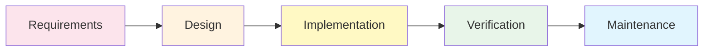
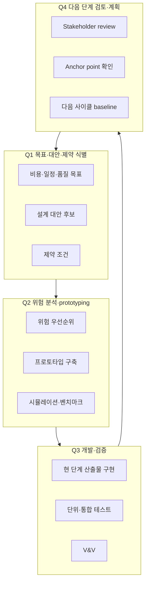
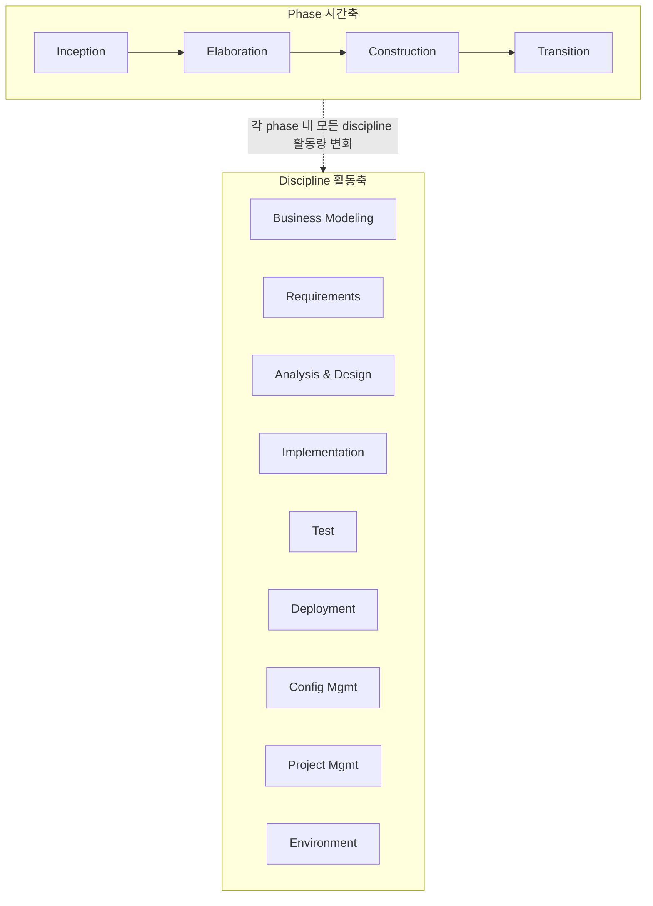
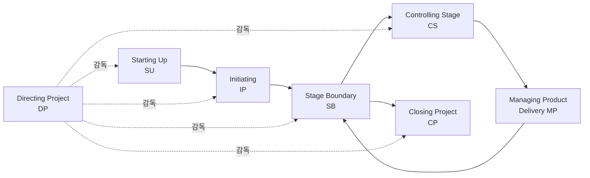
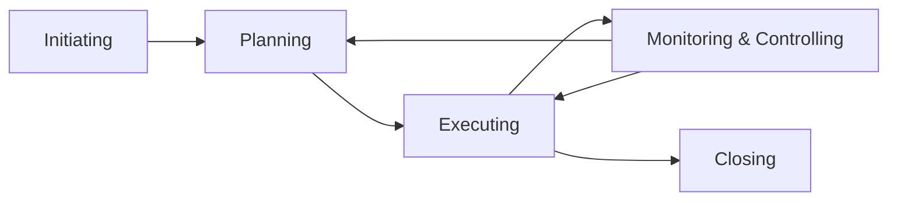

# SDLC 모델 (Software Development Life Cycle Models)

소프트웨어 개발 수명주기(SDLC) 를 정의하는 **전통 / 반복 / 점진 / 위험 기반 / 프로세스 프레임워크** 7 모델을 다룬다. Agile / Lean / DevOps 가 등장하기 이전의 무거운(heavyweight) 방법론과 PMBOK·PRINCE2 같은 **프로젝트 관리 표준** 까지 포함한다. Agile / Scrum / XP 등 경량 방법론은 `process-metrics.md` 와 `sustainable-sw.md` 에서 별도로 다루며, 본 문서는 **전통적 SDLC 골격** 의 기준선 역할을 한다.

**원전**:
- Winston W. Royce, "Managing the Development of Large Software Systems", *Proceedings, IEEE WESCON* (Aug 1970) — Waterfall 원형
- Barry W. Boehm, "A Spiral Model of Software Development and Enhancement", *IEEE Computer* 21 (5) 1988 — Spiral
- IEEE Std 1012-2016, *IEEE Standard for System, Software, and Hardware Verification and Validation* — V-Model 기반
- Philippe Kruchten, *The Rational Unified Process: An Introduction* 3rd ed. (2003) — RUP
- AXELOS, *Managing Successful Projects with PRINCE2* 7th ed. (2023)
- PMI, *A Guide to the Project Management Body of Knowledge (PMBOK Guide)* 7th ed. (2021)
- Ken Schwaber & Mike Beedle, *Agile Software Development with Scrum* (2001) — 경량 비교 기준

---

## 1. Waterfall (폭포수 모델, Royce 1970) <a id="sdlc-waterfall"></a>

**정의**: 단계가 **선형(linear)** 으로 흐르는 SDLC 의 원형. Requirements → Design → Implementation → Verification → Maintenance 5(또는 7) 단계를 *역행 없이* 진행한다고 가정한다. Royce 가 1970 년 WESCON 논문에서 제시했으나, 본문에서는 *완전한 선형은 위험하며 피드백 루프가 필요* 하다고 명시했음에도 산업 실무는 "단계 게이트" 만 차용해 보급되었다.

**역사적 배경**:
- 1956 년 SAGE 방공망 프로젝트에서 Bennington 이 단계별 산출물 모델 제안
- 1970 Royce 가 9 단계 모델 + 반복 화살표 제시
- 1985 DoD-STD-2167(미 국방부) 가 단계 게이트만 채택 → "Pure Waterfall" 산업 표준화
- 1990 년대 Agile 운동의 *반례* 로 다시 호명됨

**단계 / 산출물**:

| 단계 | 활동 | 산출물 | 표준 검토 |
|---|---|---|---|
| 1. System Requirements | 시스템 범위·제약 정의 | SyRS (System Requirements Spec) | SRR (System Req Review) |
| 2. Software Requirements | 기능·비기능 요구 명세 | SRS (IEEE 830 / ISO 29148) | SRR |
| 3. Analysis | 도메인 모델·DFD | Analysis Model | PDR (Preliminary Design Review) |
| 4. Design | 아키텍처·인터페이스 설계 | SDD (IEEE 1016) | CDR (Critical Design Review) |
| 5. Coding | 구현 | Source Code + Unit Test | Code Review |
| 6. Testing | 통합·시스템·인수 테스트 | Test Report | TRR (Test Readiness Review) |
| 7. Operations & Maintenance | 운영·결함 수정 | Maintenance Log | PIR (Post-Implementation Review) |



**장점**:
- 단계별 **문서화 강제** → 규제 산업(국방·항공·의료) 감사 추적 용이
- 마일스톤 / 게이트 / 비용 예측 단순 (고정 가격 계약과 정합)
- 인력 교체 시 인계 비용 낮음 (문서가 진실 공급원)

**단점**:
- 요구사항이 사전에 *완전히* 파악된다는 가정 — 실증적으로 거짓 (CHAOS Report 1995, 31% 프로젝트 취소)
- 후반에 결함 발견 시 비용 폭증 (Boehm 비용 곡선: 요구 단계 1× → 운영 단계 100×)
- 사용자 피드백 지연 → "올바른 것을 잘못 만든" 위험

**적용 시나리오**:
- 요구사항이 *법적으로 고정* 된 도메인 (계약 시스템, 정부 입찰)
- 안전 필수 시스템 (IEC 62304 Class C, DO-178C DAL A) 의 V&V 게이트 강제 필요 시
- 단기간 + 단일 모듈 + 기존 시스템 마이그레이션

**관련 패턴**:
- V-Model (각 단계에 대응 검증 단계 추가) → [sdlc-v-model](#sdlc-v-model)
- Stage-Gate Process (Cooper 1990, 제품 개발 일반화)
- Big Design Up Front (BDUF) — 안티 Agile 의 대명사

---

## 2. V-Model (검증 모델, IEEE 1012) <a id="sdlc-v-model"></a>

**정의**: Waterfall 의 변형. 좌측 하강 단계(분석·설계·구현)와 우측 상승 단계(검증·확인) 가 **V 자형으로 대칭** 을 이룬다. 각 좌측 단계는 동일 추상 수준의 우측 검증 단계와 *짝* 을 이뤄, "검증은 *언제* 어떻게 할지 사전에 정의" 한다. 독일 V-Modell XT (1997) 가 BMVg(독일 국방부) 표준으로 공식화.

**역사적 배경**:
- 1979 NASA STD-2100, 1986 미 DoD-STD-2167A 에서 "Verification & Validation" 단계 명시
- 1991 독일 BMVg 가 V-Modell 97 표준화 → V-Modell XT (2005) 로 확장
- IEEE 1012-2016 이 IV&V (Independent V&V) 기준으로 일반화

**짝 관계 (V 의 양 날개)**:

```
좌측 (개발)                       우측 (검증)
─────────────────                ─────────────────
Requirements Analysis  <───────> Acceptance Testing
                                  (UAT, 사용자 인수)
   ↓                                ↑
System Design          <───────> System Testing
                                  (E2E 시나리오)
   ↓                                ↑
Architectural Design   <───────> Integration Testing
                                  (모듈 간 인터페이스)
   ↓                                ↑
Module Design          <───────> Unit Testing
                                  (단위 함수·클래스)
   ↓                                ↑
        ╲                       ╱
         ╲                     ╱
          ─── Implementation ──
                  (Coding)
```

**산업 표준 매핑**:

| 산업 | 표준 | V-Model 활용 |
|---|---|---|
| 의료기기 SW | **IEC 62304** (Medical device software lifecycle) | Class A/B/C 별 검증 깊이 차등. Class C(생명 위협)는 좌측 각 단계마다 우측 검증 산출물 강제 |
| 항공전자 SW | **DO-178C** (Software Considerations in Airborne Systems) | DAL A~E (Design Assurance Level). DAL A 는 MC/DC coverage + 독립 검증 강제 |
| 자동차 SW | **ISO 26262** (Road vehicles — Functional safety) | ASIL A~D. ASIL D 는 모든 좌측 단계에 우측 V&V 산출물 + 안전 케이스 |
| 철도 신호 SW | **EN 50128** | SIL 1~4. SIL 4 는 Formal Methods 권장 |
| 산업 자동화 | **IEC 61508** | SIL 1~4 (functional safety) |

**장점**:
- 검증 활동의 **사전 계획** 강제 → 후반 결함 발견 비용 감소
- 안전 / 규제 인증 트레이스 매트릭스 (Requirements Traceability Matrix, RTM) 자연 생성
- IEEE 1012 IV&V 조직(독립 검증팀) 분리 가능

**단점**:
- Waterfall 의 가정(요구 고정) 그대로 상속
- 반복 / 점진 개발과 정합 어려움 — Agile V-Model 변형(W-Model, X-Model) 존재하나 산업 표준화 미흡
- 우측 단계 산출물 양이 좌측보다 더 많아질 수 있음 (감사 추적 문서)

**적용 시나리오**:
- **안전 필수 시스템 (Safety-Critical)** — 의료기기, 항공전자, 자동차 ECU, 원자력 I&C
- 인증 통과가 출시 전제조건인 제품
- IV&V 외주 / 독립 검증 조직 운영 시

**관련 패턴**:
- Waterfall → [sdlc-waterfall](#sdlc-waterfall)
- 테스트 전략 [pyramid-trophy-diamond-honeycomb](../patterns/testing-strategies.md#pyramid-trophy-diamond-honeycomb) — V-Model 의 우측 단계 비율과 대응
- ISO/IEC 25010 [품질 모델](iso25010.md) — V-Model 검증 기준의 품질 특성 정의

---

## 3. Spiral Model (위험 기반 점증 모델, Boehm 1986) <a id="sdlc-spiral"></a>

**정의**: Waterfall 의 단계 게이트와 Iterative 의 반복 사이클을 **위험(risk) 분석** 으로 결합한 모델. 각 사이클(spiral 한 바퀴)이 4 사분면을 순회한다: ① 목표·대안 식별 → ② 위험 평가·prototyping → ③ 개발·검증 → ④ 다음 단계 계획. Boehm 이 *IEEE Computer* 1988 논문에서 제시.

**역사적 배경**:
- 1986 TRW 에서 TRW-SPS (Software Productivity System) 개발 경험 정리
- 1988 IEEE Computer 논문으로 공식화
- 2000 *Spiral Development: Experience, Principles, and Refinements* (Boehm) 로 6 불변량(invariants) 추가
- WinWin Spiral (1996) — 이해관계자 협상 요소 통합

**4 사분면 (위험 주도, Risk-Driven)**:



**6 불변량 (Boehm 2000)**:
1. **위험 기반 활동 결정** — 단계 종류·순서는 위험이 결정
2. **위험 기반 산출물 수준** — 문서 깊이는 위험에 비례
3. **위험 기반 노력 배분** — 일정 / 인력 / 자원은 위험에 따라
4. **Anchor Point 마일스톤** — LCO (Life Cycle Objectives), LCA (Life Cycle Architecture), IOC (Initial Operational Capability) 3 개의 의무 검토점
5. **이해관계자 Win-Win 협상** — WinWin 변형의 핵심
6. **시스템·소프트웨어 통합 시각** — 하드웨어·운영·HCI 까지 포함

**장점**:
- 위험이 큰 항목을 **조기에 prototyping** 으로 해소 → 후반 비용 폭증 방지
- 요구사항 진화에 대응 (각 사이클마다 재협상)
- 대형 / 신기술 / 불확실성 큰 프로젝트에 적합

**단점**:
- 위험 평가 능력에 강하게 의존 — 미숙한 PM 에게는 위험
- 사이클 수 / 종료 조건이 명확치 않으면 *영원한 prototyping* 위험
- 고정 가격 계약과 정합 어려움
- 소규모 / 단순 프로젝트엔 과한 오버헤드

**적용 시나리오**:
- 신기술·신시장 (요구 불확실성 高)
- 대형 시스템 (수십~수백 인년)
- TRW-SPS·DARPA STARS 같은 R&D 프로젝트
- 요구사항이 **이해관계자별 충돌** 하는 경우 (WinWin 적용)

**Anchor Point 마일스톤**:

| 마일스톤 | 시점 | 검증 내용 |
|---|---|---|
| **LCO** (Life Cycle Objectives) | Inception 종료 | 비즈니스 케이스, 운영 컨셉, 주요 위험 식별 |
| **LCA** (Life Cycle Architecture) | Elaboration 종료 | 아키텍처 baseline, 위험 80% 해소 |
| **IOC** (Initial Operational Capability) | Construction 종료 | 사용자 인수 가능한 첫 버전 |

(LCO/LCA/IOC 는 후일 RUP 의 phase 경계로 채택됨 → [sdlc-rup](#sdlc-rup))

**관련 패턴**:
- 요구공학 [event-storming](../patterns/requirements-engineering.md#event-storming) — Spiral Q1/Q4 의 이해관계자 협상에 활용 가능
- RUP → [sdlc-rup](#sdlc-rup) (Boehm Anchor Point 를 phase 게이트로 채택)
- WinWin Spiral 변형 — 이해관계자 협상 명시

---

## 4. RAD / FDD / Crystal (경량 방법론 3 종 비교) <a id="sdlc-rad-fdd-crystal"></a>

**정의**: 1990 년대 후반 ~ 2000 년대 초 등장한 **경량 / 적응형** 방법론 3 종. Agile Manifesto (2001) 직전·직후의 과도기 모델로, Scrum 보다 *기능 단위 / 적응성 / 사용자 참여* 를 더 강조하거나 다르게 강조한다.

### 4-A. RAD (Rapid Application Development, Martin 1991)

**정의**: James Martin 이 IBM Information Engineering 에서 발전시킨 모델. 4 단계(Requirements Planning → User Design → Construction → Cutover) 를 **타임박스(60-90 일)** + CASE 도구 + JAD (Joint Application Design) 워크숍 + **사용자 직접 참여** 로 압축.

**핵심 특징**:
- JAD 워크숍 — 사용자 + 개발자 + 도메인 전문가가 동시 설계
- 프로토타이핑 도구(PowerBuilder, Visual Basic, Oracle Forms) 의존
- 60-90 일 타임박스 강제

**장점**: 빠른 출시, 사용자 참여 高
**단점**: 도구 종속, 비기능 요구(성능·보안) 약함, 대형 시스템 부적합

### 4-B. FDD (Feature-Driven Development, Coad/De Luca 1997)

**정의**: Peter Coad + Jeff De Luca 가 싱가포르 은행 프로젝트(1997) 에서 정립. **기능(Feature) 단위 진행** + 도메인 모델 우선 + 2 주 이내 feature 완성.

**5 프로세스**:
1. **DOM** — Develop Overall Model (전체 도메인 모델)
2. **BFL** — Build Feature List (기능 목록 작성, `<action> <result> <object>` 패턴)
3. **PBF** — Plan By Feature (기능별 계획)
4. **DBF** — Design By Feature (기능별 설계)
5. **BBF** — Build By Feature (기능별 구축, 2 주 이내)

**Feature 명명 규칙**: `<action> the <result> <by|for|of|to> a(n) <object>` (예: "Calculate the total of a sale")

**장점**: 도메인 모델 강제, 진행 가시성 高 (feature 완성 % 추적)
**단점**: 작은 팀(10인 미만) 에 비효율, 도메인 모델러 의존

### 4-C. Crystal Family (Cockburn 1991-2004)

**정의**: Alistair Cockburn 이 IBM 컨설팅 경험으로 정립한 **방법론 가족(family)**. 팀 크기(C, D, ..., Magenta) 와 시스템 중요도(Comfort / Discretionary money / Essential money / Life) 로 *방법론 자체를 선택* 한다.

**Crystal 가족 분류** (팀 크기 × 중요도):

| 코드 / 색상 | 팀 크기 | 적용 |
|---|---|---|
| Crystal Clear | 1-6 명 | 단일 팀, 같은 방 |
| Crystal Yellow | 7-20 명 | 1-2 팀 |
| Crystal Orange | 21-40 명 | 다중 팀 |
| Crystal Red | 41-80 명 | 부서 규모 |
| Crystal Maroon | 81-200 명 | 대규모 프로그램 |
| Crystal Diamond/Sapphire | 200+ 명 (생명 위협) | 안전 필수 |

**7 속성** (Crystal Clear 기준):
1. Frequent Delivery (잦은 배포)
2. Reflective Improvement (회고)
3. Osmotic Communication (같은 공간 자연 소통)
4. Personal Safety (의견 표명 안전성)
5. Focus (집중 시간 확보)
6. Easy Access to Expert Users (사용자 접근성)
7. Technical Environment (CI / 도구 / 자동 테스트)

**장점**: 상황 적응성, 팀 규모별 최적화
**단점**: 방법론 선택 자체가 의사결정 부담, 한국어 자료 부족

### 비교 매트릭스

| 항목 | RAD | FDD | Crystal Clear |
|---|---|---|---|
| 등장 | 1991 (Martin) | 1997 (Coad/De Luca) | 1991-2004 (Cockburn) |
| 단위 | 모듈 (60-90일) | Feature (2주 이내) | Iteration (1-4주) |
| 도메인 모델 | 약함 | **강제 (DOM)** | 약함 |
| 사용자 참여 | **JAD 워크숍** | 도메인 전문가 | Easy access |
| 도구 의존 | **CASE 강제** | UML 권장 | 자유 |
| 팀 크기 | 6-15 | 10-50 | 1-6 (Clear) |
| 현재 사용 | 거의 사라짐 | 일부 금융권 | Agile 변형으로 흡수 |

---

## 5. RUP (Rational Unified Process) <a id="sdlc-rup"></a>

**정의**: Rational Software (현 IBM Rational) 가 1990 년대 후반 UML / Objectory / Spiral 을 통합해 만든 **반복·점증 프로세스 프레임워크**. Philippe Kruchten 이 *The Rational Unified Process* (1998 초판, 2003 3rd) 로 정리. 4 phase × 6 + 3 discipline 매트릭스가 핵심.

**역사적 배경**:
- 1995 Rational Approach (Booch / Rumbaugh / Jacobson) — Three Amigos 합류
- 1997 UML 1.0 표준화 후 RUP 1.0 출시
- 1998 *Unified Software Development Process* (Jacobson/Booch/Rumbaugh) — USDP / RUP 동시 정립
- 2003 Kruchten 3rd ed.
- 2006 IBM 이 OpenUP / EUP (Enterprise Unified Process) 로 분기
- 현재는 EssUP / Disciplined Agile (DAD) 로 진화

**6 모범 사례 (Best Practices)**:
1. 반복 개발 (Iterative Development)
2. 요구사항 관리 (Requirements Management)
3. 컴포넌트 기반 아키텍처
4. 시각적 모델링 (UML)
5. 품질 지속 검증
6. 변경 통제

### 4 Phase (시간 축, Boehm Anchor Point 채택)

| Phase | 목적 | 종료 마일스톤 | Boehm 매핑 |
|---|---|---|---|
| **Inception** | 비즈니스 케이스, 범위 정의 | **LCO** (Life Cycle Objectives) | Boehm LCO |
| **Elaboration** | 아키텍처 baseline, 위험 해소 | **LCA** (Life Cycle Architecture) | Boehm LCA |
| **Construction** | 기능 구현·통합·베타 | **IOC** (Initial Operational Capability) | Boehm IOC |
| **Transition** | 사용자 인수·운영 이관 | **GA** (General Availability) | — |

### 9 Discipline (활동 축)

**Engineering Disciplines (6)**:
1. Business Modeling
2. Requirements
3. Analysis & Design
4. Implementation
5. Test
6. Deployment

**Supporting Disciplines (3)**:
7. Configuration & Change Management
8. Project Management
9. Environment



**활동량 곡선 (Hump Chart)**:
- Business Modeling / Requirements — Inception 에 peak, 이후 감소
- Analysis & Design — Elaboration 에 peak
- Implementation — Construction 에 peak
- Test — Construction~Transition 에 지속
- Deployment — Transition 에 peak

**4+1 View 아키텍처 모델** (Kruchten 1995):
- **Logical View** — 기능 요구 (UML Class / Sequence)
- **Process View** — 동시성·성능 (UML Activity / Component)
- **Development View** — 모듈·패키지 구조
- **Physical View** — 배포 토폴로지
- **+1 Use Case View** — 시나리오, 위 4 view 를 통합 검증

**장점**:
- UML / 시각 모델링 / 반복 / 위험 관리 통합 (90 년대 후반 베스트 프랙티스 집대성)
- 대규모 / 분산 팀 / 다중 stakeholder 프로젝트에 강력
- IBM Rational Tools (RSA, ClearCase, ClearQuest) 와 정합

**단점**:
- *Heavyweight* — 9 discipline × 4 phase 매트릭스 + 100+ artifact 정의
- Tailoring 필수, 미실행 시 문서화 부담 폭증
- Agile / Scrum 대비 *과정 중심* (개인·상호작용 < 프로세스·도구)
- 라이선스 / 도구 종속 — 오픈소스 OpenUP 으로 일부 해소

**적용 시나리오**:
- 50+ 인 / 12 개월+ / 다중 stakeholder
- 안전·보안 검증 + 반복 개발이 동시에 필요한 경우
- 금융·통신·국방 도메인 (현 운영 시스템 중 다수가 RUP 잔재)

**관련 패턴**:
- Spiral → [sdlc-spiral](#sdlc-spiral) (Boehm Anchor Point 계승)
- Clean Architecture → [patterns/architectural.md](../patterns/architectural.md) (4+1 View 의 Logical/Development View 와 정합)
- DAD (Disciplined Agile Delivery) — RUP 의 Agile 후계

---

## 6. PRINCE2 (PRojects IN Controlled Environments v2) <a id="sdlc-prince2"></a>

**정의**: 영국 정부(OGC, 현 AXELOS) 가 1996 년 정립한 **프로젝트 관리 방법론**. SDLC 자체보다는 *프로젝트 거버넌스·통제 / 비즈니스 정당성 / 단계별 통제* 에 초점. 7 원칙 × 7 테마 × 7 처리(Process) 구조. UK 정부 + EU + 호주·뉴질랜드 표준.

**역사적 배경**:
- 1989 CCTA (Central Computer and Telecommunications Agency) 가 PROMPT II 기반 PRINCE 1 발표
- 1996 PRINCE2 (일반화, IT 외 분야 포함) 출시
- 2009 PRINCE2 2009 (개정판)
- 2017 PRINCE2 6th ed.
- **2023 PRINCE2 7** (최신, AXELOS) — Agile 통합 강화

### 7 원칙 (Principles, 적용 의무)

1. **Continued Business Justification** — 비즈니스 정당성 지속 확인 (Business Case 살아 있어야 함)
2. **Learn from Experience** — 교훈 등록부(Lessons Log) 유지
3. **Defined Roles & Responsibilities** — Project Board / PM / Team Manager 명확화
4. **Manage by Stages** — 단계(stage) 경계마다 Go/No-Go 결정
5. **Manage by Exception** — 허용 범위(tolerance) 초과시만 상위 보고
6. **Focus on Products** — 산출물 기반(Product-based Planning)
7. **Tailor to suit Project** — 프로젝트 규모·복잡도에 맞춤

### 7 테마 (Themes, 지속 관리 영역)

| 테마 | 한국어 | 핵심 산출물 |
|---|---|---|
| Business Case | 비즈니스 케이스 | Business Case 문서 |
| Organization | 조직 | Project Initiation Document (PID) |
| Quality | 품질 | Quality Management Approach |
| Plans | 계획 | Project / Stage / Team Plan |
| Risk | 위험 | Risk Register |
| Change | 변경 | Issue Register / Change Request |
| Progress | 진행 | Highlight Report / Checkpoint Report |

### 7 처리 (Processes, 시간 흐름)



1. **SU** — Starting Up a Project (사전 준비)
2. **DP** — Directing a Project (Project Board 의 의사결정, 전 기간)
3. **IP** — Initiating a Project (PID 작성)
4. **SB** — Managing a Stage Boundary (단계 게이트)
5. **CS** — Controlling a Stage (단계 내 일일 운영)
6. **MP** — Managing Product Delivery (Team Manager 의 산출물 인도)
7. **CP** — Closing a Project (종료)

**역할 (Project Management Team)**:
- **Project Board** — Executive, Senior User, Senior Supplier (3 인 1조)
- **Project Manager** — 일일 운영
- **Team Manager** — 작업 패키지 실행
- **Project Assurance / Change Authority / Project Support** — 보조 역할

**장점**:
- **UK 정부 / 공공 입찰 표준** — UK / EU / 호주·뉴질랜드·중동 공공 프로젝트 필수
- 7 원칙·7 테마·7 처리의 명확한 구조 → 자격증(Foundation / Practitioner / Agile) 표준화
- 프로젝트 거버넌스 / 비즈니스 케이스 강조 — 정치적 / 예산 변동성 큰 환경에 강력
- Tailoring 원칙 — 작은 프로젝트도 적용 가능

**단점**:
- *프로젝트 관리* 방법론 — SDLC / 기술 프로세스 미정의 (RUP / Scrum 과 결합 필요)
- 문서·역할 부담 (Tailoring 안 하면)
- 자격증 비용·재인증 부담 (AXELOS 유료)

**적용 시나리오**:
- UK / EU 공공 입찰 프로젝트
- 다단계 / 다년간 / 다부서 협업
- 거버넌스가 핵심 위험인 환경 (정부, 대기업 IT 통합)
- PRINCE2 Agile (2015~) 로 Scrum / SAFe 와 결합 가능

**관련 표준**:
- ISO 21500 (Project Management Guidance) — PRINCE2 / PMBOK 통합 ISO
- ISO 21502 (2020) — 프로젝트 관리 지침 (PRINCE2 영향)
- MSP (Managing Successful Programmes) — PRINCE2 의 프로그램 관리 확장
- M_o_R (Management of Risk) — 위험 테마 확장

---

## 7. PMBOK (Project Management Body of Knowledge, PMI) <a id="sdlc-pmbok"></a>

**정의**: PMI (Project Management Institute, 1969 설립) 가 발행하는 **프로젝트 관리 지식체계**. *A Guide to the Project Management Body of Knowledge* 가 정식 명칭. 1996 1판 → 2021 **7판** (PMBOK 7) 까지 7 회 개정. PMP (Project Management Professional) 자격증 표준 텍스트.

**역사적 변화**:
- 1996 PMBOK 1판 — 9 Knowledge Area, 39 Process
- 2000 2판 / 2004 3판 / 2008 4판 / 2012 **5판 (10 Knowledge Area, 47 Process)**
- 2017 6판 — 49 Process, Agile 부록 추가
- **2021 7판** — **Process 중심 → 12 원칙 / 8 성과 도메인 (Performance Domain)** 으로 *근본 재구성*

**6판 (전통 Process 중심) — 5 Process Group × 10 Knowledge Area**:

### 5 Process Groups (시간축)



1. **Initiating** — 프로젝트·단계 시작 인가 (Charter 작성)
2. **Planning** — 범위·일정·비용·자원·위험·이해관계자 계획
3. **Executing** — 계획 실행
4. **Monitoring & Controlling** — 진행 추적·변경 통제 (전 기간)
5. **Closing** — 프로젝트·단계 종료

### 10 Knowledge Areas (영역축)

| # | 영역 | 핵심 산출물 |
|---|---|---|
| 1 | Integration Management | Project Charter, Project Management Plan |
| 2 | Scope Management | WBS (Work Breakdown Structure), Scope Statement |
| 3 | Schedule Management | Network Diagram, Gantt Chart, Critical Path |
| 4 | Cost Management | Cost Baseline, EVM (Earned Value Management) |
| 5 | Quality Management | Quality Management Plan |
| 6 | Resource Management | RACI Matrix, Team Charter |
| 7 | Communications Management | Communications Plan |
| 8 | Risk Management | Risk Register, Risk Response Plan |
| 9 | Procurement Management | Procurement SOW, Contract |
| 10 | Stakeholder Management | Stakeholder Register, Engagement Plan |

**Process Group × Knowledge Area 매트릭스** (6판 기준 49 process):

```
                  | Init | Plan | Exec | M&C  | Close
Integration       |  1   |  1   |  1   |  2   |  1   = 6
Scope             |      |  4   |      |  2   |      = 6
Schedule          |      |  5   |      |  1   |      = 6
Cost              |      |  3   |      |  1   |      = 4
Quality           |      |  1   |  1   |  1   |      = 3
Resource          |      |  1   |  3   |  1   |      = 6  ← 7판에서 통합
Communications    |      |  1   |  1   |  1   |      = 3
Risk              |      |  5   |  1   |  1   |      = 7
Procurement       |      |  1   |  1   |  1   |      = 3
Stakeholder       |  1   |  1   |  1   |  1   |      = 4
                  ━━━━━━━━━━━━━━━━━━━━━━━━━━━━━━━━━━━━━━━━ 49 process
```

### 7판 (2021) — 근본 재구성

7판은 **Process 중심에서 원칙·성과 도메인 중심** 으로 패러다임 전환:

**12 원칙**:
1. Stewardship (청지기 정신)
2. Team (팀)
3. Stakeholders (이해관계자)
4. Value (가치)
5. Systems Thinking (시스템 사고)
6. Leadership (리더십)
7. Tailoring (맞춤화)
8. Quality (품질)
9. Complexity (복잡성)
10. Risk (위험)
11. Adaptability & Resilience (적응성·복원력)
12. Change (변경)

**8 성과 도메인** (Performance Domains):
1. Stakeholders
2. Team
3. Development Approach & Life Cycle
4. Planning
5. Project Work
6. Delivery
7. Measurement
8. Uncertainty

**Development Approach Spectrum** (7판 명시):
```
Predictive ── Iterative ── Incremental ── Adaptive ── Hybrid
(Waterfall)                                (Agile)
```

**장점**:
- 글로벌 표준 — PMI 회원 300 만+, PMP 자격증 100 만+
- 6판 매트릭스는 *체계적 학습 / 시험 / 인증* 에 최적
- 7판은 Agile / Hybrid 통합으로 현대화
- ISO 21500 / ISO 21502 와 정합

**단점**:
- 6판 — Heavyweight, 49 process 외움 자체가 부담
- 7판 — 원칙 중심으로 *모호함 증가*, 실무 적용 가이드 약함
- 비용 (PMI 회원비 + PMP 시험 + PDU 재인증)

**적용 시나리오**:
- 글로벌 다국적 프로젝트 (북미·중남미·중동 강세)
- PMP 자격증 보유 PM 채용 / 인증 강제 환경
- EVM (Earned Value Management) 필요한 정부 / 국방 계약
- 7판 — Agile / Hybrid 와 결합 가능

**관련 표준**:
- ISO 21500 (Guidance on Project Management)
- ISO 21502 (2020, Project Management Guidance)
- PMI 의 PgMP (Program Management), PfMP (Portfolio Management) 확장
- Disciplined Agile (DA, PMI 가 2019 인수)

---

## 전통 vs Agile vs Lean 비교 매트릭스

7 SDLC 모델은 **전통(plan-driven)** 진영에 속한다. Agile / Lean 진영과의 차이를 4 축으로 정리.

| 축 | 전통 (Waterfall / V-Model / RUP / PRINCE2 / PMBOK 6판) | Agile (Scrum / XP / FDD / Crystal / Spiral 후기) | Lean (Lean SW Development / Kanban / Toyota Way) |
|---|---|---|---|
| **생명주기 형태** | 선형 단계 게이트 + 마일스톤 (LCO/LCA/IOC) | 짧은 반복 (1-4주 스프린트), 점증 인도 | 연속 흐름 (continuous flow), Pull system |
| **계획 시점** | Big Design Up Front (BDUF) — 사전 완전 계획 | Rolling Wave — 다음 1-3 스프린트만 상세 | Just-In-Time — Pull 신호 도착 시 계획 |
| **산출물** | SRS, SDD, RTM, Test Plan, ICD 등 100+ artifact | Backlog, Sprint Goal, Increment, Burndown | A3 Report, Value Stream Map, Kanban Board |
| **위험 처리** | Risk Register + 사전 식별·완화 (PMBOK Risk Mgmt) | Spike, Prototype, Fail Fast, 점진 노출 | 7 낭비 식별 + 근본 원인 (5 Whys) + Andon |
| **이해관계자 참여** | 마일스톤 검토 (단속적) | 스프린트 리뷰 (1-4주) + Product Owner 상시 | Gemba Walk (현장), Genchi Genbutsu (현지·현물) |
| **품질** | V&V 게이트 (V-Model), 단계별 검토 | TDD / Refactoring / CI 상시 | Jidoka (자율화), Built-in Quality, Poka-Yoke |
| **변경 대응** | Change Control Board (CCB), 변경 비용 곡선 | Backlog 재정렬, Sprint 단위 흡수 | Kaizen (지속 개선), Continuous Flow 조정 |
| **문서화** | 강함 (감사 추적, RTM) | "Working software over comprehensive documentation" | A3 한 장, Visual Management |
| **계약 모델** | Fixed Price / FFP (Firm Fixed Price) | T&M (Time & Materials), Capped T&M | Pull-based, 가치 인도 기반 |
| **인증 / 규제** | 안전 필수(IEC 62304 / DO-178C / ISO 26262) 친화 | 인증 통합 어려움 (Agile + V-Model 변형 필요) | 제조업 표준 (Toyota TPS), SW 도입 늦음 |
| **대표 메트릭** | EVM (CPI / SPI), Defect Density | Velocity, Cycle Time, Lead Time | WIP, Lead Time, Throughput, CFD |
| **팀 구조** | Hierarchical (PM / TM / Developer / QA 분리) | Cross-functional (T-shape, 자율 팀) | Pull-based 자율 팀 + 명확한 책임 |
| **적용 적합성** | 요구 고정 / 안전 필수 / 대형 / 규제 | 요구 진화 / 짧은 출시 / 학습 중심 | 흐름 최적화 / 낭비 제거 / 연속 인도 |

### 하이브리드 (Hybrid) — 현실의 답

**PMBOK 7판** 이 명시한 Development Approach Spectrum 처럼, 실무는 *순수 전통 / 순수 Agile* 보다 **혼합** 이 압도적이다:

- **Water-Scrum-Fall** — 요구 / 출시는 Waterfall, 개발은 Scrum
- **PRINCE2 Agile** (AXELOS 2015) — PRINCE2 거버넌스 + Scrum 실행
- **Disciplined Agile (DA)** — PMI 가 2019 인수, RUP 후계 + Agile 통합
- **SAFe** (Scaled Agile Framework) — Lean + Agile + DevOps 대규모 통합
- **Wagile** — 비공식 용어, 잘못된 혼합 (Waterfall 의 문서 + Agile 의 무계획) 안티 패턴

본 카탈로그의 다른 항목 → `process-metrics.md` (Scrum / XP / Kanban / Lean / DORA), `sustainable-sw.md` (Spotify Model 등), 그리고 별도 신설 예정 `scaled-agile.md` (SAFe / LeSS / Nexus / DA / Team Topologies) 가 Agile / Lean / Hybrid 측면을 다룬다.

---

## 표준 인용 (종합)

**Waterfall / V-Model**:
- Winston W. Royce, "Managing the Development of Large Software Systems", *Proc. IEEE WESCON* (Aug 1970)
- IEEE Std 1012-2016, *IEEE Standard for System, Software, and Hardware Verification and Validation*
- IEEE Std 1016-2009, *Software Design Descriptions*
- IEC 62304:2006/AMD1:2015, *Medical device software — Software life cycle processes*
- RTCA DO-178C:2011, *Software Considerations in Airborne Systems and Equipment Certification*
- ISO 26262:2018, *Road vehicles — Functional safety*
- EN 50128:2011, *Railway applications — Software for railway control and protection systems*

**Spiral**:
- Barry W. Boehm, "A Spiral Model of Software Development and Enhancement", *IEEE Computer* 21 (5): 61-72, May 1988
- Boehm & Hansen, "Spiral Development: Experience, Principles, and Refinements", CMU/SEI-2000-SR-008
- Boehm et al., *Software Cost Estimation with COCOMO II* (2000)

**RAD / FDD / Crystal**:
- James Martin, *Rapid Application Development* (1991)
- Stephen R. Palmer & John M. Felsing, *A Practical Guide to Feature-Driven Development* (2002)
- Alistair Cockburn, *Crystal Clear: A Human-Powered Methodology for Small Teams* (2004)
- Alistair Cockburn, *Agile Software Development: The Cooperative Game* 2nd ed. (2006)

**RUP**:
- Philippe Kruchten, *The Rational Unified Process: An Introduction* 3rd ed. (Addison-Wesley, 2003)
- Ivar Jacobson, Grady Booch, James Rumbaugh, *The Unified Software Development Process* (1999)
- Philippe Kruchten, "The 4+1 View Model of Architecture", *IEEE Software* 12 (6): 42-50, Nov 1995

**PRINCE2**:
- AXELOS, *Managing Successful Projects with PRINCE2 — 7th edition* (2023)
- AXELOS, *PRINCE2 Agile* (2015)
- ISO 21500:2021, *Project, programme and portfolio management — Context and concepts*

**PMBOK**:
- PMI, *A Guide to the Project Management Body of Knowledge (PMBOK Guide) — Seventh Edition* (2021)
- PMI, *PMBOK Guide — Sixth Edition* (2017) — 6 판 (5 Process Groups × 10 KA 매트릭스 기준)
- PMI, *The Standard for Project Management* (2021, PMBOK 7 부속)
- ISO 21502:2020, *Project, programme and portfolio management — Guidance on project management*
- PMI, *Disciplined Agile* (2019 인수, DA 4.0)

**비교 / 종합**:
- Ken Schwaber & Mike Beedle, *Agile Software Development with Scrum* (2001)
- Mary & Tom Poppendieck, *Lean Software Development: An Agile Toolkit* (2003)
- Mike Cohn, *Agile Estimating and Planning* (2005)
- Standish Group, *CHAOS Report* (1995~) — 프로젝트 성공률 통계
