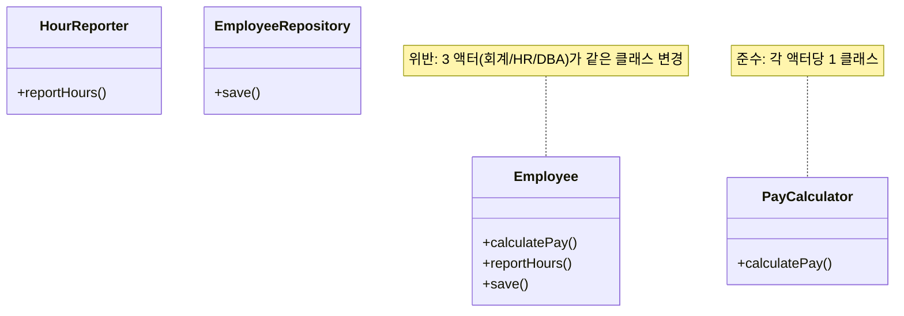
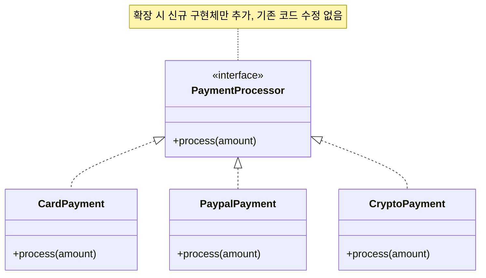
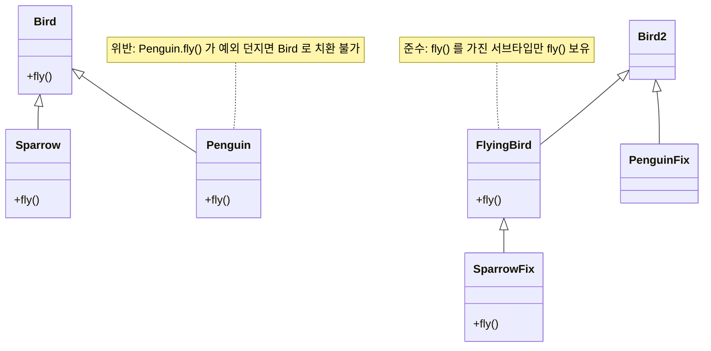
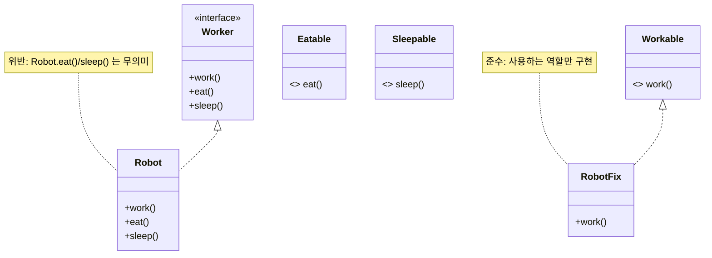
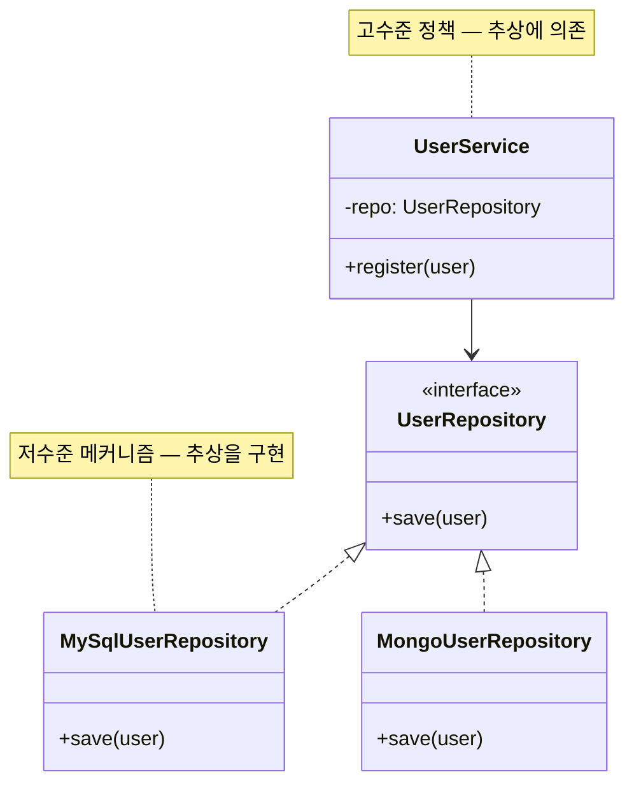

# SOLID 원칙

Robert C. Martin (Uncle Bob) 이 정리한 **객체지향 설계 5 원칙**. 변경에 강한 코드를 만들기 위한 OO 설계 기준. SRP / OCP / LSP / ISP / DIP 5 항목.

**원전**:
- Robert C. Martin, *Agile Software Development: Principles, Patterns, and Practices* (2002)
- Robert C. Martin, *Clean Architecture* (2017), Chapter 7~11

---

## 1. Single Responsibility Principle (SRP, 단일 책임 원칙)

**정의**: "A class should have only one reason to change." — 한 클래스(또는 모듈)는 **단 하나의 변경 이유** 만 가져야 한다.

**핵심 판단**: "변경 이유" = "이 코드를 바꿔달라고 요구할 수 있는 *액터(actor)*". 다른 액터의 요구가 같은 클래스를 건드리면 SRP 위반.

**특징**:
- 책임(responsibility) ≠ 기능(function). 책임은 *변경 축* 으로 정의된다.
- 같은 도메인 액터의 요구는 같은 클래스에 모음 (응집)
- 다른 도메인 액터의 요구는 다른 클래스로 분리 (분리)

**장점**:
- 변경 영향 범위 국소화
- 테스트 격리 용이
- 재사용성 향상

**단점/주의**:
- 과분리 시 클래스 폭증 (Lazy Class 양산)
- "단일 책임" 의 입자 크기 결정이 도메인 지식에 의존

**위반 사례**:
- 한 클래스가 비즈니스 규칙 + DB 접근 + 출력 포맷을 모두 처리
- 결제 클래스가 *회계* 액터와 *운영* 액터의 변경 요구를 동시에 받음

**적용 사례**:
- Repository 패턴 (도메인 ↔ DB 분리)
- Presenter 패턴 (도메인 ↔ UI 분리)
- DTO ↔ 도메인 객체 분리

**난이도**: 중간 | **사용 빈도**: ★★★★★

**관련 원칙 / 패턴**:
- [code-smell-large-class](code-smells.md#2-large-class), [code-smell-divergent-change](code-smells.md#10-divergent-change), [code-smell-long-method](code-smells.md#1-long-method)
- [high-cohesion](grasp.md#5-high-cohesion), [information-expert](grasp.md#1-information-expert)
- Facade, Mediator, Strategy

---

## 2. Open/Closed Principle (OCP, 개방-폐쇄 원칙)

**정의**: "Software entities should be open for extension, but closed for modification." — 확장에는 열려 있고, 변경에는 닫혀 있어야 한다.

**핵심 판단**: 새 요구사항을 *기존 코드를 수정하지 않고* 추가할 수 있는가? 추상화 (interface / abstract class) + 다형성으로 확장점을 제공.

**특징**:
- 확장 지점 = 추상화 경계
- 의존 방향이 "구체 → 추상" 으로 흐름
- 변경 차단 효과를 위해 DIP 와 함께 적용

**장점**:
- 기존 코드 회귀 위험 차단
- 플러그인 아키텍처 가능
- 라이브러리 / 프레임워크 설계의 기본

**단점/주의**:
- 추상화 비용 (인터페이스 정의·구현체 증가)
- 미래 확장이 없는데 추상화하면 [Speculative Generality](code-smells.md#18-speculative-generality) 발생

**위반 사례**:
- 새 결제 수단 추가 시 `if (type == "card") ... else if (type == "paypal") ...` 분기 확장
- 기존 클래스에 메서드 / 필드를 계속 추가

**적용 사례**:
- Strategy 패턴 (알고리즘 교체)
- Plugin 아키텍처 (Eclipse, IntelliJ)
- 결제 수단별 PaymentMethod 인터페이스

**난이도**: 중간~높음 | **사용 빈도**: ★★★★☆

**관련 원칙 / 패턴**:
- [dip](#5-dependency-inversion-principle-dip-의존-역전-원칙), [protected-variations](grasp.md#9-protected-variations)
- [code-smell-switch-statements](code-smells.md#7-switch-statements), [code-smell-shotgun-surgery](code-smells.md#11-shotgun-surgery)
- Strategy, Template Method, Decorator, Plugin

---

## 3. Liskov Substitution Principle (LSP, 리스코프 치환 원칙)

**정의**: "Subtypes must be substitutable for their base types." — 서브타입은 기반 타입으로 *완전히 대체 가능* 해야 한다. (Barbara Liskov, 1987)

**핵심 판단**: 부모 타입 변수에 자식 인스턴스를 대입했을 때 클라이언트 코드가 모르고도 정상 동작해야 한다. 사전 조건(precondition) 약화 + 사후 조건(postcondition) 강화 허용. 반대는 금지.

**특징**:
- "is-a" 관계의 *행위적 호환성* 보장
- 단순 상속 가능성이 아니라 *계약(contract)* 일치
- Design by Contract (Eiffel, Meyer) 와 결합

**장점**:
- 다형성이 의도대로 동작
- OCP 의 추상화 경계 신뢰 가능
- 테스트가 부모 타입 기준으로 작성 가능

**단점/주의**:
- 상속이 잘못 쓰이면 LSP 위반이 일상화 (정사각형-직사각형 문제)
- Composition over Inheritance 가 안전한 회피책

**위반 사례**:
- `Square extends Rectangle` 에서 `setWidth` 가 `setHeight` 도 강제로 바꿈
- `ReadOnlyList` 가 `List` 를 상속하면서 `add()` 에서 `UnsupportedOperationException`
- 자식 클래스가 부모의 사전 조건을 *강화* (입력 제한)

**적용 사례**:
- 인터페이스 기반 다형성
- 컬렉션 프레임워크의 List / Set / Map 계층
- 플러그인 컨트랙트

**난이도**: 높음 | **사용 빈도**: ★★★☆☆

**관련 원칙 / 패턴**:
- [code-smell-refused-bequest](code-smells.md#8-refused-bequest), [code-smell-parallel-inheritance-hierarchies](code-smells.md#12-parallel-inheritance-hierarchies)
- Composition over Inheritance, Design by Contract, [polymorphism](grasp.md#6-polymorphism)
- Adapter, Bridge

---

## 4. Interface Segregation Principle (ISP, 인터페이스 분리 원칙)

**정의**: "Clients should not be forced to depend upon interfaces that they do not use." — 클라이언트는 사용하지 않는 메서드에 의존하지 말아야 한다.

**핵심 판단**: 비대한 인터페이스를 *클라이언트 별 역할(role)* 단위로 분리. 한 클라이언트의 변경이 다른 클라이언트가 의존하는 인터페이스를 흔들지 않게.

**특징**:
- "fat interface" → "role interface" 분해
- 인터페이스 = 사용자 시점의 계약
- 다중 구현/다중 상속 언어에서 효과 큼

**장점**:
- 변경 전파 차단
- 테스트 스텁/목 단순화
- 인터페이스 진화의 점진성

**단점/주의**:
- 인터페이스 폭증 가능 (역할이 많은 클래스의 경우)
- 언어가 인터페이스 합성을 지원해야 자연스러움 (Java/Kotlin/TypeScript OK, Go 구조적 타이핑은 자연 적용)

**위반 사례**:
- `IPrinter` 인터페이스에 `print() / scan() / fax()` 다 들어있고, 단순 프린터 구현이 `scan/fax` 를 빈 메서드로 둠
- `User` 인터페이스에 `loginAsAdmin()`, `loginAsGuest()` 등 역할이 섞임

**적용 사례**:
- `Readable` + `Writable` 분리 (Java NIO)
- Role 별 권한 인터페이스
- Repository 분해 (`UserReader` + `UserWriter`)

**난이도**: 중간 | **사용 빈도**: ★★★★☆

**관련 원칙 / 패턴**:
- [code-smell-refused-bequest](code-smells.md#8-refused-bequest), [code-smell-large-class](code-smells.md#2-large-class)
- [low-coupling](grasp.md#4-low-coupling), [high-cohesion](grasp.md#5-high-cohesion)
- Role Interface, Facade

---

## 5. Dependency Inversion Principle (DIP, 의존 역전 원칙)

**정의**: "High-level modules should not depend on low-level modules. Both should depend on abstractions. Abstractions should not depend on details. Details should depend on abstractions."

**핵심 판단**: 의존 방향을 "구체 → 추상" 으로 *뒤집어서* 상위 계층(정책)이 하위 계층(메커니즘)에 직접 결합되지 않게.

**특징**:
- 의존성 주입(DI) / IoC 컨테이너의 이론적 근거
- Clean Architecture / Hexagonal / Onion 의 의존 방향 원칙
- 추상은 *클라이언트* 가 소유 (Robert Martin: "Abstractions belong to the high-level policy")

**장점**:
- 상위 정책이 인프라 교체에 영향 안 받음
- 단위 테스트에서 mock 주입 가능
- 멀티 환경 (dev / prod / test) 배선 분리

**단점/주의**:
- 추상화 비용 (인터페이스 + 구현체 + 배선 코드)
- 단순 CRUD 에서는 과한 설계

**위반 사례**:
- 서비스 클래스가 `new MySqlUserRepository()` 직접 호출
- 도메인 계층이 ORM annotation 으로 의존
- 비즈니스 로직 안에서 `System.out.println` 같은 인프라 호출

**적용 사례**:
- Spring `@Autowired` / `@Inject`
- Repository 인터페이스 정의는 도메인 계층, 구현은 인프라 계층
- Clean Architecture 의 Use Case ↔ Repository 경계

**난이도**: 중간~높음 | **사용 빈도**: ★★★★★

**관련 원칙 / 패턴**:
- [ocp](#2-openclosed-principle-ocp-개방-폐쇄-원칙), [pure-fabrication](grasp.md#7-pure-fabrication), [indirection](grasp.md#8-indirection)
- [code-smell-inappropriate-intimacy](code-smells.md#20-inappropriate-intimacy)
- Dependency Injection, Service Locator, Hexagonal Architecture, Clean Architecture

---

## 표준 인용

- Robert C. Martin, *Agile Software Development: Principles, Patterns, and Practices* (2002), Part II
- Robert C. Martin, *Clean Architecture: A Craftsman's Guide to Software Structure and Design* (2017), Chapter 7~11
- Barbara H. Liskov, "Data Abstraction and Hierarchy", *SIGPLAN Notices* 23 (1988) — LSP 원전
- Bertrand Meyer, *Object-Oriented Software Construction* 2nd ed. (1997) — OCP / Design by Contract 원전
